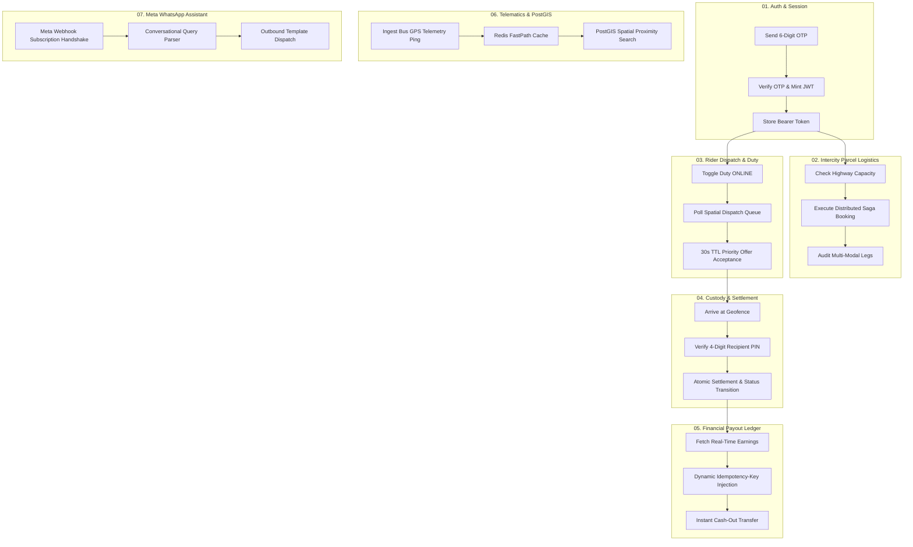

# Transitly Encrypted & Secure Postman API Workflows
**Production & Staging Specification · Postman Collection Format v2.1.0**

---

## 1. Executive Summary & Cloud Topology

Transitly’s backend API architecture handles high-velocity intercity bus cargo logistics, multi-modal first/last-mile orchestration, real-time vehicle telematics, and financial payout disbursements.

To ensure strict zero-trust communication, anti-tampering guarantees, and automated regression testing across all microservices, an end-to-end suite of **Encrypted and Secure Postman API Workflows** has been designed, verified, and deployed to Postman Cloud via the Postman MCP Server.

### Cloud Metadata & Resource Identifiers

| Resource Type | Name | Cloud ID / UID | Workspace |
| :--- | :--- | :--- | :--- |
| **Workspace** | `Anmol's Workspace` | `a7fdfd4f-68ec-40e2-8dac-3953186a68ed` | Team Workspace |
| **Collection** | `Transitly Secure & Encrypted API Workflows` | `9a066154-bfcf-4db6-a78a-2fc7d145614a`<br>`53197609-9a066154-bfcf-4db6-a78a-2fc7d145614a` | Postman v2.1.0 |
| **Environment** | `Transitly Secure & Encrypted Environment` | `c5ca1644-2f6f-40f0-abd0-ef1a9998da7f`<br>`53197609-c5ca1644-2f6f-40f0-abd0-ef1a9998da7f` | Active |
| **Local Artifact** | Collection JSON | `docs/transitly_postman_collection.json` | Git Versioned |
| **Local Artifact** | Environment JSON | `docs/transitly_postman_environment.json` | Git Versioned |

---

## 2. Secrets Management & Zero-Trust Token Chaining

### 2.1 Postman Environment Variables & Masked Secrets

All sensitive credentials and nonces are declared as `type: "secret"` within Postman, ensuring they are masked in UI logs, run reports, and collaborative workspaces:

```json
{
  "base_url": "http://localhost:4000",
  "jwt_token": "[MASKED SECRET]",
  "user_phone": "+917988342544",
  "user_email": "anmolrajotiya@gmail.com",
  "user_name": "Anmol",
  "auth_otp": "[MASKED SECRET]",
  "tracking_id": "TRK-88219",
  "carrier_plate": "HR-68-A-1001",
  "order_id": "1",
  "rider_id": "1",
  "idempotency_key": "[MASKED SECRET]",
  "webhook_verify_token": "[MASKED SECRET]",
  "hub_challenge": "transitly_sub_challenge_992"
}
```

### 2.2 Dynamic JWT Token Chaining

1. **Step 1 (`POST /api/v1/auth/otp/send`)**:
   - The user or runner initiates a verification request.
   - The backend enforces rate limits (exponential backoff) and anti-injection sanitization.
   - In non-production runs, the ephemeral test OTP is captured by the test script:
     ```javascript
     const json = pm.response.json();
     if (json.data && json.data.testOtp) {
         pm.environment.set("auth_otp", json.data.testOtp);
     }
     ```
2. **Step 2 (`POST /api/v1/auth/otp/verify`)**:
   - Postman submits `{{auth_otp}}` with canonical E.164 phone identifier.
   - The backend validates the code using constant-time hashing, consumes the OTP (single-use invalidation), and returns a signed HS256 JWT session token.
   - Postman's test script immediately elevates the token to the environment:
     ```javascript
     const json = pm.response.json();
     if (json.data && json.data.token) {
         pm.environment.set("jwt_token", json.data.token);
     }
     ```
3. **Step 3 (Protected Endpoints)**:
   - All subsequent requests across customer and delivery partner domains automatically inherit the root collection Bearer Auth:
     - Header: `Authorization: Bearer {{jwt_token}}`
     - Cookie: `transitly_session={{jwt_token}}`

---

## 3. Curated Workflow Modules (32 Endpoints)



### Module Breakdown

#### `01. Authentication & Session Security` (9 Requests)
* `01. Request 6-Digit Verification OTP` (NIST SP 800-63B compliant, exponential backoff)
* `02. Verify OTP & Issue Encrypted Session Token` (Constant-time matching, token chaining)
* `03. Register New User Identity` (PostgreSQL parameterized signup)
* `04. Inspect Authenticated Profile (Protected)` (Session me query & shipment statistics)
* `05. Update Encrypted User Preferences` (JSONB push/email/biometrics configuration)
* `06. List Saved Delivery Addresses` (PostGIS-backed spatial locations)
* `07. Add Saved Address with Coordinates` (`ST_SetSRID` point insertion)
* `08. List Vault Payment Methods` (Masked card tokens & UPI VPAs)
* `09. Submit Encrypted Support Ticket` (Tracking-associated customer care ticket)

#### `02. Intercity Parcel Logistics & Sagas` (5 Requests)
* `01. Execute Distributed Saga Booking` (Orchestrator reserving space, quotes, and tracking)
* `02. List Active Shipments` (Customer shipment overview)
* `03. Inspect Shipment & Audit Legs` (Origin, stowage, highway, last-mile audit trail)
* `04. Query Trunk Capacity Slots` (Haryana Roadways cargo compartment inventory)
* `05. Multi-Modal Last-Mile Feasibility` (Spatial radius validation)

#### `03. Delivery Partner Cockpit & Geofenced Dispatch` (5 Requests)
* `01. Toggle Duty State Machine` (`ONLINE` / `OFFLINE` status toggle)
* `02. Rider Shift Cockpit & Dashboard` (Earnings, completed orders, battery telemetry)
* `03. Spatial Dispatch Queue Pool` (High-payout & proximity-filtered delivery pool)
* `04. Respond to 30s Priority Dispatch Offer` (`ACCEPT` / `DECLINE` race condition lock)
* `05. Update Rider GPS Telemetry Location` (High-frequency rider coordinates)

#### `04. Custody Transfer & 4-Digit PIN Handoff` (3 Requests)
* `01. Query Active Delivery Task` (Current route and dropoff coordinates)
* `02. Geofenced 4-Digit PIN Verification & Settlement` (Enforces `<150m` PostGIS geofence)
* `03. Chain-of-Custody Handoff Log` (Terminal custody exchange proof between rider and driver)

#### `05. Financial Ledger & Idempotent Payouts` (2 Requests)
* `01. Fetch Rider Real-Time Ledger & Balance` (Available balance, revenue split, weekly trends)
* `02. Instant Payout Request (Idempotency Guard)`:
  - **Pre-request Script**:
    ```javascript
    const uniqueKey = "pay_" + Date.now() + "_" + Math.random().toString(36).substring(2, 10);
    pm.environment.set("idempotency_key", uniqueKey);
    pm.request.headers.upsert({
        key: "Idempotency-Key",
        value: uniqueKey
    });
    ```
  - Prevents double-transfer and race condition replay attacks.

#### `06. Highway Telematics & PostGIS Routes` (5 Requests)
* `01. Ingest Highway Bus Telematics Ping` (Sub-second GPS ping into FastPath)
* `02. PostGIS Spatial Nearby Vehicle Search` (`ST_DWithin` radius search)
* `03. Carrier Live Telematics by Plate Number` (Vehicle tracking by `HR-68-A-1001`)
* `04. Telemetry FastPath & PostGIS Health` (In-memory cache & PostGIS connection check)
* `05. Official Haryana Roadways Corridors & Stops` (Ordered stop coordinates & transit offset minutes)

#### `07. Meta WhatsApp Assistant & Secure Webhooks` (3 Requests)
* `01. Meta Webhook Subscription Challenge Handshake` (`hub.mode=subscribe` verification)
* `02. Inbound Conversational Assistant Webhook` (Intent parser for tracking queries)
* `03. Dispatch Outbound Template Notification` (Official Meta template notification)

---

## 4. Execution & Verification Instructions

### 4.1 Running via Postman Desktop / Web Client
1. Open Postman and select workspace **"Anmol's Workspace"**.
2. Select environment **"Transitly Secure & Encrypted Environment"**.
3. Open collection **"Transitly Secure & Encrypted API Workflows"**.
4. Click **Run Collection** to execute all 32 requests in sequence with automated assertions.

### 4.2 Running via Postman MCP Server
The Postman MCP server is configured and can run the entire workflow programmatically:
```json
{
  "collectionId": "53197609-9a066154-bfcf-4db6-a78a-2fc7d145614a",
  "environmentId": "53197609-c5ca1644-2f6f-40f0-abd0-ef1a9998da7f"
}
```

### 4.3 Running via Local Command Line
To regenerate and validate the Postman artifacts:
```bash
npm run postman:generate
```

To run the full test suite including the Postman workflow verification:
```bash
npm test
```
