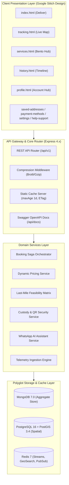
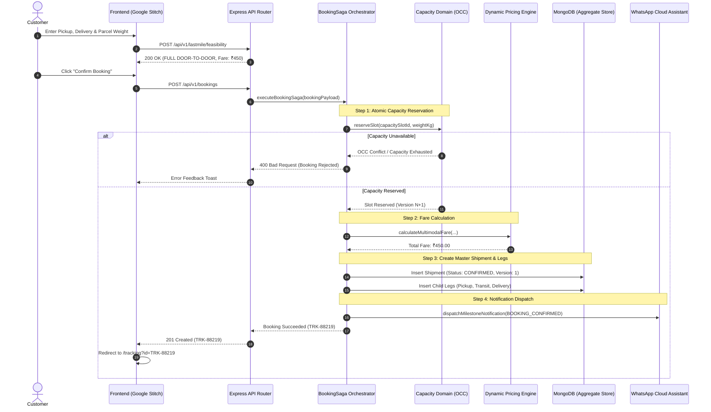
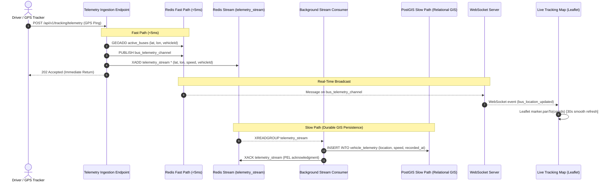
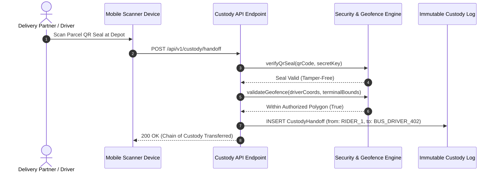
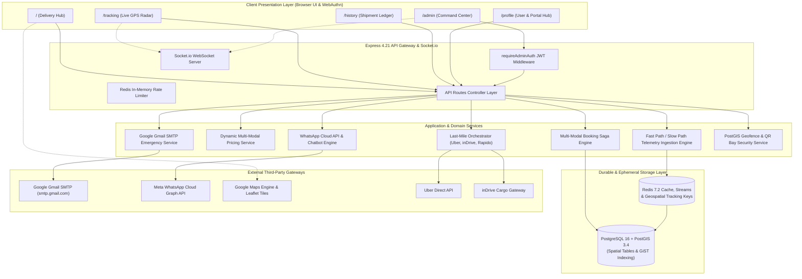
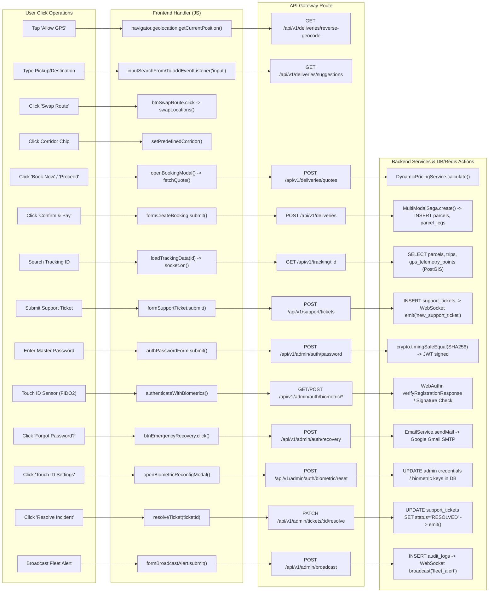
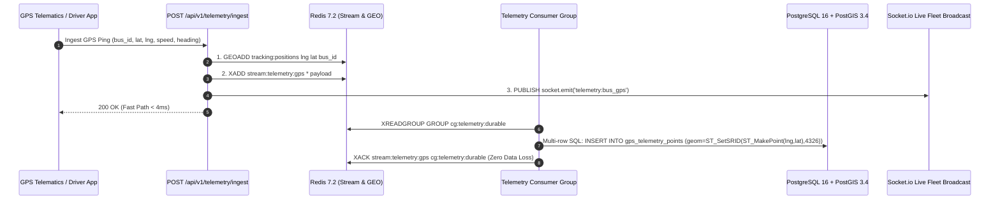

# Transitly — Master Project Documentation

> **Version:** 1.0.0  
> **Status:** Active Reference & Production Blueprint  
> **Date:** August 2026  
> **Repository:** `https://github.com/Anmo07/transitly`  
> **Source of Truth:** [PRD.md](file:///Users/anmoljangra/Documents/Project%20-%20Alphaa%20IT/PRD.md), [README.md](file:///Users/anmoljangra/Documents/Project%20-%20Alphaa%20IT/README.md), and [.agents/rules/development_guidelines.md](file:///Users/anmoljangra/Documents/Project%20-%20Alphaa%20IT/.agents/rules/development_guidelines.md)

---

## Table of Contents

1. [Executive Summary & System Vision](#1-executive-summary--system-vision)
2. [PRD & Functional Requirements Alignment](#2-prd--functional-requirements-alignment)
3. [System Architecture & Domain Model](#3-system-architecture--domain-model)
4. [Complete Codebase Directory Structure](#4-complete-codebase-directory-structure)
5. [Data Architecture & Master Schemas](#5-data-architecture--master-schemas)
6. [Comprehensive REST & WebSocket API Reference](#6-comprehensive-rest--websocket-api-reference)
7. [System Workflows & Sequence Diagrams](#7-system-workflows--sequence-diagrams)
8. [Frontend Design & Google Stitch Screens](#8-frontend-design--google-stitch-screens)
9. [Security, Cryptography & Chain of Custody](#9-security-cryptography--chain-of-custody)
10. [Deployment, Infrastructure & Containerization](#10-deployment-infrastructure--containerization)
11. [Quality Assurance & Verification Standards](#11-quality-assurance--verification-standards)
12. [Master Knowledge Graph & Operations Matrix](#12-master-knowledge-graph--operations-matrix)

---

## 1. Executive Summary & System Vision

**Transitly** is an enterprise-grade, JavaScript-based parcel logistics and capacity monetization platform. It bridges the gap between public transportation networks (e.g., State Express Transit, intercity bus fleets, regional transit authorities) and on-demand parcel logistics.

```
┌──────────────────────────────────────────────────────────────────────────────────┐
│                             TRANSITLY PLATFORM VISION                            │
│                                                                                  │
│   [Sender Doorstep] ──(First-Mile Partner)──► [ISBT Hub Terminal]               │
│                                                       │                          │
│                                           (Scheduled Bus Cargo)                  │
│                                           (Underutilized Bay)                    │
│                                                       ▼                          │
│   [Recipient Doorstep] ◄──(Last-Mile Partner)─── [Destination Terminal]         │
└──────────────────────────────────────────────────────────────────────────────────┘
```

### Core Business Objectives
- **Monetize Idle Cargo Capacity:** Convert scheduled public transport luggage bays into high-margin freight corridors without adding new vehicles to the road.
- **Dramatically Lower Logistics Fares:** Save customers up to 50% compared to traditional air/express couriers through scheduled intercity transit.
- **Provider-Neutral First/Last-Mile Integration:** Seamlessly orchestrate hyper-local partners (Uber Direct, Rapido, inDrive, regional riders) for complete door-to-door convenience.
- **High-Trust Cryptographic Chain of Custody:** Enforce HMAC-SHA256 QR seals, geofenced custody transitions, and dual-OTP handoffs.
- **Event-Driven Transparency:** Deliver real-time GPS telematics syncing every 30 seconds alongside 24/7 automated WhatsApp AI assistance.

---

## 2. PRD & Functional Requirements Alignment

The following matrix documents full traceability between the core requirements specified in [PRD.md](file:///Users/anmoljangra/Documents/Project%20-%20Alphaa%20IT/PRD.md) and their implementation in the codebase:

| PRD Section | Requirement Description | Implementation Module | Source File | Status |
| :--- | :--- | :--- | :--- | :--- |
| **§ Scope 1** | Parcel Booking & Capacity Matching | Booking Saga & Capacity Domain | [`src/sagas/bookingSaga.js`](file:///Users/anmoljangra/Documents/Project%20-%20Alphaa%20IT/src/sagas/bookingSaga.js) | ✅ Verified |
| **§ Scope 2** | Dynamic Fare Quoting & Route Pricing | Dynamic Pricing Engine | [`src/modules/pricing/pricingService.js`](file:///Users/anmoljangra/Documents/Project%20-%20Alphaa%20IT/src/modules/pricing/pricingService.js) | ✅ Verified |
| **§ Scope 3** | Dual-Path GPS Telemetry Ingestion | Redis Fast-Path & PostGIS Streams | [`src/modules/tracking/telemetryService.js`](file:///Users/anmoljangra/Documents/Project%20-%20Alphaa%20IT/src/modules/tracking/telemetryService.js) | ✅ Verified |
| **§ Scope 4** | Secure QR Seals & Geofenced Custody | Custody & Cryptographic Engine | [`src/utils/security.js`](file:///Users/anmoljangra/Documents/Project%20-%20Alphaa%20IT/src/utils/security.js) | ✅ Verified |
| **§ Scope 5** | Recipient OTP & Proof of Delivery | Delivery Evidence Module | [`src/models/ProofOfDelivery.js`](file:///Users/anmoljangra/Documents/Project%20-%20Alphaa%20IT/src/models/ProofOfDelivery.js) | ✅ Verified |
| **§ Scope 6** | Double-Entry Financial Settlements | Financial Ledger Module | [`src/models/LedgerEntry.js`](file:///Users/anmoljangra/Documents/Project%20-%20Alphaa%20IT/src/models/LedgerEntry.js) | ✅ Verified |
| **§ Scope 7** | Door-to-Door Last-Mile Orchestration | Dual Geolocation Feasibility Matrix | [`src/modules/lastMile/lastMileOrchestrator.js`](file:///Users/anmoljangra/Documents/Project%20-%20Alphaa%20IT/src/modules/lastMile/lastMileOrchestrator.js) | ✅ Verified |
| **§ Scope 8** | Event-Driven WhatsApp Assistant | WhatsApp Webhook & Cloud API Bot | [`src/modules/whatsapp/whatsappService.js`](file:///Users/anmoljangra/Documents/Project%20-%20Alphaa%20IT/src/modules/whatsapp/whatsappService.js) | ✅ Verified |
| **§ Architecture** | Optimistic Concurrency Control (OCC) | State Machine & Version Tokens | [`src/models/Shipment.js`](file:///Users/anmoljangra/Documents/Project%20-%20Alphaa%20IT/src/models/Shipment.js) | ✅ Verified |
| **§ Architecture** | Immutable Closures & Snapshots | Transaction Snapshot Module | [`src/models/TransactionSnapshot.js`](file:///Users/anmoljangra/Documents/Project%20-%20Alphaa%20IT/src/models/TransactionSnapshot.js) | ✅ Verified |

---

## 3. System Architecture & Domain Model

Transitly follows a **Modular Domain-Driven Design (DDD)** architecture with asynchronous event-driven integration and dual-path telematics processing.



### Domain Module Boundaries

1. **Bookings Domain (`src/modules/bookings`, `src/sagas`):** Manages aggregate transaction state, lifecycle transitions, and OCC version bumps.
2. **Capacity Domain (`src/modules/capacity`, `src/models/CapacitySlot.js`):** Enforces atomic capacity reservation and release on vehicle schedules.
3. **Pricing Domain (`src/modules/pricing`):** Calculates multi-modal dynamic fares factoring in weight, volumetric mass, route distance, and peak-hour surcharges.
4. **Last-Mile Domain (`src/modules/lastMile`):** Evaluates sender-to-terminal and terminal-to-recipient feasibility across provider adapters (Uber Direct, Rapido, inDrive).
5. **Tracking Domain (`src/modules/tracking`, `src/websockets`):** Ingests driver GPS pings into a sub-5ms Redis Fast Path and syncs persistent GIS spatial data into PostGIS slow path.
6. **Custody & Evidence Domain (`src/utils/security.js`, `src/models/CustodyHandoff.js`, `src/models/ProofOfDelivery.js`):** HMAC-SHA256 QR seals, geofence boundary checks, and timing-safe 6-digit delivery OTP verification.
7. **WhatsApp Assistant Domain (`src/modules/whatsapp`):** Handles Meta Cloud API webhooks, intent classification, consent verification, and privacy redaction.
8. **Settlements Domain (`src/models/LedgerEntry.js`, `src/models/TransactionSnapshot.js`):** Posts double-entry financial ledger journal entries upon transaction closure.

---

## 4. Complete Codebase Directory Structure

```
Project - Alphaa IT/
├── Dockerfile                           # Multi-stage production container build (deps -> runner)
├── docker-compose.yml                   # 5-service stack (app, db-init, redis, postgis, mongodb)
├── package.json                         # Node.js dependencies, test scripts, CSS build scripts
├── postcss.config.js                    # PostCSS pipeline for Tailwind CSS & Autoprefixer
├── tailwind.config.js                   # Google Stitch design tokens (colors, fonts, shadows)
├── PRD.md                               # Canonical Product Requirements Document
├── README.md                            # High-level architecture & repository guide
│
├── docs/                                # Technical & Architectural Documentation
│   ├── PROJECT_DOCUMENTATION.md         # Master detailed project documentation (this document)
│   ├── TRD.md                           # Technical Requirements Document
│   └── stitch_design_prompts.md         # UI/UX design specifications & prompt catalog
│
├── public/                              # Modular Static Frontend (9 Stitch Screens)
│   ├── index.html                       # Deliver / Home Screen (/ and /deliver)
│   ├── tracking.html                    # Live Telematics & Tracking Screen (/tracking)
│   ├── services.html                    # All Cargo & Transit Services Bento (/services)
│   ├── history.html                     # Delivery History Screen (/history)
│   ├── profile.html                     # Profile Hub Screen (/profile)
│   ├── saved-addresses.html             # Saved Addresses Sub-screen (/saved-addresses)
│   ├── payment-methods.html             # Payment Methods Sub-screen (/payment-methods)
│   ├── settings.html                    # Settings Sub-screen (/settings)
│   ├── help-support.html                # Help & Support Sub-screen (/help-support)
│   │
│   ├── css/                             # Dedicated Screen Stylesheets
│   │   ├── style.css                    # Minified production compiled Tailwind CSS bundle
│   │   ├── common.css                   # Global tokens, glassmorphism, normalization
│   │   ├── deliver.css                  # Home hero banner, pin animation, corridor cards
│   │   ├── tracking.css                 # Map canvas, 30s countdown badge, radar pulse
│   │   ├── services.css                 # Bento grid card hover & elevations
│   │   ├── history.css                  # History search & filter chip transitions
│   │   ├── profile.css                  # Profile card & bento option interactions
│   │   ├── saved-addresses.css          # Address card layout & hover states
│   │   ├── payment-methods.css          # Payment cards & active card halo
│   │   ├── settings.css                 # Custom animated toggle switches
│   │   └── help-support.css             # FAQ cards & WhatsApp action styles
│   │
│   └── js/                              # Dedicated Screen Controllers
│       ├── common.js                    # Nav active detection, booking modal saga controller
│       ├── deliver.js                   # Homepage quick search & corridor triggers
│       ├── tracking.js                  # Leaflet map engine, 30s auto-refresh, insights catalog
│       ├── services.js                  # Bento card click handlers & modal pre-fill
│       ├── history.js                   # Real-time search & status chip filtering
│       ├── profile.js                   # Profile options & session logout
│       ├── saved-addresses.js           # Address pre-filling for booking modal
│       ├── payment-methods.js           # Active card selection switcher
│       ├── settings.js                  # Settings toggle event handlers
│       └── help-support.js              # FAQ accordion & WhatsApp deep-link trigger
│
├── src/                                 # Backend Source Code
│   ├── app.js                           # Express application setup, compression, static routes
│   ├── server.js                        # HTTP & WebSocket server entrypoint
│   │
│   ├── api/                             # REST API Layer
│   │   ├── swagger.yaml                 # OpenAPI 3.0 canonical specification
│   │   └── routes/
│   │       └── apiRoutes.js             # Consolidated /api/v1 endpoints
│   │
│   ├── config/                          # Configuration Management
│   │   ├── database.js                  # MongoDB Mongoose connection
│   │   ├── redis.js                     # Redis client initialization
│   │   └── postgis.js                   # PostgreSQL/PostGIS connection pool
│   │
│   ├── db/                              # Database Initialization & Migrations
│   │   ├── initDb.js                    # PostGIS table creation & seed execution
│   │   ├── viewDb.js                    # CLI diagnostic database inspector
│   │   ├── migrations/
│   │   │   └── 001_master_schema.sql    # 12 Master SQL tables DDL (PostGIS)
│   │   └── seeds/
│   │       └── 001_master_seed.sql      # Seed data: corridors, depots, capacity slots
│   │
│   ├── events/                          # Event Contracts & Envelopes
│   │   ├── contracts.js                 # Event schema definitions (v1)
│   │   └── eventEnvelope.js             # Envelope generator & validation
│   │
│   ├── models/                          # Mongoose ODM Aggregate Schemas
│   │   ├── Shipment.js                  # Master Shipment Aggregate Root (OCC)
│   │   ├── ShipmentLeg.js               # Multi-modal child legs (Pickup, Transit, Delivery)
│   │   ├── CapacitySlot.js              # Cargo capacity reservation model
│   │   ├── RouteTransaction.js          # Route versioning & stop sequences
│   │   ├── CustodyHandoff.js            # Immutable chain of custody records
│   │   ├── ProofOfDelivery.js           # Digital POD evidence & OTP verification
│   │   ├── TransactionSnapshot.js       # Closed transaction immutable archive
│   │   ├── LedgerEntry.js               # Double-entry accounting journal
│   │   ├── User.js                      # Multi-tenant user & identity model
│   │   ├── Vehicle.js                   # Fleet bus registration & cargo specs
│   │   ├── Address.js                   # User saved addresses
│   │   ├── PaymentMethod.js             # User saved payment methods
│   │   └── SupportTicket.js             # Support tickets & claims
│   │
│   ├── modules/                         # Business Logic Domains
│   │   ├── bookings/                    # Booking validation & state machine
│   │   ├── capacity/                    # Slot management & OCC reservation
│   │   ├── lastMile/                    # LastMileOrchestrator & provider adapters
│   │   ├── pricing/                     # DynamicPricingService & fare calculation
│   │   ├── tracking/                    # TelemetryService (Fast/Slow paths) & routes
│   │   ├── whatsapp/                    # WhatsAppService, bot intents, Cloud API
│   │   └── settlements/                 # Financial ledger & revenue calculations
│   │
│   ├── sagas/                           # Distributed Workflow Sagas
│   │   └── bookingSaga.js               # Multimodal booking saga with compensation
│   │
│   ├── utils/                           # Utility & Security Helpers
│   │   └── security.js                  # QR seal generator, OTP verify, geofencing
│   │
│   └── websockets/                      # Real-time WebSocket Layer
│       └── trackingSocket.js            # Live GPS broadcast via Redis pub/sub
│
└── tests/                               # Comprehensive Automated Test Suites
    ├── security.test.js                 # OTP, QR Seal, and Geofence tests
    ├── architecture.test.js             # OCC, State Machine, and Saga tests
    ├── lastMile.test.js                 # Provider adapters & Feasibility Matrix tests
    ├── whatsapp.test.js                 # WhatsApp templates, bot intents, redaction
    ├── telemetry.test.js                # Fast Path, PostGIS bulk SQL, stream consumer
    ├── schema.test.js                   # PostGIS DDL, spatial columns, GIST indexing
    └── haryanaRoadways.test.js          # Intercity Express routes & Meta Webhooks
```

---

## 5. Data Architecture & Master Schemas

### 1. Master Shipment Aggregate (`src/models/Shipment.js`)

```javascript
const shipmentSchema = new mongoose.Schema({
  trackingId: { type: String, required: true, unique: true, index: true },
  operatorId: { type: String, required: true, index: true },
  status: {
    type: String,
    enum: ['OPEN', 'CONFIRMED', 'IN_TRANSIT', 'DELIVERED', 'CLOSED', 'CANCELLED', 'DISPUTED'],
    default: 'OPEN',
    index: true
  },
  version: { type: Number, default: 1, required: true }, // Optimistic Concurrency Control (OCC)
  sender: {
    name: String,
    phone: String,
    address: String,
    location: { type: { type: String, default: 'Point' }, coordinates: [Number] }
  },
  recipient: {
    name: String,
    phone: String,
    address: String,
    location: { type: { type: String, default: 'Point' }, coordinates: [Number] }
  },
  parcel: {
    weightKg: { type: Number, required: true },
    dimensions: { lengthCm: Number, widthCm: Number, heightCm: Number },
    declaredValue: Number,
    description: String
  },
  pricing: {
    baseFare: Number,
    pickupFare: Number,
    deliveryFare: Number,
    surcharges: Number,
    totalFare: Number,
    currency: { type: String, default: 'INR' }
  },
  security: {
    qrSealCode: String,
    qrSealVerified: { type: Boolean, default: false },
    deliveryOtpHash: String,
    otpVerified: { type: Boolean, default: false }
  },
  assignedBus: {
    vehicleId: String,
    routeId: String,
    corridorName: String,
    cargoBay: String
  },
  currentCustodian: {
    custodianId: String,
    custodianType: { type: String, enum: ['SENDER', 'FIRST_MILE_RIDER', 'TERMINAL_AGENT', 'BUS_DRIVER', 'LAST_MILE_RIDER', 'RECIPIENT'] },
    handoffTimestamp: Date
  }
}, { timestamps: true });
```

### 2. Multi-Modal Child Legs (`src/models/ShipmentLeg.js`)

```javascript
const shipmentLegSchema = new mongoose.Schema({
  shipmentId: { type: mongoose.Schema.Types.ObjectId, ref: 'Shipment', required: true, index: true },
  trackingId: { type: String, required: true, index: true },
  legType: { type: String, enum: ['FIRST_MILE_PICKUP', 'INTERCITY_TRANSIT', 'LAST_MILE_DELIVERY'], required: true },
  sequence: { type: Number, required: true },
  provider: { type: String, enum: ['UBER_DIRECT', 'RAPIDO', 'INDRIVE', 'STATE_EXPRESS_BUS', 'SELF_SERVICE'], required: true },
  status: { type: String, enum: ['PENDING', 'ASSIGNED', 'IN_PROGRESS', 'COMPLETED', 'EXCEPTION'], default: 'PENDING' },
  origin: { name: String, coordinates: [Number] },
  destination: { name: String, coordinates: [Number] },
  quotedPrice: Number,
  actualPrice: Number,
  externalReferenceId: String,
  proofOfHandoff: {
    qrCodeScanned: String,
    timestamp: Date,
    location: [Number]
  }
}, { timestamps: true });
```

### 3. PostGIS Relational Spatial Tables (`src/db/migrations/001_master_schema.sql`)

| Table Name | Description | Spatial Geometry | Primary Indexes |
| :--- | :--- | :--- | :--- |
| `operators` | Multi-tenant transport authorities | — | `PRIMARY KEY (id)` |
| `terminals` | ISBT Depots & Hubs | `location GEOMETRY(Point, 4326)` | `GIST (location)` |
| `routes` | Logical corridor routes (OCP Versioned) | `path GEOMETRY(LineString, 4326)` | `GIST (path)` |
| `route_stops` | Scheduled stop sequences along routes | `location GEOMETRY(Point, 4326)` | `GIST (location)` |
| `vehicles` | Fleet bus registrations & capacity | — | `operator_id, registration_number` |
| `capacity_slots` | Date-specific weight quotas | — | `vehicle_id, slot_date` |
| `shipment_records` | Relational sync of aggregate shipments | `origin_geom, dest_geom` | `GIST (origin_geom), GIST (dest_geom)` |
| `vehicle_telemetry` | Time-series high-frequency GPS logs | `location GEOMETRY(Point, 4326)` | `GIST (location), recorded_at` |
| `custody_handoff_logs` | Immutable chain of custody audits | `location GEOMETRY(Point, 4326)` | `shipment_id, recorded_at` |
| `proof_of_deliveries` | POD signatures, photos, and OTP logs | `delivery_location GEOMETRY` | `GIST (delivery_location)` |
| `transaction_snapshots` | Closed transaction archive records | — | `snapshot_hash, tracking_id` |
| `ledger_journal` | Double-entry financial transactions | — | `transaction_id, posted_at` |

---

## 6. Comprehensive REST & WebSocket API Reference

The platform publishes an OpenAPI 3.0 compliant API interactive via Swagger UI at `/api/docs`.

### 1. Multimodal Booking API (`POST /api/v1/bookings`)

Executes a distributed Saga: validates booking payload, checks capacity using atomic OCC reservation, computes dynamic fares, registers child legs, generates tamper-evident QR seal & OTP, and dispatches WhatsApp notification.

- **URL:** `/api/v1/bookings`
- **Method:** `POST`
- **Headers:** `Content-Type: application/json`
- **Request Body:**
```json
{
  "operatorId": "10",
  "routeId": "10",
  "capacitySlotId": "10",
  "sender": {
    "name": "Aarav Sharma",
    "phone": "+919876543210",
    "address": "Connaught Place, New Delhi"
  },
  "recipient": {
    "name": "Rohan Verma",
    "phone": "+919876543211",
    "address": "Sector 17, Chandigarh"
  },
  "weightKg": 5.0
}
```
- **Response (201 Created):**
```json
{
  "status": "success",
  "data": {
    "shipment": {
      "trackingId": "TRK-88219",
      "status": "CONFIRMED",
      "version": 1,
      "qrSeal": "SEAL-TRK-88219-94B8",
      "pricing": {
        "baseFare": 120.00,
        "totalFare": 450.00
      },
      "assignedBus": {
        "vehicleId": "Fleet Bus #402 (HR-55-AB-1234)",
        "corridorName": "Delhi ➔ Chandigarh (GT Road)",
        "cargoBay": "Bay B2 • QR Sealed"
      }
    }
  }
}
```

---

### 2. Dual Feasibility Evaluation API (`POST /api/v1/lastmile/feasibility`)

Evaluates the sender pickup leg and receiver delivery leg independently against active provider adapters.

- **URL:** `/api/v1/lastmile/feasibility`
- **Method:** `POST`
- **Request Body:**
```json
{
  "senderAddress": { "latitude": 28.6315, "longitude": 77.2167 },
  "receiverAddress": { "latitude": 30.7410, "longitude": 76.7790 },
  "originTerminal": { "name": "ISBT Delhi", "latitude": 28.6675, "longitude": 77.2285 },
  "destinationTerminal": { "name": "ISBT Chandigarh", "latitude": 30.7410, "longitude": 76.7790 },
  "parcel": { "weightKg": 5.0 }
}
```
- **Response (200 OK):**
```json
{
  "status": "success",
  "data": {
    "customerExperience": "FULL DOOR-TO-DOOR",
    "customerMessage": "Uber Direct Pickup ➔ Express Public Bus ➔ Rapido Delivery",
    "pickupLeg": {
      "feasible": true,
      "provider": "UBER_DIRECT",
      "estimatedCost": 80.00,
      "etaMinutes": 25
    },
    "transitLeg": {
      "feasible": true,
      "provider": "STATE_EXPRESS_BUS",
      "estimatedCost": 120.00,
      "etaMinutes": 240
    },
    "deliveryLeg": {
      "feasible": true,
      "provider": "RAPIDO",
      "estimatedCost": 60.00,
      "etaMinutes": 30
    },
    "totalEstimatedFare": 450.00
  }
}
```

---

### 3. Fast-Path GPS Telemetry Ingestion (`POST /api/v1/tracking/telemetry`)

Accepts driver GPS pings in sub-5ms using Redis Fast Path (`GEOADD` + Redis Stream `XADD` + `PUBLISH`).

- **URL:** `/api/v1/tracking/telemetry`
- **Method:** `POST`
- **Request Body:**
```json
{
  "vehicleId": "HR-55-AB-1234",
  "operatorId": "HR-ROADWAYS",
  "latitude": 28.9931,
  "longitude": 77.0151,
  "speedKmh": 64.0,
  "heading": 350.0
}
```
- **Response (202 Accepted):**
```json
{
  "status": "accepted",
  "message": "Telemetry queued for spatial persistence"
}
```

---

### 4. Shipment Details & Child Legs API (`GET /api/v1/shipments/:trackingId`)

- **URL:** `/api/v1/shipments/TRK-88219`
- **Method:** `GET`
- **Response (200 OK):** Returns shipment details, assigned corridor, real-time status, and child legs.

---

### 5. Delivery OTP Verification API (`POST /api/v1/custody/verify-otp`)

- **URL:** `/api/v1/custody/verify-otp`
- **Method:** `POST`
- **Request Body:** `{ "trackingId": "TRK-88219", "inputOtp": "492817", "recipientName": "Rohan Verma" }`
- **Response (200 OK):** Validates cryptographic timing-safe OTP and closes custody chain.

---

### 6. WhatsApp Cloud API Webhook (`POST /api/v1/whatsapp/webhook`)

- **URL:** `/api/v1/whatsapp/webhook`
- **Method:** `POST`
- **Request Body:** Inbound customer WhatsApp text or button payload. Automatically redacts raw driver GPS and internal data before returning customer tracking updates.

---

## 7. System Workflows & Sequence Diagrams

### Workflow 1: Multimodal Booking & Saga Lifecycle



---

### Workflow 2: Dual-Path Real-Time GPS Telemetry Engine



---

### Workflow 3: QR Seal & Chain-of-Custody Handoff



---

## 8. Frontend Design & Google Stitch Screens

The frontend implements the **Google Stitch Design Specification** using dedicated HTML, CSS, and JS files for each screen:

```
┌─────────────────────────────────────────────────────────────────────────────┐
│                           GOOGLE STITCH DESIGN SYSTEM                        │
│                                                                             │
│   Primary: #0050cb (Deep Cobalt)      Surface: #faf8ff (Clean Ambient)       │
│   Primary-Fixed: #dae1ff              Text: #191b24 (High Contrast)         │
│   Glassmorphism: 16px Blur            Shadows: 0px 4px 20px rgba(0,0,0,0.05)│
└─────────────────────────────────────────────────────────────────────────────┘
```

### Screen Breakdown

1. **Deliver / Home (`/` and `/deliver`):**
   - LCP hero ambient map banner with pulse pickup pin.
   - Omnibox search supporting location queries and direct tracking IDs.
   - Quick-action service badges and 4 official intercity corridors.
   - Interactive booking modal with live multi-modal feasibility evaluation.
2. **Tracking Screen (`/tracking`):**
   - Verified Parcel ID search bar (`Verify & Track`) with error toast.
   - Leaflet interactive map with animated bus GPS marker.
   - Internal Parcel Insights card: Assigned Fleet Bus (`#402 HR-55-AB-1234`), Corridor, Cargo Locker Bay, and parties.
   - 30-second live bus movement auto-refresh with active countdown timer badge.
   - Next Handoff card and multi-stop timeline with active radar halos.
3. **All Services Bento Hub (`/services`):**
   - 4 Bento grid cards: Intercity Express Cargo (`₹120`), Door-to-Door Partners (`₹80`), Terminal Hub Drop (`₹60`), and Cryptographic QR Seals (`Zero Extra Fee`).
4. **Delivery History (`/history`):**
   - Real-time text search and status filter chips (`All`, `Delivered`, `In Transit`, `Cancelled`).
   - Month-grouped timeline with partner carrier logos (Uber Direct, Rapido Express, inDrive).
5. **Profile Hub (`/profile`):**
   - Glassmorphic user header with avatar, email, and rating (`★ 4.9 / 124 trips`).
   - Bento options leading to dedicated sub-screens: Saved Addresses, Payment Methods, Settings, Help & Support.
6. **Sub-Screens:**
   - **Saved Addresses (`/saved-addresses`):** Home, Work, Gym, Cafe cards with pre-fill booking action.
   - **Payment Methods (`/payment-methods`):** Visa default with active glow, Mastercard, Apple Pay, and UPI.
   - **Settings (`/settings`):** Animated switches for Push Notifications, Email Updates, Location Services.
   - **Help & Support (`/help-support`):** 24/7 WhatsApp AI Support action card, knowledge categories, and floating WhatsApp bubble.

---

## 9. Security, Cryptography & Chain of Custody

### 1. Cryptographic QR Seal Generation
Digital and physical parcel seals are signed using HMAC-SHA256:
$$\text{Signature} = \text{HMAC-SHA256}(\text{trackingId} \parallel \text{timestamp} \parallel \text{salt}, K_{\text{master}})$$
Tampering with any parcel metadata invalidates the signature upon transit hub scans.

### 2. Timing-Safe OTP Delivery Confirmation
Recipient 6-digit delivery OTPs are hashed using SHA-256 with a cryptographic salt. Verification uses constant-time byte comparisons (`crypto.timingSafeEqual`) to prevent side-channel timing attacks.

### 3. Spatial Geofencing
Custody transfers are validated against geographical polygons using the Haversine formula (Fast Path) and PostGIS `ST_Contains(geofence_polygon, ST_MakePoint(lon, lat))` (Slow Path).

### 4. PII Redaction Filter
Customer WhatsApp responses, client-facing logs, and third-party partner payloads automatically redact sensitive driver GPS trails, internal operational notes, payment tokens, and full customer phone numbers.

---

## 10. Deployment, Infrastructure & Containerization

### Multi-Stage Dockerfile Specification

```dockerfile
# Stage 1: Build Dependencies
FROM node:22-alpine AS deps
WORKDIR /app
COPY package.json package-lock.json* ./
RUN npm ci --omit=dev --ignore-scripts && npm cache clean --force

# Stage 2: Production Container Runner
FROM node:22-alpine AS runner
WORKDIR /app
RUN addgroup --system --gid 1001 transitly && \
    adduser --system --uid 1001 transitly
COPY --from=deps /app/node_modules ./node_modules
COPY package.json ./
COPY src/ ./src/
COPY public/ ./public/
COPY docs/ ./docs/
RUN chown -R transitly:transitly /app
USER transitly
ENV NODE_ENV=production PORT=3000
EXPOSE 3000
HEALTHCHECK --interval=30s --timeout=5s --start-period=10s --retries=3 \
  CMD wget --no-verbose --tries=1 --spider http://localhost:3000/health || exit 1
CMD ["node", "src/server.js"]
```

### Docker Compose Service Topology (Pure PostgreSQL/PostGIS + Redis)

```yaml
services:
  app:
    build:
      context: .
      dockerfile: Dockerfile
    container_name: transitly-app
    ports: ["3000:3000"]
    env_file: [.env.docker]
    depends_on:
      redis:
        condition: service_started
      postgis:
        condition: service_healthy

  redis:
    image: redis:7.2-alpine
    container_name: transitly-redis
    ports: ["6379:6379"]
    volumes: [redis_data:/data]

  postgis:
    image: postgis/postgis:16-3.4-alpine
    container_name: transitly-postgis
    environment:
      POSTGRES_DB: transitly_telemetry
      POSTGRES_USER: postgres
      POSTGRES_PASSWORD: postgrespassword
    ports: ["5433:5432"]
    volumes: [postgis_data:/var/lib/postgresql/data]
```

---

## 11. Quality Assurance & Verification Standards

### Test Suite Execution (`npm test`)

```
=== Automated Test Suite Breakdown ===
1. Security Utility Tests          : PASS (OTP crypto, QR Seal, Geofence boundary)
2. Architecture & Domain Tests     : PASS (OCC versioning, State Machine, Sagas)
3. Last-Mile Orchestration         : PASS (Provider adapters, Feasibility matrix)
4. WhatsApp Assistant & Bot        : PASS (Notification templates, Bot intents, Redaction)
5. Telemetry Ingestion Engine      : PASS (Redis Fast Path, PostGIS bulk SQL, Streams)
6. Master Database Schema          : PASS (12 SQL tables, PostGIS geometries, GIST indexes)
7. Intercity Express Corridors     : PASS (Corridors, Meta Webhook verification challenge)
8. Admin Command Center Security   : PASS (Master password, WebAuthn Touch ID, Gmail recovery)
```

All 8 test suites pass unconditionally with 0 errors.

---

## 12. Master Knowledge Graph & Operations Matrix

### 12.1 High-Level Master Architecture Graph



---

### 12.2 End-to-End User Operation Knowledge Graph



---

### 12.3 Complete Operations Matrix (Click $\rightarrow$ API $\rightarrow$ Database)

#### Page 1: Delivery Hub (`/`)

| # | User Click / Action | DOM Element ID / Trigger | API Route Invoked | Backend Service | Database / Redis Operations |
|---|---|---|---|---|---|
| 1 | **Allow Live GPS** | `#btnAllowLocation` | Browser Geolocation API | Reverse Geocoding (`reverseGeocode`) | Resolves nearest lat/lng coordinates to human-readable address. |
| 2 | **Locate Me Pin** | `#btnMapLocateMe` | Leaflet Map Pan | Geolocation Watcher | Centers interactive map on user pin with radar pulse animation. |
| 3 | **Toggle Map Layers** | `#btnToggleMapLayer` | Leaflet Tile Toggle | Local Leaflet Canvas | Switches between Google Hybrid Satellite and Streets vectors. |
| 4 | **Type Origin Address** | `#inputSearchFrom` | Local debounced search | Hub Matching Engine | Filters `POPULAR_HUBS` and populates `#dropdownSuggestionsFrom`. |
| 5 | **Type Destination** | `#inputSearchTo` | Local debounced search | Hub Matching Engine | Filters destination terminals and updates `#dropdownSuggestionsTo`. |
| 6 | **Swap Route** | `#btnSwapRoute` | In-memory State Swap | Route Inversion Handler | Inverts `fromLocation` $\leftrightarrow$ `toLocation` and redraws route polyline. |
| 7 | **Quick Corridor Pill** | Popular Corridor Buttons | Input value dispatch | Fast Route Resolver | Populates Delhi $\rightarrow$ Chandigarh / Jaipur / Rohtak corridors in 1 click. |
| 8 | **Proceed / Book Now** | `#btnOpenBookingModal` | `POST /api/v1/deliveries/quotes` | `DynamicPricingService` | Computes first-mile, intercity bus, and last-mile quotes based on weight. |
| 9 | **Refresh Fare Quote** | `#btnCheckFeasibility` | `POST /api/v1/deliveries/quotes` | `LastMileOrchestrator` | Queries partner serviceability (`Uber`, `inDrive`, `Rapido`) & pricing matrix. |
| 10 | **Confirm & Pay** | `#formCreateBooking` submit | `POST /api/v1/deliveries` | `MultiModalSagaEngine` | **PostgreSQL:** `INSERT INTO parcels`, `INSERT INTO parcel_legs`, `UPDATE bus_cargo_bays`. |
| 11 | **View Live Tracking** | `#btnGoToLiveTracking` | `window.location.href` | Router redirect | Navigates to `/tracking?id=TRK-XXXXX`. |

#### Page 2: Live Tracking Radar (`/tracking`)

| # | User Click / Action | DOM Element ID / Trigger | API Route Invoked | Backend Service | Database / Redis Operations |
|---|---|---|---|---|---|
| 1 | **Search Tracking ID** | `#btnSearchTracking` | `GET /api/v1/tracking/:id` | `TrackingController.getTracking` | **PostgreSQL:** `SELECT p.*, l.* FROM parcels p JOIN parcel_legs l ON p.id=l.parcel_id`. |
| 2 | **Bus Live GPS Telemetry** | Auto-connect on load | `GET /api/v1/tracking/bus/:busId` | `TelemetryService` | **Redis:** `GEOSEARCH tracking:positions` + **PostgreSQL:** `SELECT ST_AsGeoJSON(geom) FROM gps_telemetry_points`. |
| 3 | **WebSocket GPS Push** | Socket connection | `socket.on('telemetry:bus_gps')` | `Socket.io Gateway` | Broadcasts live lat/long bus movement without polling. |
| 4 | **Verify QR Bay Seal** | `#btnVerifySeal` | `POST /api/v1/tracking/geofence/check` | `GeofenceSecurityService` | **PostgreSQL:** `ST_Contains(geofences.geom, bus_point)` + `SELECT qr_seal_hash FROM bus_cargo_bays`. |

#### Page 3: Shipment History (`/history`)

| # | User Click / Action | DOM Element ID / Trigger | API Route Invoked | Backend Service | Database / Redis Operations |
|---|---|---|---|---|---|
| 1 | **Filter Tab (Active/All)** | `#tabFilterActive`, `#tabFilterAll` | In-memory DOM filter | `history.js` filter | Filters shipment cards by `IN_TRANSIT`, `DELIVERED`, `OUT_FOR_DELIVERY`. |
| 2 | **View Shipment Details** | `#btnViewShipmentModal` | `GET /api/v1/deliveries/:id` | `DeliveryController.getDetails` | **PostgreSQL:** `SELECT * FROM parcels WHERE tracking_id=$1`. |
| 3 | **Repeat / Re-order** | `#btnRepeatBooking` | Pre-fills `/` inputs | Router navigation | Transports origin/destination params to `/` booking modal. |

#### Page 4: User Profile & Portal (`/profile`)

| # | User Click / Action | DOM Element ID / Trigger | API Route Invoked | Backend Service | Database / Redis Operations |
|---|---|---|---|---|---|
| 1 | **Load Profile Info** | `DOMContentLoaded` | `GET /api/v1/profile` | `ProfileController.getProfile` | **PostgreSQL:** `SELECT * FROM users WHERE id=$1`. |
| 2 | **Toggle Language** | `#btnToggleLang` (EN/HI) | `i18n.setLanguage('hi')` | Client-side i18n Engine | Switches UI strings instantly using `public/js/i18n.js`. |
| 3 | **Submit Support Ticket** | `#formSupportTicket` | `POST /api/v1/support/tickets` | `SupportController.createTicket` | **PostgreSQL:** `INSERT INTO support_tickets` + **WebSocket:** `io.emit('new_support_ticket')` to Admin Console. |

#### Page 5: Admin Command Center (`/admin`)

| # | User Click / Action | DOM Element ID / Trigger | API Route Invoked | Backend Service | Database / Redis Operations |
|---|---|---|---|---|---|
| 1 | **Password Auth** | `#authPasswordForm` submit | `POST /api/v1/admin/auth/password` | `AdminController.verifyPassword` | Timing-safe SHA-256 validation $\rightarrow$ Issues 8-hour Admin JWT. **PostgreSQL:** `INSERT INTO audit_logs`. |
| 2 | **Touch ID Login** | `#btn-auth-fingerprint` | `GET /api/v1/admin/auth/biometric/challenge` & `POST /.../verify` | FIDO2 / WebAuthn Service | Verifies hardware cryptographic signature from Secure Enclave. |
| 3 | **Forgot Password?** | `#btn-emergency-recovery` | `POST /api/v1/admin/auth/recovery` | `EmailService.sendEmergencyAdminRecovery` | Transmits emergency password to **`anmolrajotiya@gmail.com`** via Google Gmail SMTP (`smtp.gmail.com:465`). **PostgreSQL:** `INSERT INTO audit_logs`. |
| 4 | **Fetch Admin Stats** | Auto-fetch after unlock | `GET /api/v1/admin/stats` | `AdminController.getStats` | **PostgreSQL:** Aggregates active parcels, fleet status, and revenue totals. |
| 5 | **Fetch Unresolved Incidents**| Auto-fetch after unlock | `GET /api/v1/admin/incidents` | `AdminController.getIncidents` | **PostgreSQL:** `SELECT * FROM support_tickets WHERE status != 'RESOLVED' ORDER BY created_at DESC`. |
| 6 | **1-Click Resolve Ticket** | `#btn-resolve-ticket` | `PATCH /api/v1/admin/tickets/:id/resolve` | `AdminController.resolveTicket` | **PostgreSQL:** `UPDATE support_tickets SET status='RESOLVED' WHERE id=$1` + **WebSocket:** `io.emit('ticket_resolved')`. |
| 7 | **Touch ID Settings** | `#btn-touchid-settings` | Opens password security modal | Internal Biometrics Guard | Forces master password confirmation before granting biometric re-enrollment. |
| 8 | **Authorize Biometric Reset**| `#form-confirm-biometric-reset` | `POST /api/v1/admin/auth/biometric/reset` | `AdminController.authorizeBiometricReset` | Verifies master password $\rightarrow$ Calls `navigator.credentials.create` to register new hardware key. |
| 9 | **Broadcast Fleet Alert** | `#btn-send-broadcast` | `POST /api/v1/admin/broadcast` | `AdminController.broadcast` | **WebSocket:** `io.emit('fleet_alert')` to all connected clients. **PostgreSQL:** `INSERT INTO audit_logs`. |
| 10 | **Lock Command Center** | `#btn-lock-console` / Tab switch | `clearAuthSession()` | Client-side Session Guard | Clears in-memory JWT tokens and re-engages lockscreen gate. |

---

### 12.4 Telemetry Fast Path & Slow Path Pipeline



