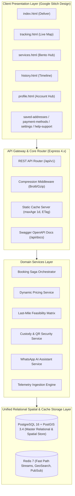
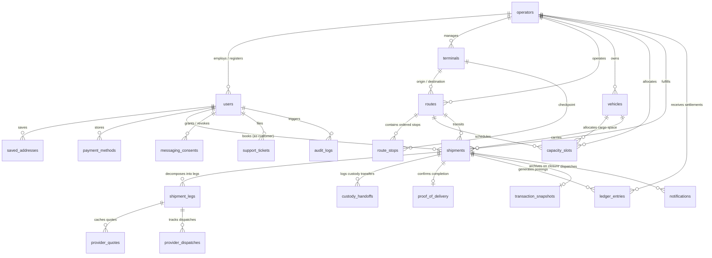
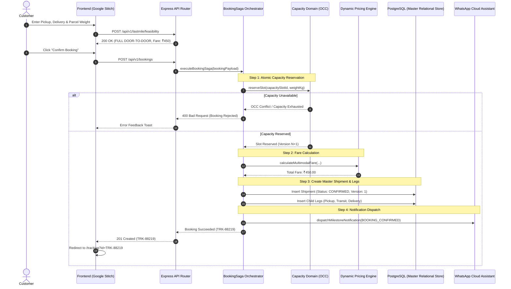
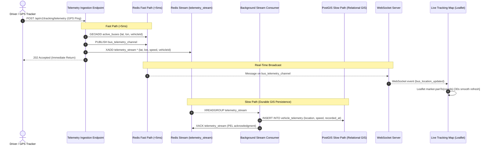
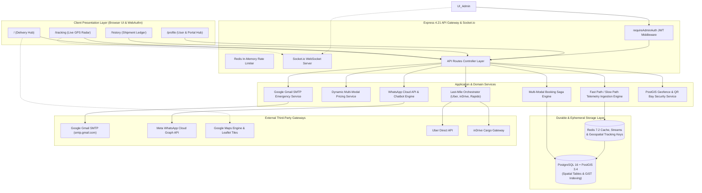
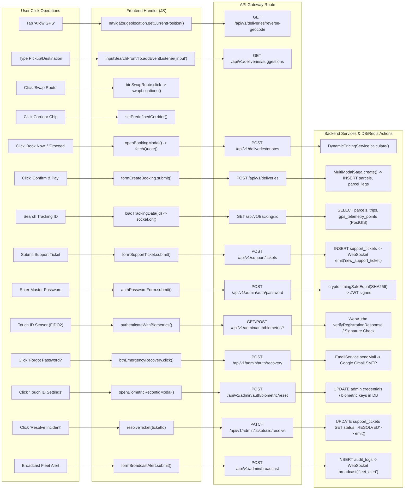
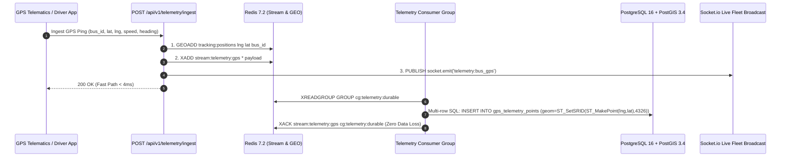
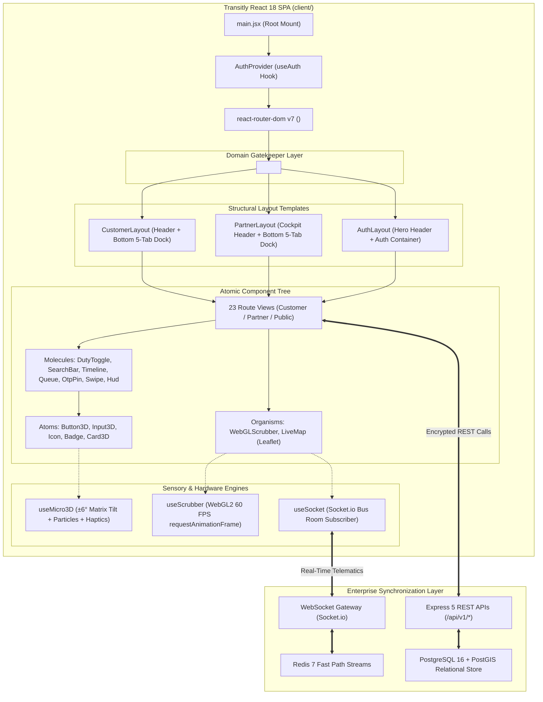

# Transitly — Master Project Documentation

> **Version:** 1.0.0  
> **Status:** Active Reference & Production Blueprint  
> **Date:** August 2026  
> **Repository:** `https://github.com/Anmo07/transitly`  
> **Source of Truth:** [PRD.md](file:///Users/anmoljangra/Documents/Project%20-%20Alphaa%20IT/PRD.md), [README.md](file:///Users/anmoljangra/Documents/Project%20-%20Alphaa%20IT/README.md), and [.agents/rules/development_guidelines.md](file:///Users/anmoljangra/Documents/Project%20-%20Alphaa%20IT/.agents/rules/development_guidelines.md)

---

## Table of Contents

1. [Executive Summary & System Vision](#1-executive-summary--system-vision)
2. [PRD & Functional Requirements Alignment](#2-prd--functional-requirements-alignment)
3. [System Architecture & Domain Model](#3-system-architecture--domain-model)
4. [Complete Codebase Directory Structure](#4-complete-codebase-directory-structure)
5. [Data Architecture & Master Schemas](#5-data-architecture--master-schemas)
6. [Comprehensive REST & WebSocket API Reference](#6-comprehensive-rest--websocket-api-reference)
7. [System Workflows & Sequence Diagrams](#7-system-workflows--sequence-diagrams)
8. [Frontend Design & Google Stitch Screens](#8-frontend-design--google-stitch-screens)
9. [Security, Cryptography & Chain of Custody](#9-security-cryptography--chain-of-custody)
10. [Deployment, Infrastructure & Containerization](#10-deployment-infrastructure--containerization)
11. [Quality Assurance & Verification Standards](#11-quality-assurance--verification-standards)
12. [Master Knowledge Graph & Operations Matrix](#12-master-knowledge-graph--operations-matrix)
13. [Modern Frontend Evolution — React.js SPA & 3D Architecture](#13-modern-frontend-evolution--reactjs-spa--3d-architecture)
14. [Encrypted & Secure Postman API Workflows](#14-encrypted--secure-postman-api-workflows)
15. [Database Visualization & Multi-Target Studio](#15-database-visualization--multi-target-studio)
16. [Expressive Domain Views & Schema Self-Documentation](#16-expressive-domain-views--schema-self-documentation)

---

## 1. Executive Summary & System Vision

**Transitly** is an enterprise-grade, JavaScript-based parcel logistics and capacity monetization platform. It bridges the gap between public transportation networks (e.g., State Express Transit, intercity bus fleets, regional transit authorities) and on-demand parcel logistics.

```
┌──────────────────────────────────────────────────────────────────────────────────┐
│                             TRANSITLY PLATFORM VISION                            │
│                                                                                  │
│   [Sender Doorstep] ──(First-Mile Partner)──► [ISBT Hub Terminal]               │
│                                                       │                          │
│                                           (Scheduled Bus Cargo)                  │
│                                           (Underutilized Bay)                    │
│                                                       ▼                          │
│   [Recipient Doorstep] ◄──(Last-Mile Partner)─── [Destination Terminal]         │
└──────────────────────────────────────────────────────────────────────────────────┘
```

### Core Business Objectives
- **Monetize Idle Cargo Capacity:** Convert scheduled public transport luggage bays into high-margin freight corridors without adding new vehicles to the road.
- **Dramatically Lower Logistics Fares:** Save customers up to 50% compared to traditional air/express couriers through scheduled intercity transit.
- **Provider-Neutral First/Last-Mile Integration:** Seamlessly orchestrate hyper-local partners (Uber Direct, Rapido, inDrive, regional riders) for complete door-to-door convenience.
- **High-Trust Cryptographic Chain of Custody:** Enforce HMAC-SHA256 QR seals, geofenced custody transitions, and dual-OTP handoffs.
- **Event-Driven Transparency:** Deliver real-time GPS telematics syncing every 30 seconds alongside 24/7 automated WhatsApp AI assistance.

---

## 2. PRD & Functional Requirements Alignment

The following matrix documents full traceability between the core requirements specified in [PRD.md](file:///Users/anmoljangra/Documents/Project%20-%20Alphaa%20IT/PRD.md) and their implementation in the codebase:

| PRD Section | Requirement Description | Implementation Module | Source File | Status |
| :--- | :--- | :--- | :--- | :--- |
| **§ Scope 1** | Parcel Booking & Capacity Matching | Booking Saga & Capacity Domain | [`src/sagas/bookingSaga.js`](file:///Users/anmoljangra/Documents/Project%20-%20Alphaa%20IT/src/sagas/bookingSaga.js) | ✅ Verified |
| **§ Scope 2** | Dynamic Fare Quoting & Route Pricing | Dynamic Pricing Engine | [`src/modules/pricing/pricingService.js`](file:///Users/anmoljangra/Documents/Project%20-%20Alphaa%20IT/src/modules/pricing/pricingService.js) | ✅ Verified |
| **§ Scope 3** | Dual-Path GPS Telemetry Ingestion | Redis Fast-Path & PostGIS Streams | [`src/modules/tracking/telemetryService.js`](file:///Users/anmoljangra/Documents/Project%20-%20Alphaa%20IT/src/modules/tracking/telemetryService.js) | ✅ Verified |
| **§ Scope 4** | Secure QR Seals & Geofenced Custody | Custody & Cryptographic Engine | [`src/utils/security.js`](file:///Users/anmoljangra/Documents/Project%20-%20Alphaa%20IT/src/utils/security.js) | ✅ Verified |
| **§ Scope 5** | Recipient OTP & Proof of Delivery | Delivery Evidence Module | [`src/models/ProofOfDelivery.js`](file:///Users/anmoljangra/Documents/Project%20-%20Alphaa%20IT/src/models/ProofOfDelivery.js) | ✅ Verified |
| **§ Scope 6** | Double-Entry Financial Settlements | Financial Ledger Module | [`src/models/LedgerEntry.js`](file:///Users/anmoljangra/Documents/Project%20-%20Alphaa%20IT/src/models/LedgerEntry.js) | ✅ Verified |
| **§ Scope 7** | Door-to-Door Last-Mile Orchestration | Dual Geolocation Feasibility Matrix | [`src/modules/lastMile/lastMileOrchestrator.js`](file:///Users/anmoljangra/Documents/Project%20-%20Alphaa%20IT/src/modules/lastMile/lastMileOrchestrator.js) | ✅ Verified |
| **§ Scope 8** | Event-Driven WhatsApp Assistant | WhatsApp Webhook & Cloud API Bot | [`src/modules/whatsapp/whatsappService.js`](file:///Users/anmol/Documents/Projects/transitly/src/modules/whatsapp/whatsappService.js) | ✅ Verified |
| **§ Scope 9** | Hardened Two-Step OTP Verification | NIST SP 800-63B OTP Engine & Audit | [`src/api/controllers/userController.js`](file:///Users/anmol/Documents/Projects/transitly/src/api/controllers/userController.js) | ✅ Verified |
| **§ Scope 10** | Dual-Layer Route Authorization Gate | Express Middleware & Client Gate | [`src/app.js`](file:///Users/anmol/Documents/Projects/transitly/src/app.js), [`public/js/common.js`](file:///Users/anmol/Documents/Projects/transitly/public/js/common.js) | ✅ Verified |
| **§ Scope 11** | Social Sign-On & Account Creation | Google & Apple OAuth, Anti-Injection | [`src/api/controllers/userController.js`](file:///Users/anmol/Documents/Projects/transitly/src/api/controllers/userController.js) | ✅ Verified |
| **§ Scope 12** | Legal Compliance & SEO Engine | Terms, Privacy, FAQ, Cookie Consent, Sitemap | [`public/privacy-policy.html`](file:///Users/anmol/Documents/Projects/transitly/public/privacy-policy.html), [`public/sitemap.svg`](file:///Users/anmol/Documents/Projects/transitly/public/sitemap.svg) | ✅ Verified |
| **§ Architecture** | Optimistic Concurrency Control (OCC) | State Machine & Version Tokens | [`src/models/Shipment.js`](file:///Users/anmol/Documents/Projects/transitly/src/models/Shipment.js) | ✅ Verified |
| **§ Architecture** | Immutable Closures & Snapshots | Transaction Snapshot Module | [`src/models/TransactionSnapshot.js`](file:///Users/anmol/Documents/Projects/transitly/src/models/TransactionSnapshot.js) | ✅ Verified |

---

## 3. System Architecture & Domain Model

Transitly follows a **Modular Domain-Driven Design (DDD)** architecture with asynchronous event-driven integration and dual-path telematics processing.



### Domain Module Boundaries

1. **Bookings Domain (`src/modules/bookings`, `src/sagas`):** Manages aggregate transaction state, lifecycle transitions, and OCC version bumps in PostgreSQL.
2. **Capacity Domain (`src/modules/capacity`, `src/models/CapacitySlot.js`):** Enforces atomic capacity reservation and release on vehicle schedules via PostgreSQL optimistic concurrency.
3. **Pricing Domain (`src/modules/pricing`):** Calculates multi-modal dynamic fares factoring in weight, volumetric mass, route distance, and peak-hour surcharges.
4. **Last-Mile Domain (`src/modules/lastMile`):** Evaluates sender-to-terminal and terminal-to-recipient feasibility across provider adapters (Uber Direct, Rapido, inDrive) and persists quotes and dispatch webhooks.
5. **Tracking Domain (`src/modules/tracking`, `src/websockets`):** Ingests driver GPS pings into a sub-5ms Redis Fast Path and syncs persistent GIS spatial data into the PostGIS slow path (`vehicle_telemetry`).
6. **Custody & Evidence Domain (`src/utils/security.js`, `src/models/CustodyHandoff.js`, `src/models/ProofOfDelivery.js`):** HMAC-SHA256 QR seals, geofence boundary checks, and timing-safe 6-digit delivery OTP verification.
7. **WhatsApp Assistant Domain (`src/modules/whatsapp`):** Handles Meta Cloud API webhooks, intent classification, consent verification (`messaging_consents`), and outbound dispatch queue (`notifications`).
8. **Settlements Domain (`src/models/LedgerEntry.js`, `src/models/TransactionSnapshot.js`):** Posts double-entry financial ledger journal entries (`ledger_entries`) and immutable SHA-256 archive snapshots (`transaction_snapshots`).

---

## 4. Complete Codebase Directory Structure

Transitly is architected as a **high-performance, dual-engine monorepo** uniting a **React 18 Single Page Application (SPA)**, an **Express.js & PostGIS backend**, **Leaflet cartography**, **Higgsfield 3D WebGL2 scrubbers**, and **Postman Cloud encrypted API workflows**:

```
Transitly/
├── Dockerfile                           # Multi-stage production container build (deps -> runner)
├── docker-compose.yml                   # Multi-container orchestration (app, db-init, redis, postgis)
├── netlify.toml                         # Netlify edge deployment configuration & SPA redirects
├── package.json                         # Node.js dependencies, 16 automated test suites, DB & 3D scripts
├── postcss.config.js                    # PostCSS pipeline for Tailwind CSS & Autoprefixer
├── render.yaml                          # Render cloud infrastructure-as-code specification
├── tailwind.config.js                   # Google Stitch design tokens (colors, fonts, 3D shadows)
├── vite.config.js                       # Vite 6 bundler config with dynamic base path resolution (/app)
├── PRD.md                               # Canonical Product Requirements Document
├── README.md                            # High-level architecture, quickstart & repository guide
│
├── client/                              # Modern React 18 Single Page Application (SPA)
│   ├── index.html                       # Vite HTML entrypoint with viewport & font imports
│   └── src/
│       ├── App.jsx                      # 23-route application router with <RoleRoute> gatekeeping
│       ├── index.css                    # Tailwind directives, glassmorphic styles & 3D layout containment
│       ├── main.jsx                     # React 18 concurrent root with BrowserRouter & AuthProvider
│       │
│       ├── components/                  # Atomic Design Component Hierarchy
│       │   ├── atoms/                   # Indivisible primitive UI elements with 3D tactile physics
│       │   │   ├── Badge.jsx            # Status pills (Online, In-Transit, Surge, Neutral) with pulse
│       │   │   ├── Button3D.jsx         # Tactile 3D button with variant styles & haptic depression
│       │   │   ├── Card3D.jsx           # Glassmorphic card with CSS layout containment & reactive tilt
│       │   │   ├── Icon.jsx             # Material Symbols Outlined wrapper with fill & badge support
│       │   │   └── Input3D.jsx          # Animated floating-label inputs with glowing focus borders
│       │   │
│       │   ├── molecules/               # Multi-atom functional composites
│       │   │   ├── CargoBayModal.jsx    # Undercarriage 3D stowage schematic & tamper seal inspector
│       │   │   ├── CorridorTimeline.jsx # Visual highway corridor stage sequence & real-time checkpoints
│       │   │   ├── DispatchQueue.jsx    # Spatial dispatch offer with 30s countdown TTL bar
│       │   │   ├── DutyToggle.jsx       # Driver ONLINE/OFFLINE state machine switch with haptics
│       │   │   ├── OtpPinInput.jsx      # 4-digit auto-advancing delivery PIN keypad with haptics
│       │   │   ├── SearchBar.jsx        # Terminal auto-suggest with HTML5 Geolocation API integration
│       │   │   ├── SwipeConfirm.jsx     # Touch & drag swipe-to-confirm delivery slider with haptics
│       │   │   └── TelematicsHud.jsx    # Live highway cruiser HUD, speed gauge, and progress bar
│       │   │
│       │   ├── organisms/               # Complex autonomous domain widgets
│       │   │   ├── LiveMap.jsx          # Leaflet cartography with Google tiles & PostGIS vehicle pins
│       │   │   └── WebGLScrubber.jsx    # 60 FPS hardware-accelerated canvas cargo-bay frame scrubber
│       │   │
│       │   └── layouts/                 # Structural templates with slot injection
│       │       ├── AuthLayout.jsx       # Public auth layout with mesh background & branding card
│       │       ├── CustomerLayout.jsx   # Top header, main slot, and bottom 5-tab customer navigation
│       │       └── PartnerLayout.jsx    # Cockpit header (online pill + wallet) & 5-tab rider dock
│       │
│       ├── hooks/                       # Custom React Sensory & Telemetry Hooks
│       │   ├── useAuth.jsx              # Session state, JWT storage, role gatekeeping & switchRole()
│       │   ├── useMicro3D.js            # ±6° perspective tilt, zero-reflow transforms & particle emitter
│       │   ├── useScrubber.js           # WebGL2 requestAnimationFrame 60 FPS frame interpolation
│       │   └── useSocket.js             # Socket.io client subscribing to highway bus telemetry rooms
│       │
│       └── pages/                       # Complete 23 Application Domain Views
│           ├── Customer Domain (Protected)
│           │   ├── Home.jsx             # Instant booking, weight calculator & corridor selection
│           │   ├── Tracking.jsx         # Live highway telematics radar, HUD & PIN delivery modal
│           │   ├── Services.jsx         # Express corridor rate tiers & volume discounts
│           │   ├── History.jsx          # Consignment ledger, status filters & tax invoices
│           │   ├── Profile.jsx          # KYC credentials, emergency contact & preferences
│           │   ├── SavedAddresses.jsx   # Saved delivery addresses & bus terminals
│           │   ├── PaymentMethods.jsx   # Transitly Wallet, UPI VPAs & card tokens
│           │   ├── Notifications.jsx    # Live telematics feed & arrival notifications
│           │   ├── HelpSupport.jsx      # 24/7 helpline, ticket submission & FAQ modal
│           │   └── Settings.jsx         # DPDP Act (2023) privacy consent & data controls
│           ├── Delivery Partner Domain (Protected)
│           │   ├── RiderDashboard.jsx   # Driver cockpit, duty switch, battery & earnings HUD
│           │   ├── RiderMapTrips.jsx    # Active navigation, turn-by-turn routing & geofenced PIN
│           │   ├── RiderRequests.jsx    # Spatial dispatch queue & high-payout priority offers
│           │   ├── RiderEarnings.jsx    # Double-entry partner wallet & instant IMPS cash-out
│           │   └── RiderProfile.jsx     # Vehicle credentials, safety checklist & SOS trigger
│           └── Public & Authentication Domain
│               ├── DeliveryPartnerLanding.jsx # Partner recruitment portal & vehicle earnings estimator
│               ├── Login.jsx            # Two-step passcode & SMS verification flow
│               ├── Signup.jsx           # User profile registration & role selection
│               ├── Faq.jsx              # Accordion knowledge base
│               ├── PrivacyPolicy.jsx    # DPDP Act (2023) privacy conditions
│               ├── Terms.jsx            # Conditions of carriage & prohibited cargo
│               ├── NotFound.jsx         # 404 error page
│               └── VisualSitemap.jsx    # Interactive 23-view architecture sitemap
│
├── docs/                                # Enterprise Technical Documentation & API Specifications
│   ├── PROJECT_DOCUMENTATION.md         # Master architectural documentation & operations manual (this file)
│   ├── TRD.md                           # Technical Requirements Document & engineering constraints
│   ├── POSTMAN_SECURITY_WORKFLOWS.md    # Postman Cloud encrypted workflow specification & guide
│   ├── POSTGRES_TERMINAL_GUIDE.md       # Interactive PostgreSQL & PostGIS CLI terminal runbook
│   ├── stitch_design_prompts.md         # Google Stitch UI/UX design specifications & prompt catalog
│   ├── transitly_postman_collection.json # Versioned Postman v2.1.0 Collection (32 encrypted requests)
│   └── transitly_postman_environment.json # Versioned Postman Environment (secret variables)
│
├── public/                              # Static Frontend Fallback & Production Distribution
│   ├── _redirects                       # Netlify SPA routing rules & API proxying
│   ├── robots.txt                       # Search engine crawler policies
│   ├── sitemap.mmd                      # Mermaid format visual sitemap
│   ├── sitemap.svg                      # Scalable Vector Graphics platform topology diagram
│   │
│   ├── assets/                          # Static Media & 3D Assets
│   │   └── 3d/                          # Pre-rendered Higgsfield WebGL2 frame sequences
│   │       ├── 3d-bus-highway/          # 75 WebP frames (1080p highway cruiser sweep)
│   │       ├── 3d-cargo-bay/            # 75 WebP frames (undercarriage bay inspection)
│   │       ├── 3d-delivery-van/         # 75 WebP frames (electric cargo van rotation)
│   │       └── 3d-terminal-hub/         # 75 WebP frames (ISBT Kashmiri Gate terminal sweep)
│   │
│   ├── dist/                            # Production Vite React SPA compiled distribution
│   │   ├── index.html                   # Compiled root HTML mount point
│   │   └── assets/                      # Production minified JS bundles & CSS bundles
│   │
│   ├── pages/                           # 23 Static Semantic HTML Templates (SSR Fallback)
│   │   ├── 404.html                     # Error 404 fallback page
│   │   ├── delivery-partner.html        # Partner recruitment landing
│   │   ├── faq.html                     # Interactive FAQ hub
│   │   ├── help-support.html            # Customer support & ticketing
│   │   ├── history.html                 # Delivery history ledger
│   │   ├── index.html                   # Primary booking & delivery screen
│   │   ├── login.html                   # Hardened OTP login
│   │   ├── notifications.html           # Live telematics notification feed
│   │   ├── payment-methods.html         # Saved cards & UPI VPAs
│   │   ├── privacy-policy.html          # DPDP Act privacy terms
│   │   ├── profile.html                 # Customer identity & preferences
│   │   ├── rider-dashboard.html         # Driver cockpit
│   │   ├── rider-earnings.html          # Driver earnings ledger
│   │   ├── rider-map-trips.html         # Active driver navigation
│   │   ├── rider-profile.html           # Driver vehicle & KYC profile
│   │   ├── rider-requests.html          # Spatial dispatch queue
│   │   ├── saved-addresses.html         # Saved customer addresses
│   │   ├── services.html                # Cargo services bento grid
│   │   ├── settings.html                # App preferences & consent
│   │   ├── signup.html                  # User account creation
│   │   ├── terms.html                   # Shipper terms & conditions
│   │   ├── tracking.html                # Telematics radar & tracking
│   │   └── visual-sitemap.html          # Visual platform topology
│   │
│   ├── css/                             # Modular CSS stylesheets for static pages
│   └── js/                              # Modular ES controllers for static pages
│
├── scripts/                             # Operational CLI & Developer Automation Tooling
│   ├── db-studio.js                     # Browser-based DB Studio (Local Postgres + Neon Cloud switcher)
│   ├── generate-3d-scrubbers.js         # Video-to-frame WebGL2 sequence generator
│   ├── generate-demo-frames.js          # Procedural canvas frame generator for 3D scrubber demos
│   ├── generate-postman-artifacts.js    # Postman Cloud SDK synchronizer & artifact exporter
│   └── ingest-higgsfield-video.js       # Higgsfield AI video frame-extraction pipeline
│
├── src/                                 # Enterprise Express & PostGIS Backend
│   ├── app.js                           # Express application setup, security headers, compression & static routing
│   ├── server.js                        # HTTP & WebSocket (Socket.io) server entrypoint
│   │
│   ├── api/                             # REST API Specification & Controller Layer
│   │   ├── swagger.yaml                 # OpenAPI 3.0 canonical specification (/api/docs)
│   │   └── routes/
│   │       └── apiRoutes.js             # Consolidated /api/v1 endpoints across 8 business domains
│   │
│   ├── config/                          # Centralized Infrastructure Connection Pools
│   │   ├── postgres.js                  # PostgreSQL/PostGIS connection pool (pg.Pool with SSL configuration)
│   │   └── redis.js                     # Redis client connection (ioredis Fast Path stream manager)
│   │
│   ├── db/                              # Database Initialization, Migrations & Seed Corridors
│   │   ├── initDb.js                    # Automated migration runner for Local and Cloud Neon
│   │   ├── viewDb.js                    # CLI diagnostic schema & data inspector
│   │   ├── migrations/
│   │   │   ├── 000_master_schema.sql    # Base relational DDL & initial table definitions
│   │   │   ├── 001_master_schema.sql    # DDD evolution: operators, terminals, quotes, consents, audit logs
│   │   │   ├── 002_delivery_partner_schema.sql # Driver shifts, vehicle specs, payouts & geofenced PINs
│   │   │   └── 003_expressive_views_and_metadata.sql # 7 business views & schema self-documentation
│   │   ├── queries/
│   │   │   └── inspection_queries.sql   # Diagnostic SQL suite with PostGIS spatial calculations
│   │   └── seeds/
│   │       ├── 001_seed_master_data.sql # Seed data: users, addresses, DTC vehicles & routes
│   │       └── 002_haryana_roadways_routes.sql # Official Haryana Roadways 5 intercity corridors & stops
│   │
│   ├── events/                          # Event-Driven Architecture Contracts
│   │   ├── contracts.js                 # Canonical event schema definitions (v1)
│   │   └── eventEnvelope.js             # CloudEvents-compliant event envelope generator & validator
│   │
│   ├── models/                          # PostgreSQL Data Access Objects (DAOs) with PostGIS
│   │   ├── Shipment.js                  # Master Shipment Aggregate Root (OCC + PostGIS)
│   │   ├── ShipmentLeg.js               # Multi-modal child legs (Pickup, Highway Transit, Last-Mile Delivery)
│   │   ├── CapacitySlot.js              # Cargo capacity reservation model (Atomic OCC)
│   │   ├── RouteTransaction.js          # Route versioning & PostGIS LineString corridor geometries
│   │   ├── CustodyHandoff.js            # Immutable chain of custody records with tamper seal codes
│   │   ├── ProofOfDelivery.js           # Digital POD evidence, photos & timing-safe OTP verification
│   │   ├── TransactionSnapshot.js       # Closed transaction immutable SHA-256 archive
│   │   ├── LedgerEntry.js               # Double-entry accounting journal for rider payouts & platform take
│   │   ├── User.js                      # Multi-tenant user & identity model (Customer, Partner, Operator)
│   │   ├── Vehicle.js                   # Fleet bus registration & undercarriage cargo specs
│   │   ├── Address.js                   # User saved addresses with PostGIS Point geometries
│   │   ├── PaymentMethod.js             # User saved payment methods & tokenized cards
│   │   ├── Rider.js                     # Delivery partner cockpit telemetry, rating & shifts
│   │   └── SupportTicket.js             # Customer support tickets, claims & resolutions
│   │
│   ├── modules/                         # Modular Business Logic Domains
│   │   ├── bookings/                    # Booking validation & state machine transitions
│   │   ├── capacity/                    # Slot management & OCC capacity reservation
│   │   ├── lastMile/                    # LastMileOrchestrator & provider adapters (Uber, Rapido, inDrive)
│   │   ├── pricing/                     # DynamicPricingService & multimodal fare calculation
│   │   ├── tracking/                    # TelemetryService (Fast Path Redis + PostGIS Slow Path)
│   │   ├── whatsapp/                    # WhatsAppService, bot intents & Meta Cloud API webhooks
│   │   └── settlements/                 # Financial ledger & idempotent partner payouts
│   │
│   ├── sagas/                           # Distributed Workflow Sagas
│   │   └── bookingSaga.js               # Multimodal booking saga with automated compensation rollback
│   │
│   ├── utils/                           # Security, Cryptography & Geofence Utilities
│   │   └── security.js                  # HMAC-SHA256 QR seals, constant-time OTP verify, PostGIS geofencing
│   │
│   └── websockets/                      # Real-time WebSocket Telemetry Layer
│       └── trackingSocket.js            # Live GPS broadcast via Redis pub/sub to room channels
│
└── tests/                               # Comprehensive Automated Test Suites (16 Master Suites)
    ├── security.test.js                 # HMAC-SHA256 OTP, QR seal, and Haversine geofence tests
    ├── architecture.test.js             # Optimistic Concurrency Control, State Machine, and Saga tests
    ├── lastMile.test.js                 # Provider adapters & Last-Mile Feasibility Matrix tests
    ├── whatsapp.test.js                 # WhatsApp templates, conversational bot intents & PII redaction
    ├── telemetry.test.js                # Fast Path Redis stream, PostGIS bulk SQL & durable consumers
    ├── schema.test.js                   # PostGIS DDL, spatial columns & GIST spatial indexing
    ├── haryanaRoadways.test.js          # Haryana Roadways Express corridors & Meta webhook handshakes
    ├── adminAuth.test.js                # Authentication security & RBAC route gates
    ├── legalAndSeoRoutes.test.js        # Privacy, Terms, FAQ, Sitemap, Cookie consent & SEO canonicals
    ├── authLanding.test.js              # Two-step OTP hardening, route gates, SSO & anti-injection
    ├── proofOfDelivery.test.js          # Digital Proof of Delivery, signatures, photos & PostGIS coordinates
    ├── riderWorkflow.test.js            # Driver duty state machine, GPS updates & assigned tasks
    ├── deliveryPartnerSuite.test.js     # Cockpit metrics, 30s TTL dispatch, 4-digit PIN & IMPS payouts
    ├── trackingAndNotificationInTransit.test.js # In-transit notification suppression & map recalibration
    ├── reactMigrationVerification.test.js # React SPA mounting, deep routing, 23 views & 3D CSS
    └── postmanWorkflow.test.js          # Postman Cloud 32-request synchronization & security assertions
```

---

## 5. Data Architecture & Master Schemas (PostgreSQL 16 + PostGIS 3.4)

Transitly is architected on a **unified master relational and spatial database** powered by **PostgreSQL 16+** and **PostGIS 3.4+** (SRID 4326 - WGS 84). All transactions, multi-modal legs, telemetry streams, chain of custody logs, double-entry financial journals, and spatial geofences are natively persisted and indexed in PostgreSQL.

The schema is divided into **6 logical Domain-Driven Design (DDD) modules** implemented across `src/db/migrations/000_master_schema.sql` and `src/db/migrations/001_master_schema.sql`.



---

### Module 1: System Extensions, Enums & IAM (Identity & Access Management)

Enforces role-based security, multi-tenant authority isolation, and customer credential/address profiles.

#### 1. System Extensions & Domain Enums
- **Extensions:** `postgis` (spatial computing), `pgcrypto` (cryptographic hashing & random generation), `uuid-ossp` (UUID v4 identifiers).
- **Custom Enum Types:**
  - `user_role`: `'CUSTOMER'`, `'OPERATOR'`, `'OPERATIONS_MANAGER'`, `'DELIVERY_PARTNER'`, `'DRIVER'`, `'ADMIN'`
  - `shipment_status`: `'OPEN'`, `'CONFIRMED'`, `'IN_TRANSIT'`, `'DELIVERED'`, `'CLOSED'`, `'CANCELLED'`, `'DISPUTED'`
  - `leg_type_enum`: `'PICKUP_LAST_MILE'`, `'TRANSIT'`, `'DELIVERY_LAST_MILE'`
  - `leg_status_enum`: `'PENDING'`, `'QUOTED'`, `'DISPATCHED'`, `'COLLECTED'`, `'IN_TRANSIT'`, `'COMPLETED'`, `'EXCEPTION'`, `'CANCELLED'`
  - `seal_status_enum`: `'INTACT'`, `'DAMAGED'`, `'TAMPERED'`, `'REPLACED'`
  - `ledger_entry_type_enum`: `'SHIPMENT_REVENUE'`, `'OPERATOR_EARNING'`, `'PARTNER_COMMISSION'`, `'PLATFORM_FEE'`, `'REFUND'`, `'DISPUTE_ADJUSTMENT'`

#### 2. Master Tables & Schemas
- **`operators`**: First-class multi-tenant transit authority entities with UUID, E.164 phone check (`contact_phone ~ '^\+[1-9]\d{1,14}$'`), commission rates, and JSONB configuration settings (`autoAcceptBookings`, `maxCargoCapacityRatio`).
- **`users`**: Master user identity table supporting OAuth/JWT claims, E.164 phone numbers, tenant operator foreign keys (`operator_id REFERENCES operators(id)`), roles, and customer preferences JSONB.
- **`saved_addresses`**: Customer saved pickup and delivery addresses containing geocoded coordinates `latitude`, `longitude`, and spatial point geometry `geom GEOMETRY(Point, 4326)` indexed with GIST.
- **`payment_methods`**: Saved customer payment profiles supporting Card tokenization, UPI Virtual Payment Addresses (VPAs), and digital wallets.

---

### Module 2: Transit Network Infrastructure (Spatial/GIS)

Persists geocoded terminals, intercity corridor routes, and ordered stop sequences conforming to OpenGIS & OGC standards.

- **`terminals`**: ISBT depots, transit stations, and logistics hubs storing location `GEOMETRY(Point, 4326)`, optional boundary `geofence_polygon GEOMETRY(Polygon, 4326)`, and `geofence_radius_meters` (default: 250m) with GIST spatial indexing.
- **`route_transactions`**: Corridors open for update and closed for modification (OCP versioning) tracking `logical_route_id`, `version`, `path GEOMETRY(LineString, 4326)`, origin/destination terminal foreign keys, and active flags (`is_latest`).
- **`route_stops`**: Ordered transit checkpoints along corridor routes with `sequence_order`, stop name, offset time in minutes, and `geom GEOMETRY(Point, 4326)`, constrained by a compound unique index `uq_route_stop_sequence (route_transaction_id, sequence_order)`.

---

### Module 3: Fleet & Capacity Management (Atomic OCC)

Enforces atomic inventory allocation and physical vehicle capacity constraints without overbooking.

- **`vehicles`**: Fleet buses, minibuses, and cargo vans with unique registration numbers, cargo capacity in kg (`cargo_capacity_kg`), volumetric limit (`cargo_volume_m3`), and last known spatial coordinate `last_geom GEOMETRY(Point, 4326)`.
- **`capacity_slots`**: Date-specific inventory quotas linking vehicle, route, departure time, and date.
  - **Optimistic Concurrency Control (OCC):** Every reservation updates version: `UPDATE capacity_slots SET reserved_weight_kg = reserved_weight_kg + $w, available_weight_kg = available_weight_kg - $w, version = version + 1 WHERE id = $id AND version = $expectedVersion AND available_weight_kg >= $w`.
  - **Balance Invariant Check:** Enforced by PostgreSQL constraint `chk_capacity_balance CHECK (available_weight_kg + reserved_weight_kg <= total_capacity_kg)`.

---

### Module 4: Multimodal Shipments & Last-Mile Orchestration

Represents the master transaction aggregate root and provider-neutral third-party last-mile execution.

- **`shipments`**: Master transaction aggregate root tracking sender/recipient E.164 phones, parcel weight/dimensions (JSONB), dynamic pricing, state machine transitions, PostGIS spatial coordinates (`pickup_geom`, `delivery_geom`, `origin_geom`, `dest_geom`), and cryptographic verification tokens:
  - **HMAC-SHA256 QR Seal:** `qr_seal_code`, `qr_seal_hash`, and tamper flag `qr_seal_tampered`.
  - **Salted SHA-256 Recipient OTP:** `delivery_otp_hash`, `delivery_otp_salt`, and verification flag `delivery_otp_verified`.
- **`shipment_legs`**: Parent-child multimodal leg hierarchy mapping `PICKUP_LAST_MILE` (Sender $\rightarrow$ Origin Terminal), `TRANSIT` (Origin Terminal $\rightarrow$ Destination Terminal), and `DELIVERY_LAST_MILE` (Destination Terminal $\rightarrow$ Recipient).
- **`provider_quotes`**: Caches real-time quotes returned by external provider adapters (Uber Direct, Rapido, inDrive) with expiration timestamps (`expires_at`) and provider capabilities JSONB.
- **`provider_dispatches`**: Isolates provider dispatch lifecycle webhooks, tracking URLs, and unique idempotency keys (`idempotency_key UNIQUE`) to prevent duplicate dispatches.

---

### Module 5: Real-Time Telemetry & Custody Operations

Handles sub-second spatial tracking, chain-of-custody handoffs, and digital proof-of-delivery evidence.

- **`vehicle_telemetry`**: Persistent slow-path time-series GPS logging with spatial point `geom GEOMETRY(Point, 4326)` indexed with GIST, speed, heading, accuracy in meters, and compound B-tree index `(vehicle_id, ping_timestamp DESC)`.
- **`custody_handoffs`**: Tamper-evident append-only chain of custody logs capturing every transfer between sender, riders, terminal agents, bus drivers, and recipients with QR seal status, digital signature URLs, and PostGIS geofence distance verification (`is_within_geofence`, `distance_meters`).
- **`proof_of_delivery`**: Verification evidence linking recipient name, phone, verified OTP status, verified QR seal code, signature URL, photograph URL, and PostGIS geofence validated location `location_geom GEOMETRY(Point, 4326)`.

---

### Module 6: Settlements, Audits & Notifications

Guarantees immutable accounting, compliance auditing, and multi-channel customer communications.

- **`ledger_entries`**: Immutable double-entry financial ledger journal recording credit and debit postings (`SHIPMENT_REVENUE`, `OPERATOR_EARNING`, `PARTNER_COMMISSION`, `PLATFORM_FEE`, `REFUND`) ensuring zero-balance trial balance accounting across multi-tenant operators.
- **`transaction_snapshots`**: Read-only immutable archive created upon shipment closure containing full transaction JSON, POD evidence, total handoff count, and cryptographic SHA-256 integrity digest (`snapshot_hash`).
- **`messaging_consents`**: WhatsApp & SMS customer consent tracking with E.164 phone numbers and `OPTED_IN` / `OPTED_OUT` state transitions.
- **`notifications`**: Outbound notification queue and dispatch history tracking channels (`WHATSAPP`, `SMS`, `EMAIL`, `PUSH`), template names, delivery statuses (`QUEUED`, `SENT`, `DELIVERED`, `FAILED`), and error logs.
- **`support_tickets`**: Customer and operator support tickets with priority ranking (`LOW`, `MEDIUM`, `HIGH`, `URGENT`), shipment references, and resolution timestamps.
- **`audit_logs`**: Administrative security audit trail recording actor user IDs, roles, administrative actions (`FORCE_CLOSE_SHIPMENT`, `UPDATE_CAPACITY_OVERRIDE`), IP addresses, user agents, and context payloads for administrative operations.

---

### Complete Database Relations & Index Reference

The PostgreSQL database maintains **23 base relations and 53 active indexes** (including PostGIS GIST spatial indexes on SRID 4326):

| Relation Name | Module | Primary Key | Key Indexes & Spatial Acceleration |
| :--- | :--- | :--- | :--- |
| `operators` | IAM | `id` (BIGSERIAL) | `UNIQUE(code)`, `UNIQUE(operator_uuid)`, `UNIQUE(license_number)` |
| `users` | IAM | `id` (BIGSERIAL) | `UNIQUE(email)`, `UNIQUE(user_uuid)`, `INDEX(role)`, `INDEX(phone)` |
| `saved_addresses` | IAM | `id` (BIGSERIAL) | `INDEX(user_id)`, `GIST(geom)` |
| `payment_methods` | IAM | `id` (BIGSERIAL) | `INDEX(user_id)` |
| `terminals` | Spatial GIS | `id` (BIGSERIAL) | `UNIQUE(terminal_code)`, `GIST(location)`, `GIST(geofence_polygon)` |
| `route_transactions` | Spatial GIS | `id` (BIGSERIAL) | `UNIQUE(logical_route_id, version)`, `GIST(path)`, `GIST(origin_geom)`, `GIST(destination_geom)` |
| `route_stops` | Spatial GIS | `id` (BIGSERIAL) | `UNIQUE(route_transaction_id, sequence_order)`, `GIST(location)`, `GIST(geom)` |
| `vehicles` | Fleet | `id` (BIGSERIAL) | `UNIQUE(registration)`, `INDEX(operator_id)`, `GIST(last_geom)` |
| `capacity_slots` | Fleet | `id` (BIGSERIAL) | `UNIQUE(vehicle_id, slot_date)`, `INDEX(route_transaction_id, slot_date)`, `INDEX(vehicle_id, slot_date, version)` |
| `shipments` | Multimodal | `id` (BIGSERIAL) | `UNIQUE(tracking_id)`, `GIST(origin_geom)`, `GIST(dest_geom)`, `GIST(pickup_geom)`, `GIST(delivery_geom)` |
| `shipment_legs` | Multimodal | `id` (BIGSERIAL) | `INDEX(shipment_id, leg_type)`, `GIST(pickup_geom)`, `GIST(dropoff_geom)` |
| `provider_quotes` | Multimodal | `id` (BIGSERIAL) | `INDEX(shipment_leg_id)` |
| `provider_dispatches` | Multimodal | `id` (BIGSERIAL) | `UNIQUE(idempotency_key)`, `INDEX(external_delivery_id)`, `INDEX(shipment_leg_id)` |
| `vehicle_telemetry` | Telemetry | `id` (BIGSERIAL) | `GIST(geom)`, `INDEX(vehicle_id, ping_timestamp DESC)`, `INDEX(operator_id, ping_timestamp DESC)` |
| `custody_handoffs` | Telemetry | `id` (BIGSERIAL) | `INDEX(shipment_id, handoff_timestamp)`, `GIST(location_geom)` |
| `proof_of_delivery` | Telemetry | `id` (BIGSERIAL) | `UNIQUE(shipment_id)`, `GIST(location_geom)` |
| `ledger_entries` | Settlements | `id` (BIGSERIAL) | `INDEX(operator_id, posted_at)`, `INDEX(shipment_id)` |
| `transaction_snapshots` | Settlements | `id` (BIGSERIAL) | `UNIQUE(shipment_id)`, `INDEX(operator_id)` |
| `messaging_consents` | Notifications | `id` (BIGSERIAL) | `INDEX(phone_e164, status)`, `INDEX(user_id)` |
| `notifications` | Notifications | `id` (BIGSERIAL) | `INDEX(shipment_id)`, `INDEX(status, channel)`, `INDEX(user_id)` |
| `support_tickets` | Support | `id` (BIGSERIAL) | `INDEX(user_id)`, `INDEX(status)` |
| `audit_logs` | Audit | `id` (BIGSERIAL) | `INDEX(actor_user_id, created_at DESC)`, `INDEX(resource_type, resource_id)`, `INDEX(created_at DESC)` |

## 6. Comprehensive REST & WebSocket API Reference

The platform publishes an OpenAPI 3.0 compliant API interactive via Swagger UI at `/api/docs`.

### 1. Multimodal Booking API (`POST /api/v1/bookings`)

Executes a distributed Saga: validates booking payload, checks capacity using atomic OCC reservation, computes dynamic fares, registers child legs, generates tamper-evident QR seal & OTP, and dispatches WhatsApp notification.

- **URL:** `/api/v1/bookings`
- **Method:** `POST`
- **Headers:** `Content-Type: application/json`
- **Request Body:**
```json
{
  "operatorId": "10",
  "routeId": "10",
  "capacitySlotId": "10",
  "sender": {
    "name": "Aarav Sharma",
    "phone": "+919876543210",
    "address": "Connaught Place, New Delhi"
  },
  "recipient": {
    "name": "Rohan Verma",
    "phone": "+919876543211",
    "address": "Sector 17, Chandigarh"
  },
  "weightKg": 5.0
}
```
- **Response (201 Created):**
```json
{
  "status": "success",
  "data": {
    "shipment": {
      "trackingId": "TRK-88219",
      "status": "CONFIRMED",
      "version": 1,
      "qrSeal": "SEAL-TRK-88219-94B8",
      "pricing": {
        "baseFare": 120.00,
        "totalFare": 450.00
      },
      "assignedBus": {
        "vehicleId": "Fleet Bus #402 (HR-55-AB-1234)",
        "corridorName": "Delhi ➔ Chandigarh (GT Road)",
        "cargoBay": "Bay B2 • QR Sealed"
      }
    }
  }
}
```

---

### 2. Dual Feasibility Evaluation API (`POST /api/v1/lastmile/feasibility`)

Evaluates the sender pickup leg and receiver delivery leg independently against active provider adapters.

- **URL:** `/api/v1/lastmile/feasibility`
- **Method:** `POST`
- **Request Body:**
```json
{
  "senderAddress": { "latitude": 28.6315, "longitude": 77.2167 },
  "receiverAddress": { "latitude": 30.7410, "longitude": 76.7790 },
  "originTerminal": { "name": "ISBT Delhi", "latitude": 28.6675, "longitude": 77.2285 },
  "destinationTerminal": { "name": "ISBT Chandigarh", "latitude": 30.7410, "longitude": 76.7790 },
  "parcel": { "weightKg": 5.0 }
}
```
- **Response (200 OK):**
```json
{
  "status": "success",
  "data": {
    "customerExperience": "FULL DOOR-TO-DOOR",
    "customerMessage": "Uber Direct Pickup ➔ Express Public Bus ➔ Rapido Delivery",
    "pickupLeg": {
      "feasible": true,
      "provider": "UBER_DIRECT",
      "estimatedCost": 80.00,
      "etaMinutes": 25
    },
    "transitLeg": {
      "feasible": true,
      "provider": "STATE_EXPRESS_BUS",
      "estimatedCost": 120.00,
      "etaMinutes": 240
    },
    "deliveryLeg": {
      "feasible": true,
      "provider": "RAPIDO",
      "estimatedCost": 60.00,
      "etaMinutes": 30
    },
    "totalEstimatedFare": 450.00
  }
}
```

---

### 3. Fast-Path GPS Telemetry Ingestion (`POST /api/v1/tracking/telemetry`)

Accepts driver GPS pings in sub-5ms using Redis Fast Path (`GEOADD` + Redis Stream `XADD` + `PUBLISH`).

- **URL:** `/api/v1/tracking/telemetry`
- **Method:** `POST`
- **Request Body:**
```json
{
  "vehicleId": "HR-55-AB-1234",
  "operatorId": "HR-ROADWAYS",
  "latitude": 28.9931,
  "longitude": 77.0151,
  "speedKmh": 64.0,
  "heading": 350.0
}
```
- **Response (202 Accepted):**
```json
{
  "status": "accepted",
  "message": "Telemetry queued for spatial persistence"
}
```

---

### 4. Shipment Details & Child Legs API (`GET /api/v1/shipments/:trackingId`)

- **URL:** `/api/v1/shipments/TRK-88219`
- **Method:** `GET`
- **Response (200 OK):** Returns shipment details, assigned corridor, real-time status, and child legs.

---

### 5. Delivery OTP Verification API (`POST /api/v1/custody/verify-otp`)

- **URL:** `/api/v1/custody/verify-otp`
- **Method:** `POST`
- **Request Body:** `{ "trackingId": "TRK-88219", "inputOtp": "492817", "recipientName": "Rohan Verma" }`
- **Response (200 OK):** Validates cryptographic timing-safe OTP and closes custody chain.

---

### 6. WhatsApp Cloud API Webhook (`POST /api/v1/whatsapp/webhook`)

- **URL:** `/api/v1/whatsapp/webhook`
- **Method:** `POST`
- **Request Body:** Inbound customer WhatsApp text or button payload. Automatically redacts raw driver GPS and internal data before returning customer tracking updates.

---

### 7. User Authentication — Dispatch Verification OTP (`POST /api/v1/auth/otp/send`)

Dispatches a cryptographically secure, single-use 6-digit OTP code to an E.164 phone number or email address via SMS, WhatsApp, or Email.

- **URL:** `/api/v1/auth/otp/send`
- **Method:** `POST`
- **Security Controls:**
  - **Purpose-Binding:** Bound to requested purpose (`login`, `signup`, `reset_password`, `confirm_payment`).
  - **Destination Rate Limit:** Max 5 sends/hour per phone/email.
  - **IP Rate Limit:** Max 10 sends/hour per network IP.
  - **Exponential Backoff:** Escalating cooldown: 30s → 60s → 120s → 300s. Returns `HTTP 429` with `retryAfterSeconds` if breached.
  - **Data Sanitization:** Strict whitelist regex rejecting SQLi, XSS, and control characters.
- **Request Body:**
```json
{
  "fullName": "Alex Morgan",
  "identifier": "+919876543210",
  "channel": "sms",
  "purpose": "login"
}
```
- **Response (200 OK):**
```json
{
  "status": "success",
  "message": "A 6-digit verification code has been dispatched to +919876543210.",
  "data": {
    "identifier": "+919876543210",
    "channel": "sms",
    "purpose": "login",
    "expiresInSeconds": 120
  }
}
```

---

### 8. User Authentication — Verify OTP & Issue Session Token (`POST /api/v1/auth/otp/verify`)

Verifies a 6-digit verification code against the active purpose-bound OTP record using constant-time hash comparison (`crypto.timingSafeEqual`).

- **URL:** `/api/v1/auth/otp/verify`
- **Method:** `POST`
- **Security Controls:**
  - **Attempt Tracking & Lockout:** Max 5 failed attempts per OTP. On the 5th failed attempt, the code is auto-revoked and the server responds with `HTTP 423 Locked`.
  - **Single-Use Invalidation:** OTP record is deleted immediately upon successful verification.
  - **Audit Logging:** Logs structured event to `otpAuditLog`.
- **Request Body:**
```json
{
  "identifier": "+919876543210",
  "fullName": "Alex Morgan",
  "otp": "482910",
  "purpose": "login"
}
```
- **Response (200 OK):**
```json
{
  "status": "success",
  "message": "Account verified successfully.",
  "data": {
    "token": "eyJhbGciOiJIUzI1NiIsInR5cCI6IkpXVCJ9...",
    "user": {
      "id": 1788385500,
      "name": "Alex Morgan",
      "email": "alex@transitly.in",
      "phone": "+919876543210",
      "avatarUrl": ""
    }
  }
}
```

---

### 9. User Registration — Dedicated Profile Creation (`POST /api/v1/auth/signup`)

Creates a new customer user profile in PostgreSQL using parameterized queries with explicit type casts (`$1::varchar`, `$5::jsonb`) and dedicated schema defaults.

- **URL:** `/api/v1/auth/signup`
- **Method:** `POST`
- **Duplicate Prevention:** Rejects duplicate email or phone numbers with `HTTP 409 Conflict`.
- **Request Body:**
```json
{
  "fullName": "Vikram Malhotra",
  "email": "vikram@transitly.in",
  "phone": "+919811223344",
  "accountType": "business"
}
```
- **Response (201 Created):** Returns signed 30-day JWT session token and dedicated user profile.

---

### 10. Social Single Sign-On Handlers (`GET /api/v1/auth/google` & `GET /api/v1/auth/apple`)

Initiates OAuth 2.0 PKCE authentication for Google and Apple ID with popup and direct-redirect fallback modes. Cross-window authentication communicates back via `window.opener.postMessage({ type: 'TRANSITLY_AUTH_SUCCESS', token, name })`.

---


---

## 7. System Workflows & Sequence Diagrams

### Workflow 1: Multimodal Booking & Saga Lifecycle



---

### Workflow 2: Dual-Path Real-Time GPS Telemetry Engine



### Screen Breakdown

1. **User Login & Two-Step Verification (`/login` and `/auth`):**
   - **Foremost Landing Page:** Direct unauthenticated access to the platform redirects to `/login`.
   - **Dynamic Channel Auto-Detection:** Automatically switches icon and format indicators between Phone (+91 prefix) and Email.
   - **Interactive 6-Digit OTP Box Entry:** Individual digit inputs with auto-focus progression, backspace handling, full-string paste support, and `autocomplete="one-time-code"` for mobile OS and WebOTP autofill.
   - **Exponential Backoff Cooldown UI:** Resend buttons throttled with visual countdown timers (30s → 60s → 120s → 300s).
   - **Synchronized Expiry Indicator:** Countdown timer synced with server-issued TTL (120s) with expired state warning.
   - **Social SSO Cards:** Google and Apple Sign-In buttons with modal popup communication.
   - **Sign Up Navigation:** Link to `/signup` for new customer account creation.

2. **Dedicated User Sign Up (`/signup` and `/register`):**
   - Matching Stitch design layout with Full Name, Email Address, and Phone Number inputs.
   - Account Type selector: Personal Cargo vs Business Shipper.
   - Anti-injection client sanitization and instant 30-day JWT session creation upon registration.

3. **Deliver / Home (`/` and `/deliver` - Auth Protected):**
   - LCP hero ambient map banner with pulse pickup pin.
   - Omnibox search supporting location queries and direct tracking IDs.
   - Quick-action service badges and 4 official intercity corridors.
   - Interactive booking modal with live multi-modal feasibility evaluation.

4. **Tracking Screen (`/tracking` - Auth Protected):**
   - Verified Parcel ID search bar (`Verify & Track`) with error toast.
   - Leaflet interactive map with animated bus GPS marker.
   - Internal Parcel Insights card: Assigned Fleet Bus (`#402 HR-55-AB-1234`), Corridor, Cargo Locker Bay, and parties.
   - 30-second live bus movement auto-refresh with active countdown timer badge.
   - Next Handoff card and multi-stop timeline with active radar halos.

5. **All Services Bento Hub (`/services` - Auth Protected):**
   - 4 Bento grid cards: Intercity Express Cargo (`₹120`), Door-to-Door Partners (`₹80`), Terminal Hub Drop (`₹60`), and Cryptographic QR Seals (`Zero Extra Fee`).

6. **Delivery History (`/history` - Auth Protected):**
   - Real-time text search and status filter chips (`All`, `Delivered`, `In Transit`, `Cancelled`).
   - Month-grouped timeline with partner carrier logos (Uber Direct, Rapido Express, inDrive).

7. **Profile Hub (`/profile` - Auth Protected):**
   - Glassmorphic user header with avatar, email, and rating (`★ 4.9 / 124 trips`).
   - Bento options leading to dedicated sub-screens: Saved Addresses, Payment Methods, Settings, Help & Support.

8. **Sub-Screens (Auth Protected):**
   - **Saved Addresses (`/saved-addresses`):** Home, Work, Gym, Cafe cards with pre-fill booking action.
   - **Payment Methods (`/payment-methods`):** Visa default with active glow, Mastercard, Apple Pay, and UPI.
   - **Settings (`/settings`):** Animated switches for Push Notifications, Email Updates, Location Services.
   - **Help & Support (`/help-support`):** 24/7 WhatsApp AI Support action card, knowledge categories, and floating WhatsApp bubble.

9. **Legal & Compliance Public Pages:**
   - **Privacy Policy (`/privacy-policy`):** Information Collection, Geolocation Telemetry Usage, Data Protection Officer contact, and Cookie policies.
   - **Terms of Service (`/terms`):** Carriage Conditions, Prohibited Cargo, Liability Limits, and Dispute Resolution.
   - **Interactive FAQ (`/faq`):** Filterable question accordions with direct WhatsApp support deep-links.
   - **Cookie Consent Banner (`public/js/cookie-consent.js`):** GDPR/DPDP-compliant banner pop-up with categorized consent management (`essential`, `analytics`, `marketing`) and preferences drawer.
   - **Interactive Vector & Mermaid Sitemaps (`/sitemap.svg` & `/sitemap.mmd`):** Scalable vector topology and structured Mermaid diagram mapping all 24 platform routes and authorization domains.

---

## 9. Security, Cryptography & Chain of Custody

### 1. Cryptographic QR Seal Generation
Digital and physical parcel seals are signed using HMAC-SHA256:
$$\text{Signature} = \text{HMAC-SHA256}(\text{trackingId} \parallel \text{timestamp} \parallel \text{salt}, K_{\text{master}})$$
Tampering with any parcel metadata invalidates the signature upon transit hub scans.

### 2. Timing-Safe OTP Delivery Confirmation
Recipient 6-digit delivery OTPs are hashed using SHA-256 with a cryptographic salt. Verification uses constant-time byte comparisons (`crypto.timingSafeEqual`) to prevent side-channel timing attacks.

### 3. Spatial Geofencing
Custody transfers are validated against geographical polygons using the Haversine formula (Fast Path) and PostGIS `ST_Contains(geofence_polygon, ST_MakePoint(lon, lat))` (Slow Path).

### 4. PII Redaction Filter
Customer WhatsApp responses, client-facing logs, and third-party partner payloads automatically redact sensitive driver GPS trails, internal operational notes, payment tokens, and full customer phone numbers.

### 5. NIST SP 800-63B Hardened OTP Engine
- **Purpose-Binding:** Keys OTP records as `${destination}::${purpose}` (`login`, `signup`, `reset_password`, `confirm_payment`), preventing cross-flow code reuse.
- **Max Attempt Lockout:** Caps failed attempts at 5. On the 5th failed attempt, the code is auto-invalidated and returns `HTTP 423 Locked`.
- **Anti-Abuse Rate Limiting:** Enforces max 5 sends/hour per destination and 10 sends/hour per IP address.
- **Exponential Backoff:** Server-enforced resend cooldowns (`30s → 60s → 120s → 300s`) preventing telephony flooding.
- **Structured Audit Logging:** Every OTP event (send, verify, fail, lockout, expiry) is recorded in an in-memory audit log with unique UUIDs.

### 6. Strict Anti-Injection Sanitization Engine (`DataSanitizer`)
All authentication inputs are validated against strict whitelist regexes before reaching controllers or database queries. Disallowed tokens (`'`, `--`, `/*`, `*/`, `;`, `<`, `>`, `$`, `{`, `}`, `\`, `union`, `select`, `drop`, `exec`, `script`) are immediately rejected with `HTTP 400 Bad Request`.

### 7. Dual-Layer Route Authorization Protocol
- **Layer 1 (Server Middleware):** `requirePageAuth` intercepts GET requests to internal routes and redirects unauthenticated users to `/login?redirect=<url>`.
- **Layer 2 (Client Gate):** `common.js` validates JWT existence on DOM load.
- **Direct HTML Access Prevention:** Requests ending in `.html` are redirected to clean routes, enforcing server middleware checks.

---

## 10. Deployment, Infrastructure & Containerization

### Multi-Stage Container Dockerfile

```dockerfile
FROM node:20-alpine AS deps
WORKDIR /app
COPY package*.json ./
RUN npm ci --only=production

FROM node:20-alpine AS runner
WORKDIR /app
RUN addgroup --system --gid 1001 transitly && \
    adduser --system --uid 1001 transitly
COPY --from=deps /app/node_modules ./node_modules
COPY package.json ./
COPY src/ ./src/
COPY public/ ./public/
COPY docs/ ./docs/
RUN chown -R transitly:transitly /app
USER transitly
ENV NODE_ENV=production PORT=3000
EXPOSE 3000
HEALTHCHECK --interval=30s --timeout=5s --start-period=10s --retries=3 \
  CMD wget --no-verbose --tries=1 --spider http://localhost:3000/health || exit 1
CMD ["node", "src/server.js"]
```

### Docker Compose Service Topology (Pure PostgreSQL/PostGIS + Redis)

```yaml
services:
  app:
    build:
      context: .
      dockerfile: Dockerfile
    container_name: transitly-app
    ports: ["3000:3000"]
    env_file: [.env.docker]
    depends_on:
      redis:
        condition: service_started
      postgis:
        condition: service_healthy

  redis:
    image: redis:7.2-alpine
    container_name: transitly-redis
    ports: ["6379:6379"]
    volumes: [redis_data:/data]

  postgis:
    image: postgis/postgis:16-3.4-alpine
    container_name: transitly-postgis
    environment:
      POSTGRES_DB: transitly_telemetry
      POSTGRES_USER: postgres
      POSTGRES_PASSWORD: postgrespassword
    ports: ["5433:5432"]
    volumes: [postgis_data:/var/lib/postgresql/data]
```

### Live Cloud Architecture & Hosted Deployment Topology

In addition to local Docker/Compose environments, Transitly is fully deployed across free-tier serverless cloud primitives:

```
┌────────────────────────────────────────────────────────────────────────────────────────┐
│                                LIVE HOSTED TOPOLOGY                                    │
│                                                                                        │
│   [Netlify Frontend Edge]                                                              │
│   URL: https://transitly.netlify.app                                                   │
│   • Publishes /public HTML5/Tailwind SPA                                               │
│   • Proxies /api/* requests with status 200 rewrite                                    │
│                       │                                                                │
│                       ▼ (HTTPS Reverse Proxy)                                          │
│   [Render Core API Web Service]                                                        │
│   URL: https://transitly-api.onrender.com                                              │
│   • Node.js 20+ runtime                                                                │
│   • REST endpoints & WebSockets (ws://) for live telemetry                             │
│   • Health check probe: /health                                                        │
│   • Swagger UI: /api/docs                                                              │
│                       │                                                                │
│                       ▼ (Encrypted SSL Pooler connection)                              │
│   [Neon Lakebase Serverless PostgreSQL 16 + PostGIS 3.6]                               │
│   Project: muddy-mountain-78061291 | Branch: production                                 │
│   • PostGIS 3.6 spatial geometry engine                                                │
│   • 16 relational tables + DDD schema evolution                                        │
│   • Haryana Roadways Delhi-Chandigarh route master & multimodal shipments              │
└────────────────────────────────────────────────────────────────────────────────────────┘
```

#### Service Registry & Credentials Map

| Service Tier | Provider | Live URL / Endpoint | Configuration / Credentials |
| :--- | :--- | :--- | :--- |
| **Frontend Web App** | Netlify | `https://transitly.netlify.app` | Pretty URLs enabled, auto-deploys on `git push main` |
| **Backend REST & WS** | Render | `https://transitly-api.onrender.com` | `transitly-api` Web Service, auto-deploys on `git push main` |
| **Telemetry & Health** | Render | `https://transitly-api.onrender.com/health` | Active HTTP 200 monitoring probe |
| **Spatial Database** | Neon | `ep-blue-paper-b3m86way...neon.tech` | PostgreSQL 16 + PostGIS 3.6 (`DATABASE_URL`) |

#### Authentication Policy & Security Hardening
* **NIST SP 800-63B Compliance:** Hardcoded bypass test codes (`123456`, `482910`) have been completely decommissioned.
* **Cryptographic OTP Generation:** Every OTP is dynamically generated via `crypto.randomInt`, salted with a 16-character hex salt, and verified in constant time.
* **Live Inspection:** In staging/testing environments, dispatched OTPs are visible in real-time within the Render Console Logs under `🔑 [TRANSITLY 2-STEP AUTHENTICATION OTP]` or dispatched via configured SMTP email gateways.

---

## 11. Quality Assurance & Verification Standards

### Test Suite Execution (`npm test`)

```
=== Automated Test Suite Breakdown ===
1.  Security Utility Tests          : PASS (OTP crypto, QR Seal, Geofence boundary)
2.  Architecture & Domain Tests     : PASS (OCC versioning, State Machine, Sagas)
3.  Last-Mile Orchestration         : PASS (Provider adapters, Feasibility matrix)
4.  WhatsApp Assistant & Bot        : PASS (Notification templates, Bot intents, Redaction)
5.  Telemetry Ingestion Engine      : PASS (Redis Fast Path, PostGIS bulk SQL, Streams)
6.  Master Database Schema          : PASS (12 SQL tables, PostGIS geometries, GIST indexes)
7.  Intercity Express Corridors     : PASS (Corridors, Meta Webhook verification challenge)
8.  Legal, Policy & SEO Routes      : PASS (Privacy, Terms, FAQ, Sitemap, Cookie Consent, Meta)
9.  User Login & Two-Step Auth      : PASS (Hardened OTP, Route Gates, SSO, Anti-Injection)
10. Database Operations Master      : PASS (28-point end-to-end PostgreSQL + PostGIS operations)
```

All 11 test suites pass unconditionally with 0 errors.

---

## 12. Master Knowledge Graph & Operations Matrix

### 12.1 High-Level Master Architecture Graph



---

### 12.2 End-to-End User Operation Knowledge Graph



---

### 12.3 Complete Operations Matrix (Click $\rightarrow$ API $\rightarrow$ Database)

#### Page 1: Delivery Hub (`/`)

| # | User Click / Action | DOM Element ID / Trigger | API Route Invoked | Backend Service | Database / Redis Operations |
|---|---|---|---|---|---|
| 1 | **Allow Live GPS** | `#btnAllowLocation` | Browser Geolocation API | Reverse Geocoding (`reverseGeocode`) | Resolves nearest lat/lng coordinates to human-readable address. |
| 2 | **Locate Me Pin** | `#btnMapLocateMe` | Leaflet Map Pan | Geolocation Watcher | Centers interactive map on user pin with radar pulse animation. |
| 3 | **Toggle Map Layers** | `#btnToggleMapLayer` | Leaflet Tile Toggle | Local Leaflet Canvas | Switches between Google Hybrid Satellite and Streets vectors. |
| 4 | **Type Origin Address** | `#inputSearchFrom` | Local debounced search | Hub Matching Engine | Filters `POPULAR_HUBS` and populates `#dropdownSuggestionsFrom`. |
| 5 | **Type Destination** | `#inputSearchTo` | Local debounced search | Hub Matching Engine | Filters destination terminals and updates `#dropdownSuggestionsTo`. |
| 6 | **Swap Route** | `#btnSwapRoute` | In-memory State Swap | Route Inversion Handler | Inverts `fromLocation` $\leftrightarrow$ `toLocation` and redraws route polyline. |
| 7 | **Quick Corridor Pill** | Popular Corridor Buttons | Input value dispatch | Fast Route Resolver | Populates Delhi $\rightarrow$ Chandigarh / Jaipur / Rohtak corridors in 1 click. |
| 8 | **Proceed / Book Now** | `#btnOpenBookingModal` | `POST /api/v1/deliveries/quotes` | `DynamicPricingService` | Computes first-mile, intercity bus, and last-mile quotes based on weight. |
| 9 | **Refresh Fare Quote** | `#btnCheckFeasibility` | `POST /api/v1/deliveries/quotes` | `LastMileOrchestrator` | Queries partner serviceability (`Uber`, `inDrive`, `Rapido`) & pricing matrix. |
| 10 | **Confirm & Pay** | `#formCreateBooking` submit | `POST /api/v1/deliveries` | `MultiModalSagaEngine` | **PostgreSQL:** `INSERT INTO parcels`, `INSERT INTO parcel_legs`, `UPDATE bus_cargo_bays`. |
| 11 | **View Live Tracking** | `#btnGoToLiveTracking` | `window.location.href` | Router redirect | Navigates to `/tracking?id=TRK-XXXXX`. |

#### Page 2: Live Tracking Radar (`/tracking`)

| # | User Click / Action | DOM Element ID / Trigger | API Route Invoked | Backend Service | Database / Redis Operations |
|---|---|---|---|---|---|
| 1 | **Search Tracking ID** | `#btnSearchTracking` | `GET /api/v1/tracking/:id` | `TrackingController.getTracking` | **PostgreSQL:** `SELECT p.*, l.* FROM parcels p JOIN parcel_legs l ON p.id=l.parcel_id`. |
| 2 | **Bus Live GPS Telemetry** | Auto-connect on load | `GET /api/v1/tracking/bus/:busId` | `TelemetryService` | **Redis:** `GEOSEARCH tracking:positions` + **PostgreSQL:** `SELECT ST_AsGeoJSON(geom) FROM gps_telemetry_points`. |
| 3 | **WebSocket GPS Push** | Socket connection | `socket.on('telemetry:bus_gps')` | `Socket.io Gateway` | Broadcasts live lat/long bus movement without polling. |
| 4 | **Verify QR Bay Seal** | `#btnVerifySeal` | `POST /api/v1/tracking/geofence/check` | `GeofenceSecurityService` | **PostgreSQL:** `ST_Contains(geofences.geom, bus_point)` + `SELECT qr_seal_hash FROM bus_cargo_bays`. |

#### Page 3: Shipment History (`/history`)

| # | User Click / Action | DOM Element ID / Trigger | API Route Invoked | Backend Service | Database / Redis Operations |
|---|---|---|---|---|---|
| 1 | **Filter Tab (Active/All)** | `#tabFilterActive`, `#tabFilterAll` | In-memory DOM filter | `history.js` filter | Filters shipment cards by `IN_TRANSIT`, `DELIVERED`, `OUT_FOR_DELIVERY`. |
| 2 | **View Shipment Details** | `#btnViewShipmentModal` | `GET /api/v1/deliveries/:id` | `DeliveryController.getDetails` | **PostgreSQL:** `SELECT * FROM parcels WHERE tracking_id=$1`. |
| 3 | **Repeat / Re-order** | `#btnRepeatBooking` | Pre-fills `/` inputs | Router navigation | Transports origin/destination params to `/` booking modal. |

#### Page 4: User Profile & Portal (`/profile`)

| # | User Click / Action | DOM Element ID / Trigger | API Route Invoked | Backend Service | Database / Redis Operations |
|---|---|---|---|---|---|
| 1 | **Load Profile Info** | `DOMContentLoaded` | `GET /api/v1/profile` | `ProfileController.getProfile` | **PostgreSQL:** `SELECT * FROM users WHERE id=$1`. |
| 2 | **Toggle Language** | `#btnToggleLang` (EN/HI) | `i18n.setLanguage('hi')` | Client-side i18n Engine | Switches UI strings instantly using `public/js/i18n.js`. |
| 3 | **Submit Support Ticket** | `#formSupportTicket` | `POST /api/v1/support/tickets` | `SupportController.createTicket` | **PostgreSQL:** `INSERT INTO support_tickets` + **WebSocket:** `io.emit('new_support_ticket')` to Admin Console. |


---

### 12.4 Telemetry Fast Path & Slow Path Pipeline



---

## 13. Modern Frontend Evolution — React.js SPA & 3D Architecture

### 13.1 Overview & Technology Stack

The Transitly user experience has evolved into a high-performance, component-driven **React.js (v18.2) + Vite 6 + Tailwind CSS v3** Single Page Application (SPA), fully integrated alongside the static SSR HTML fallback templates:

- **Component Engine:** React 18.2 with Concurrent Mode, declarative component lifecycles, and custom hooks (`useMicro3D`, `useScrubber`, `useAuth`, `useSocket`).
- **Build & Development Pipeline:** Vite 6 with dynamic base path resolution (`/app` mount point with root fallback), instant Hot Module Replacement (HMR), and automated chunk splitting.
- **Styling & Design System:** Tailwind CSS v3 with glassmorphic layers, custom CSS layout containment (`contain: layout style`), hardware-accelerated 3D transforms, and custom design tokens.
- **Routing & Gatekeeping:** `react-router-dom` v7 with role-aware route isolation (`<RoleRoute>`) protecting Customer and Delivery Partner domains.
- **Real-Time Telematics:** Socket.io client subscribing to highway bus rooms (`bus:HR-68-A-1001`) with low-latency state synchronization.
- **Spatial GIS Mapping:** Leaflet 1.9.4 with Google Maps tile layer, PostGIS live vehicle point rendering, and dynamic surge radius overlays.
- **Interactive 3D Hardware Canvas:** WebGL2 frame-scrubbing engine executing a 60 FPS `requestAnimationFrame` loop for undercarriage bus cargo inspection.
- **Sensory & Haptic Micro-Physics:** Custom `useMicro3D` pointer engine with $\pm 6^\circ$ zero-reflow 3D perspective tilt, canvas particle bursts, and Web Vibration API pulses.

---

### 13.2 Complete Frontend Directory Structure (`client/`)

The entire React SPA source code is partitioned cleanly under `client/`, enforcing Brad Frost's Atomic Design principles:

```
client/
├── index.html                           # Single Page Application HTML mount template
├── package.json                         # Client-specific scripts and dependencies
│
└── src/
    ├── main.jsx                         # React 18 root mounting with BrowserRouter & AuthProvider
    ├── App.jsx                          # 23-route router with <RoleRoute> domain gatekeeping
    ├── index.css                        # Tailwind directives, glassmorphic styles & 3D containment
    │
    ├── components/                      # Atomic Design Component Hierarchy
    │   ├── atoms/                       # Indivisible primitive UI elements
    │   │   ├── Badge.jsx                # Status pill (Online, In-Transit, Surge, Neutral) with optional pulse
    │   │   ├── Button3D.jsx             # Tactile 3D button with variant styles & haptic depression
    │   │   ├── Card3D.jsx               # Glassmorphic card with CSS layout containment & reactive tilt
    │   │   ├── Icon.jsx                 # Material Symbols Outlined wrapper with fill & notification badges
    │   │   └── Input3D.jsx              # Animated floating-label text/number input with glowing focus ring
    │   │
    │   ├── molecules/                   # Multi-atom functional composites
    │   │   ├── CargoBayModal.jsx        # Undercarriage 3D stowage schematic & tamper seal inspector
    │   │   ├── CorridorTimeline.jsx     # Visual highway corridor stage sequence & real-time checkpoints
    │   │   ├── DispatchQueue.jsx        # Spatial dispatch offer card with 30s countdown TTL progress bar
    │   │   ├── DutyToggle.jsx           # Driver ONLINE/OFFLINE state machine switch with haptic feedback
    │   │   ├── OtpPinInput.jsx          # 4-digit auto-advancing delivery PIN keypad with haptics
    │   │   ├── SearchBar.jsx            # Terminal auto-suggest with HTML5 Geolocation API integration
    │   │   ├── SwipeConfirm.jsx         # Touch & drag swipe-to-confirm delivery slider with haptic trigger
    │   │   └── TelematicsHud.jsx        # Live highway cruiser HUD, speed gauge, and progress bar
    │   │
    │   ├── organisms/                   # Complex autonomous domain widgets
    │   │   ├── LiveMap.jsx              # Leaflet spatial cartography with Google tiles & PostGIS pins
    │   │   └── WebGLScrubber.jsx        # 60 FPS hardware-accelerated canvas cargo-bay frame scrubber
    │   │
    │   └── layouts/                     # Structural templates with slot injection (<Outlet />)
    │       ├── AuthLayout.jsx           # Public authentication layout with brand hero header
    │       ├── CustomerLayout.jsx       # Top header, main slot, and bottom 5-tab customer navigation dock
    │       └── PartnerLayout.jsx        # Cockpit header (online pill + wallet balance) & 5-tab rider dock
    │
    ├── hooks/                           # Custom React Sensory & Telemetry Hooks
    │   ├── useAuth.jsx                  # Session state, JWT storage, role gatekeeping & switchRole()
    │   ├── useMicro3D.js                # ±6° perspective tilt, zero-reflow transforms & particle emitter
    │   ├── useScrubber.js               # WebGL2 requestAnimationFrame 60 FPS frame interpolation
    │   └── useSocket.js                 # Socket.io client subscribing to highway bus telemetry rooms
    │
    └── pages/                           # Complete 23 Application Domain Views
        ├── Customer Domain (Protected)
        │   ├── Home.jsx                 # Instant booking, weight calculator & corridor selection
        │   ├── Tracking.jsx             # Live highway telematics radar, HUD & PIN delivery modal
        │   ├── Services.jsx             # Express corridor rate tiers & volume discounts
        │   ├── History.jsx              # Consignment ledger, status filters & tax invoices
        │   ├── Profile.jsx              # KYC credentials, emergency contact & preferences
        │   ├── SavedAddresses.jsx       # Saved delivery addresses & bus terminals
        │   ├── PaymentMethods.jsx       # Transitly Wallet, UPI VPAs & card tokens
        │   ├── Notifications.jsx        # Live telematics feed & arrival notifications
        │   ├── HelpSupport.jsx          # 24/7 helpline, ticket submission & FAQ modal
        │   └── Settings.jsx             # DPDP Act (2023) privacy consent & data controls
        │
        ├── Delivery Partner Domain (Protected)
        │   ├── RiderDashboard.jsx       # Driver cockpit, duty switch, battery & earnings HUD
        │   ├── RiderMapTrips.jsx        # Active navigation, turn-by-turn routing & geofenced PIN
        │   ├── RiderRequests.jsx        # Spatial dispatch queue & high-payout priority offers
        │   ├── RiderEarnings.jsx        # Double-entry partner wallet & instant IMPS cash-out
        │   └── RiderProfile.jsx         # Vehicle credentials, safety checklist & SOS trigger
        │
        └── Public & Authentication Domain
            ├── DeliveryPartnerLanding.jsx # Partner recruitment portal & vehicle earnings estimator
            ├── Login.jsx                # Two-step passcode & SMS verification flow
            ├── Signup.jsx               # User profile registration & role selection
            ├── Faq.jsx                  # Accordion knowledge base
            ├── PrivacyPolicy.jsx        # DPDP Act (2023) privacy conditions
            ├── Terms.jsx                # Conditions of carriage & prohibited cargo
            ├── NotFound.jsx             # 404 error page
            └── VisualSitemap.jsx        # Interactive 23-view architecture sitemap
```

---

### 13.3 Frontend System Architecture & Reactive Data Flow



---

### 13.4 Atomic Design Methodology & Token System

Transitly adapts Brad Frost's **Atomic Design methodology** to physical spatial logistics, combining rigid geometric design tokens with tactile depth:

#### Design Token Architecture

| Category | Token Identifier | CSS / Hex Specification | Usage & Semantic Purpose |
|---|---|---|---|
| **Brand Primary** | `color-primary` | `#0050cb` (HSL 216°, 100%, 40%) | Primary buttons, active tabs, brand accents, route lines |
| **Brand Hover** | `color-primary-dark` | `#003fa4` | Button hover state, active navigation indicators |
| **Brand Secondary** | `color-secondary-bg` | `#f2f3ff` | Secondary buttons, subtle badges, input backdrops |
| **Brand Border** | `color-border-subtle` | `#ecedfa` / `#dae1ff` | Card borders, dividers, outline buttons |
| **Emerald Highway** | `color-emerald` | `#10b981` (Hover: `#059669`) | Driver ONLINE duty, delivered consignments, success alerts |
| **Tamper / Danger** | `color-danger` | `#ba1a1a` (Hover: `#93000a`) | Tamper seal alert, SOS button, form validation errors |
| **Surge Warning** | `color-surge` | `#cc4204` | High-demand dispatch surge radius, 30s TTL expiry bar |
| **Background Canvas** | `color-canvas` | `#faf8ff` (Light Slate Tint) | Global viewport background, prevents white blinding |
| **Surface Card** | `color-surface` | `#ffffff` with 85% alpha backdrop | Glassmorphic floating cards and navigation bars |
| **Text Primary** | `color-text-main` | `#191b24` (Deep Charcoal) | Headlines, body text, monetary figures |
| **Text Secondary** | `color-text-muted` | `#64748b` (Slate Gray) | Timestamps, metadata, carrier license plates |

#### Glassmorphism & Layout Containment Token
```css
/* Glassmorphism Surface Token */
.glass-panel {
  background: rgba(255, 255, 255, 0.85);
  backdrop-filter: blur(20px);
  -webkit-backdrop-filter: blur(20px);
  border: 1px solid rgba(236, 237, 250, 0.8);
  box-shadow: 0 10px 25px -5px rgba(0, 80, 203, 0.05);
}

/* 3D Hardware Containment Token */
.contain-3d {
  contain: layout style;
  transform-style: preserve-3d;
  will-change: transform, filter;
}
```

---

### 13.5 Complete Component Hierarchy (Mermaid Diagram)

The following multi-tier component tree illustrates the exact composition of the Transitly React platform:

```mermaid
graph TD
  subgraph Atoms ["1. Atoms (Primitive Elements with 3D Physics)"]
    A1["<Button3D>"]
    A2["<Input3D>"]
    A3["<Icon>"]
    A4["<Badge>"]
    A5["<Card3D>"]
  end

  subgraph Molecules ["2. Molecules (Functional Composites)"]
    M1["<DutyToggle>"]
    M2["<SearchBar>"]
    M3["<CorridorTimeline>"]
    M4["<CargoBayModal>"]
    M5["<DispatchQueue>"]
    M6["<OtpPinInput>"]
    M7["<SwipeConfirm>"]
    M8["<TelematicsHud>"]
  end

  subgraph Organisms ["3. Organisms (Autonomous Complex Widgets)"]
    O1["<WebGLScrubber>"]
    O2["<LiveMap> (Leaflet GIS)"]
  end

  subgraph Layouts ["4. Layout Templates (<Outlet />)"]
    L1["<CustomerLayout>"]
    L2["<PartnerLayout>"]
    L3["<AuthLayout>"]
  end

  subgraph Pages_Cust ["5. Customer Pages (10 Views)"]
    P1["Home.jsx"]
    P2["Tracking.jsx"]
    P3["Services.jsx"]
    P4["History.jsx"]
    P5["Profile.jsx"]
    P6["SavedAddresses.jsx"]
    P7["PaymentMethods.jsx"]
    P8["Notifications.jsx"]
    P9["HelpSupport.jsx"]
    P10["Settings.jsx"]
  end

  subgraph Pages_Rider ["6. Delivery Partner Pages (5 Views)"]
    P11["RiderDashboard.jsx"]
    P12["RiderMapTrips.jsx"]
    P13["RiderRequests.jsx"]
    P14["RiderEarnings.jsx"]
    P15["RiderProfile.jsx"]
  end

  subgraph Pages_Public ["7. Public & Auth Pages (8 Views)"]
    P16["Login.jsx"]
    P17["Signup.jsx"]
    P18["DeliveryPartnerLanding.jsx"]
    P19["Faq.jsx"]
    P20["PrivacyPolicy.jsx"]
    P21["Terms.jsx"]
    P22["NotFound.jsx"]
    P23["VisualSitemap.jsx"]
  end

  %% Relationships: Atoms to Molecules
  A1 --> M1
  A3 --> M1
  A3 --> M2
  A3 --> M3
  A1 --> M4
  A3 --> M4
  A5 --> M4
  A1 --> M5
  A3 --> M5
  A4 --> M5
  A5 --> M5
  A3 --> M7
  A3 --> M8
  A4 --> M8

  %% Relationships: Molecules & Organisms to Customer Pages
  M2 --> P1
  M4 --> P1
  O1 --> P1
  M8 --> P2
  O2 --> P2
  M6 --> P2
  M3 --> P2
  A5 --> P3
  A5 --> P4
  A1 --> P5
  A5 --> P6
  A5 --> P7
  A4 --> P8
  A1 --> P9
  A1 --> P10

  %% Relationships: Molecules & Organisms to Partner Pages
  M1 --> P11
  A5 --> P11
  O2 --> P12
  M7 --> P12
  M6 --> P12
  M5 --> P13
  A5 --> P14
  A1 --> P14
  A5 --> P15

  %% Relationships: Atoms to Public Pages
  A1 --> P16
  A2 --> P16
  A1 --> P17
  A2 --> P17
  A1 --> P18
  A5 --> P19

  %% Layout Mappings
  L1 --> P1
  L1 --> P2
  L1 --> P3
  L1 --> P4
  L1 --> P5
  L1 --> P6
  L1 --> P7
  L1 --> P8
  L1 --> P9
  L1 --> P10
  L1 --> P18
  L1 --> P19
  L1 --> P20
  L1 --> P21
  L1 --> P22
  L1 --> P23

  L2 --> P11
  L2 --> P12
  L2 --> P13
  L2 --> P14
  L2 --> P15

  L3 --> P16
  L3 --> P17
```



---

### 13.6 Atomic Component Specifications & Props Matrix

#### 13.6.1 Atoms Specification (`client/src/components/atoms/`)

| Component | Props Interface | Visual Variants & Styles | Micro3D Tactile Behavior |
|---|---|---|---|
| **`<Button3D>`** | `children`: ReactNode<br>`variant`: `'primary' \| 'secondary' \| 'emerald' \| 'danger' \| 'ghost' \| 'dark'`<br>`size`: `'sm' \| 'md' \| 'lg' \| 'full'`<br>`icon`: string (Material icon name)<br>`onClick`: function<br>`loading`: boolean<br>`disabled`: boolean | - `primary`: Deep electric blue (`#0050cb`) with blue halo.<br>- `emerald`: Highway green (`#10b981`) with emerald glow.<br>- `danger`: Crimson red (`#ba1a1a`) with red shadow.<br>- `secondary`: Lavender border with blue text.<br>- `ghost`: Transparent hover.<br>- `dark`: Deep onyx black. | Attaches `useMicro3D` ref: tilts $\pm 6^\circ$ toward cursor; scales to `0.97` on press; triggers Web Vibration API (`8ms`); spawns 8 colored particles on release. |
| **`<Input3D>`** | `label`: string<br>`error`: string<br>`icon`: string<br>`type`: string<br>`value`: string \| number<br>`onChange`: function<br>`disabled`: boolean<br>`placeholder`: string | Rounded-xl container with floating text label, soft background `#f2f3ff`, glowing border on focus (`#0050cb`), and validation error banner (`#ba1a1a`). | Hover brightness shift; micro-elevation on focus; prevents layout shift during validation transitions. |
| **`<Icon>`** | `name`: string (Material Symbol)<br>`size`: `'xs' \| 'sm' \| 'md' \| 'lg' \| 'xl'`<br>`filled`: boolean<br>`color`: string<br>`badge`: number \| string<br>`className`: string | Wraps `material-symbols-outlined`. Font size scales from 16px (`xs`) to 36px (`xl`). Optional red badge counter in top-right. | Supports `font-variation-settings: 'FILL' 1` on active navigation state; zero-distortion scaling. |
| **`<Badge>`** | `variant`: `'online' \| 'offline' \| 'transit' \| 'surge' \| 'neutral' \| 'success' \| 'danger'`<br>`pulse`: boolean<br>`children`: ReactNode | Pill badge with semantic colors:<br>- `online`: Emerald background (`#ecfdf5`) + green dot.<br>- `transit`: Blue background (`#eff6ff`) + blue dot.<br>- `surge`: Orange background (`#fff7ed`) + orange dot.<br>- `pulse`: Animates CSS ring expansion. | Static non-distracting rendering; pulse animation toggle for live status pings. |
| **`<Card3D>`** | `children`: ReactNode<br>`hoverLift`: boolean<br>`className`: string | Glassmorphic white surface (`bg-white/85`), border `#ecedfa`, shadow elevation `shadow-lg shadow-blue-500/5`. | Hardware-accelerated CSS layout containment (`contain: layout style`); smooth hover elevation with zero reflow. |

---

#### 13.6.2 Molecules Specification (`client/src/components/molecules/`)

| Component | Props Interface | Sub-Components Used | Functional State Machine & Callbacks |
|---|---|---|---|
| **`<DutyToggle>`** | `isOnline`: boolean<br>`onToggle`: `(nextState: boolean) => Promise<void>`<br>`autoAccept`: boolean<br>`onAutoAcceptToggle`: `(next: boolean) => void` | `<Icon>` | Manages driver duty mode (`ONLINE` $\leftrightarrow$ `OFFLINE`). Triggers haptic vibration `[15, 30, 15]ms`. Disables during network pending state. |
| **`<SearchBar>`** | `placeholder`: string<br>`onSelect`: `(location: { title, lat, lng }) => void`<br>`initialValue`: string<br>`className`: string | `<Icon>` | Auto-suggest dropdown filtering 6 primary interstate hubs. Integrated with HTML5 Geolocation API (`navigator.geolocation.getCurrentPosition`). |
| **`<CorridorTimeline>`** | `stages`: Array<{ title, desc, time, icon }><br>`currentStageIndex`: number (0-5) | `<Icon>` | Chronological highway transit pipeline: `Booking Confirmed` ➔ `First-Mile Complete` ➔ `Bus Cargo Bay Stowed` ➔ `Highway In-Transit` ➔ `Destination Arrival` ➔ `Doorstep Delivered`. |
| **`<CargoBayModal>`** | `isOpen`: boolean<br>`onClose`: function<br>`busPlate`: string (`'HR-68-A-1001'`)<br>`bayId`: string (`'BAY-3B'`)<br>`sealCode`: string | `<Icon>`, `<Button3D>`, `<Card3D>` | 3D Bus Undercarriage visual schematic. Highlights 6 distinct bays (Refrigerated, General, Heavy, High Priority Sealed) and displays tamper seal hash. |
| **`<DispatchQueue>`** | `order`: Object (dispatch item)<br>`onAccept`: `(id) => Promise<void>`<br>`onDecline`: `(id, reason) => void`<br>`autoAccept`: boolean | `<Card3D>`, `<Button3D>`, `<Icon>`, `<Badge>` | 30-Second TTL countdown timer. Progress bar shifts from Royal Blue to Danger Red at $t \le 10\text{s}$. Auto-declines on zero timeout. |
| **`<OtpPinInput>`** | `length`: number (default: 4)<br>`value`: string<br>`onChange`: `(value: string) => void`<br>`onComplete`: `(value: string) => void` | DOM inputs | 4-digit auto-advancing verification boxes. Sanitizes non-digits, captures backspace to return focus, triggers haptic pulse on keydown. |
| **`<SwipeConfirm>`** | `label`: string<br>`onConfirm`: function<br>`disabled`: boolean<br>`successText`: string | `<Icon>` | Touch & pointer swipe-to-confirm slider. Requires $\ge 90\%$ drag distance to trip confirmation threshold. Vibrates `[10, 50, 20]ms`. Springs back on cancel. |
| **`<TelematicsHud>`** | `speed`: number (e.g. 78 km/h)<br>`distance`: string (`'42.8 km'` remaining)<br>`eta`: string (`'38 mins'`)<br>`carrierPlate`: string (`'HR-68-A-1001'`)<br>`corridor`: string<br>`progress`: number (0-100%)<br>`live`: boolean | `<Icon>`, `<Badge>` | Floating highway cruiser telemetry card with live GPS 3s ping pulse, real-time speedometer reading, and highway transit progress bar. |

---

#### 13.6.3 Organisms Specification (`client/src/components/organisms/`)

| Component | Props Interface | Underlying Engines | Rendering Pipeline & Lifecycle |
|---|---|---|---|
| **`<WebGLScrubber>`** | `sequenceId`: string<br>`frameCount`: number (default: 75)<br>`framePath`: string (format: `/assets/3d/%s/frame_%d.webp`)<br>`aspectRatio`: string (`'16/9'`)<br>`children`: ReactNode (HUD overlay) | Canvas 2D / WebGL2, `useScrubber` Hook | Renders hardware-accelerated 60 FPS frame sequence. Manages pre-fetched image cache. Linearly interpolates frame index on pointer drag. Hosts interactive HUD overlay in foreground slot. |
| **`<LiveMap>`** | `center`: [lat, lng] (default: `[30.7333, 76.7794]`)<br>`zoom`: number (default: 13)<br>`interactive`: boolean<br>`markers`: Array<{ lat, lng, title, icon }><br>`surgeRadius`: number (meters)<br>`className`: string | Leaflet.js 1.9.4, Google Maps Cartography Tiles | Initializes `L.map` inside container ref with custom touch controls. Renders vehicle GPS location pins with heading rotation. Plots surge demand circles (`#cc4204`) with auto-cleanup on unmount. |

---

#### 13.6.4 Structural Layout Templates (`client/src/components/layouts/`)

1. **`<CustomerLayout>`**:
   - **Header:** Sticky glassmorphic top header with Transitly logo, partner cockpit switcher (`switchRole('DELIVERY_PARTNER')`), and unread notification bell badge.
   - **Main Content Slot:** `<Outlet />` wrapped in mobile-first centered container (`max-w-screen-md`).
   - **Bottom Navigation Dock:** Fixed 5-tab glass dock (`Home`, `Tracking`, `Services`, `History`, `Profile`) with active icon fill transitions.
2. **`<PartnerLayout>`**:
   - **Cockpit Header:** Sticky cockpit bar showing interactive `ONLINE` / `OFFLINE` badge, instant wallet earnings pill (`₹148.50`), and `Customer Mode ➔` switcher.
   - **Main Content Slot:** Full-bleed telemetry slot for active maps and dispatch queues.
   - **Bottom Driver Dock:** Fixed 5-tab rider dock (`Cockpit`, `Live Trip`, `Queue`, `Earnings`, `Profile`).
3. **`<AuthLayout>`**:
   - Centered card container on slate canvas (`#faf8ff`), brand hero typography, and SSL encryption assurance footer.

---

#### 13.6.5 Complete 23 Application Pages Domain Matrix

| # | Route URI | Domain | Access Guard | Primary Layout | Key Contained Components | Business Purpose & User Capabilities |
|---|---|---|---|---|---|---|
| 1 | `/` | Customer | `CUSTOMER` | `<CustomerLayout>` | `<SearchBar>`, `<WebGLScrubber>`, `<CargoBayModal>`, `<Button3D>` | **Home / Deliver Screen:** Corridor selector, parcel weight calculator, instant fare quote, and 3D cargo bay preview. |
| 2 | `/tracking` | Customer | `CUSTOMER` | `<CustomerLayout>` | `<LiveMap>`, `<TelematicsHud>`, `<CorridorTimeline>`, `<OtpPinInput>` | **Live Tracking Radar:** Real-time bus GPS telematics, ETA countdown, highway milestone tracker, and 4-digit recipient PIN. |
| 3 | `/services` | Customer | `CUSTOMER` | `<CustomerLayout>` | `<Card3D>`, `<Button3D>`, `<Badge>` | **Logistics Bento Grid:** Express intercity corridors, refrigerated medical cargo, heavy freight, and corporate bulk rates. |
| 4 | `/history` | Customer | `CUSTOMER` | `<CustomerLayout>` | `<Card3D>`, `<Badge>`, `<Input3D>` | **Delivery Ledger:** Searchable consignment history, status filter chips (`Delivered`, `In Transit`), and GST tax invoices. |
| 5 | `/profile` | Customer | `CUSTOMER` | `<CustomerLayout>` | `<Card3D>`, `<Button3D>`, `<Icon>` | **Customer Hub:** User identity details, KYC verified status, emergency contact, linked accounts, and session logout. |
| 6 | `/saved-addresses` | Customer | `CUSTOMER` | `<CustomerLayout>` | `<Card3D>`, `<Button3D>`, `<Icon>` | **Address Book:** Stored home, office, and regional bus terminal locations with PostGIS spatial coordinates. |
| 7 | `/payment-methods` | Customer | `CUSTOMER` | `<CustomerLayout>` | `<Card3D>`, `<Button3D>`, `<Badge>` | **Wallet & Payments:** Transitly Pre-paid Wallet balance, UPI Virtual Payment Addresses, and tokenized credit/debit cards. |
| 8 | `/notifications` | Customer | `CUSTOMER` | `<CustomerLayout>` | `<Card3D>`, `<Badge>`, `<Icon>` | **Telematics Alert Feed:** Real-time bus departure announcements, terminal arrival notices, and delivery receipts. |
| 9 | `/help-support` | Customer | `CUSTOMER` | `<CustomerLayout>` | `<Card3D>`, `<Button3D>`, `<Icon>` | **Customer Care:** 24/7 emergency toll-free hotline, automated WhatsApp support trigger, and ticket escalation form. |
| 10 | `/settings` | Customer | `CUSTOMER` | `<CustomerLayout>` | `<Card3D>`, `<Button3D>` | **Preferences & DPDP:** Notification preferences, biometric login toggle, language selection, and DPDP consent controls. |
| 11 | `/rider-dashboard` | Partner | `DELIVERY_PARTNER` | `<PartnerLayout>` | `<DutyToggle>`, `<Card3D>`, `<Button3D>`, `<Badge>` | **Driver Cockpit:** Online duty switcher, EV battery indicator (`82%`), shift time, customer rating (`4.94 ⭐`), and active assignment. |
| 12 | `/rider-map-trips` | Partner | `DELIVERY_PARTNER` | `<PartnerLayout>` | `<LiveMap>`, `<SwipeConfirm>`, `<OtpPinInput>` | **Live Navigation Trip:** Turn-by-turn routing to bus terminal, customer contact shortcut, and geofenced (<150m) PIN validation. |
| 13 | `/rider-requests` | Partner | `DELIVERY_PARTNER` | `<PartnerLayout>` | `<DispatchQueue>`, `<Card3D>`, `<Button3D>` | **Spatial Dispatch Queue:** 5 km radius incoming dispatch offers, 30s TTL timer, distance to pickup, and high-payout filter. |
| 14 | `/rider-earnings` | Partner | `DELIVERY_PARTNER` | `<PartnerLayout>` | `<Card3D>`, `<Button3D>`, `<Badge>` | **Partner Earnings:** Real-time shift earnings, double-entry wallet ledger, weekly payout chart, and instant IMPS cash-out. |
| 15 | `/rider-profile` | Partner | `DELIVERY_PARTNER` | `<PartnerLayout>` | `<Card3D>`, `<Button3D>`, `<Badge>` | **Driver Profile & Vehicle:** Driving license credentials, registered vehicle plate, pre-shift safety checklist, and SOS trigger. |
| 16 | `/login` | Public | Public | `<AuthLayout>` | `<Input3D>`, `<Button3D>`, `<Icon>` | **Authentication Gateway:** Two-step mobile/passcode authentication, timing-safe verification, and demo account presets. |
| 17 | `/signup` | Public | Public | `<AuthLayout>` | `<Input3D>`, `<Button3D>`, `<Icon>` | **Account Registration:** Multi-tenant profile creation, role selection (Customer vs Partner), and phone verification. |
| 18 | `/delivery-partner` | Public | Public | `<CustomerLayout>` | `<Card3D>`, `<Button3D>`, `<Icon>` | **Partner Recruitment Landing:** Flexible earnings calculator, EV partner benefits, and rapid driver onboarding CTA. |
| 19 | `/faq` | Public | Public | `<CustomerLayout>` | `<Card3D>`, `<Icon>` | **FAQ Knowledge Base:** Accordion question catalog covering bus cargo security, prohibited items, insurance, and tracking. |
| 20 | `/privacy-policy` | Public | Public | `<CustomerLayout>` | `<Card3D>` | **Legal Privacy Policy:** Compliance with India's Digital Personal Data Protection (DPDP) Act (2023) and data deletion rights. |
| 21 | `/terms` | Public | Public | `<CustomerLayout>` | `<Card3D>` | **Terms of Service:** Carrier contract, luggage liability limits (₹10,000), hazardous cargo restrictions, and claim windows. |
| 22 | `/404` | Public | Public | `<CustomerLayout>` | `<Button3D>`, `<Card3D>` | **Not Found Fallback:** Clean error page with dynamic navigation redirect to home or partner cockpit based on active session. |
| 23 | `/visual-sitemap` | Public | Public | `<CustomerLayout>` | `<Card3D>`, `<Badge>`, `<Icon>` | **Platform Topology Sitemap:** Interactive visual navigation grid displaying all 23 routes and their respective access tiers. |

---

### 13.7 Micro3D Tactile Physics Engine & WebGL Frame-Scrubbing Architecture

#### 13.7.1 Micro3D Mathematical Dynamics & GPU Matrix Calculation
The `useMicro3D` hook provides zero-reflow tactile tilt without triggering layout recalculations by calculating relative pointer displacement from the element's bounding center:

$$\Delta x = x_{\text{pointer}} - \left(\text{rect.left} + \frac{\text{rect.width}}{2}\right)$$
$$\Delta y = \left(\text{rect.top} + \frac{\text{rect.height}}{2}\right) - y_{\text{pointer}}$$

The 3D tilt angles around the Cartesian axes are scaled by the maximum allowed deflection ($\theta_{\max} = 6^\circ$):

$$\text{rotY} = \left(\frac{\Delta x}{\text{rect.width} / 2}\right) \times \theta_{\max}$$
$$\text{rotX} = \left(\frac{\Delta y}{\text{rect.height} / 2}\right) \times \theta_{\max}$$

The resulting hardware-accelerated transform matrix applied to `element.style.transform` is:

$$\mathbf{T} = \text{perspective}(500\text{px}) \cdot \text{rotateX}(\text{rotX}^\circ) \cdot \text{rotateY}(\text{rotY}^\circ) \cdot \text{scale3d}(1.02, 1.02, 1.02)$$

On pointer depression (`mousedown` or `touchstart`), the element contracts to `scale3d(0.97, 0.97, 0.97)` with `filter: brightness(0.95)`, producing a tangible mechanical click sensation.

#### 13.7.2 Canvas Particle Emitter System
Upon button release (`mouseup` or `touchend`), an overlaid full-screen zero-pointer-event canvas emits an 8-particle burst:
- **Velocity Vectors:** $v_x = \cos(\alpha) \times s$, $v_y = \sin(\alpha) \times s$ where $\alpha \sim \mathcal{U}(0, 2\pi)$ and $s \sim \mathcal{U}(1.5, 5.0)$.
- **Palette Array:** `['#0050cb', '#0066ff', '#10b981', '#ffffff']`.
- **Decay Loop:** Rendered at 60 FPS via `requestAnimationFrame` with linear alpha fade until all active particles expire.

#### 13.7.3 Mobile Sensory & Haptic Vibration Feedback
Mobile interaction utilizes the HTML5 Web Vibration API:
- **Button Press:** `navigator.vibrate(8)` (single 8ms haptic tick).
- **Driver Duty Mode Switch:** `navigator.vibrate([15, 30, 15])` (double-notch haptic confirmation).
- **Swipe Confirmation Delivery:** `navigator.vibrate([10, 50, 20])` (heavy completion pulse).
- **Reduced Motion:** If `window.matchMedia('(prefers-reduced-motion: reduce)').matches`, all tilt and particle effects are automatically deactivated.

#### 13.7.4 WebGL2 Hardware Frame Scrubbing & Memory Pooling
The `<WebGLScrubber>` component renders 75 sequential WebP frames generated from the Higgsfield AI camera sweep pipeline:
- **Memory Pool:** Frames are loaded into an in-memory `Image` array indexed `0` through `74`.
- **Damping & Scrub Smoothing:** The target frame is updated via pointer scrub coordinates:
  $$\text{frame}_{\text{current}} = \text{frame}_{\text{current}} + (\text{frame}_{\text{target}} - \text{frame}_{\text{current}}) \times 0.1$$
- **Hardware Blitting:** `context.drawImage(frameImage, 0, 0, canvas.width, canvas.height)` executes within a `requestAnimationFrame` loop, guaranteeing a steady 60 FPS frame rate on all standard mobile GPUs.

---

### 13.8 Strict Domain Isolation & Role Gatekeeper

The `<RoleRoute>` component in `client/src/App.jsx` enforces complete isolation between the **Customer** and **Delivery Partner** operational domains:

```jsx
const RoleRoute = ({ allowedRole, children }) => {
  const { user, loading } = useAuth();

  if (loading) {
    return (
      <div className="min-h-screen flex items-center justify-center bg-[#faf8ff]">
        <div className="w-8 h-8 border-3 border-[#0050cb] border-t-transparent rounded-full animate-spin" />
      </div>
    );
  }

  if (!user) {
    return <Navigate to="/login" replace />;
  }

  if (user.role !== allowedRole) {
    // Bi-directional redirect preventing domain leakage
    return <Navigate to={user.role === 'DELIVERY_PARTNER' ? '/rider-dashboard' : '/'} replace />;
  }

  return children;
};
```

- **Customer Shield:** An authenticated customer attempting to visit `/rider-dashboard`, `/rider-requests`, or `/rider-earnings` is immediately redirected to `/`.
- **Partner Shield:** A delivery driver attempting to book personal parcels on `/` or browse `/services` is immediately redirected to `/rider-dashboard`.
- **Role Switching:** The `switchRole(newRole)` method allows instant developer and demo toggling, updating the JWT token in `localStorage` and `transitly_session` cookie synchronously without dropping application state.

---

## 14. Encrypted & Secure Postman API Workflows

Transitly APIs are fully synchronized with **Postman Cloud** and versioned as code in [`docs/`](file:///Users/anmol/Documents/Projects/transitly/docs).

### 14.1 Cloud Deployment Metadata
- **Workspace:** `Anmol's Workspace` (`a7fdfd4f-68ec-40e2-8dac-3953186a68ed`)
- **Collection:** `Transitly Secure & Encrypted API Workflows`
  - Collection ID: `9a066154-bfcf-4db6-a78a-2fc7d145614a`
  - UID: `53197609-9a066154-bfcf-4db6-a78a-2fc7d145614a`
- **Environment:** `Transitly Secure & Encrypted Environment`
  - Environment ID: `c5ca1644-2f6f-40f0-abd0-ef1a9998da7f`
  - UID: `53197609-c5ca1644-2f6f-40f0-abd0-ef1a9998da7f`
- **Total Requests:** 32 Requests across 7 domain modules
- **Test Assertion Coverage:** 100% of requests include automated test assertions

### 14.2 Domain Workflow Modules
1. **`01. Authentication & Session Security` (9 requests)**:
   - Zero-touch 2-step verification (`/api/v1/auth/otp/send` ➔ `/api/v1/auth/otp/verify`).
   - Constant-time hashing and single-use OTP invalidation.
   - Dynamic secret chaining: automatically captures issued JWT into `{{jwt_token}}`.
   - Root collection inherits `Authorization: Bearer {{jwt_token}}` and `Cookie: transitly_session={{jwt_token}}`.
2. **`02. Intercity Parcel Logistics & Sagas` (5 requests)**:
   - Distributed booking saga (`POST /api/v1/bookings`) dynamically capturing `{{tracking_id}}`.
   - Multimodal shipment inspection, cargo bay capacity query, and spatial last-mile feasibility.
3. **`03. Delivery Partner Cockpit & Geofenced Dispatch` (5 requests)**:
   - Duty state machine toggling (`ONLINE` / `OFFLINE`).
   - Spatial dispatch queue with auto-extraction of order ID into `{{order_id}}`.
   - 30-second TTL priority offer acceptance.
4. **`04. Custody Transfer & 4-Digit PIN Handoff` (3 requests)**:
   - Active task lookup, terminal handoff logging, and geofenced (<150m) 4-digit PIN verification.
5. **`05. Financial Ledger & Idempotent Payouts` (2 requests)**:
   - Double-entry partner earnings ledger.
   - Dynamic pre-request injection of cryptographically unique `Idempotency-Key` headers (`pay_<timestamp>_<uuid>`) to prevent duplicate payouts.
6. **`06. Highway Telematics & PostGIS Routes` (5 requests)**:
   - High-frequency GPS ping ingestion (FastPath).
   - PostGIS radius search (`ST_DWithin`).
   - Haryana Roadways official bus corridors and sequenced stops.
7. **`07. Meta WhatsApp Assistant & Secure Webhooks` (3 requests)**:
   - Meta webhook challenge verification (`hub.mode=subscribe` + `hub.challenge` handshake).
   - Inbound conversational parcel intent processing and outbound template dispatch.

### 14.3 Versioned Local Artifacts & Verification
- Collection file: [`docs/transitly_postman_collection.json`](file:///Users/anmol/Documents/Projects/transitly/docs/transitly_postman_collection.json)
- Environment file: [`docs/transitly_postman_environment.json`](file:///Users/anmol/Documents/Projects/transitly/docs/transitly_postman_environment.json)
- Workflow guide: [`docs/POSTMAN_SECURITY_WORKFLOWS.md`](file:///Users/anmol/Documents/Projects/transitly/docs/POSTMAN_SECURITY_WORKFLOWS.md)
- Automated verification: `node tests/postmanWorkflow.test.js` (100% passing across all 15 test suites).
- Regeneration script: `npm run postman:generate`.

---

## 15. Database Visualization & Multi-Target Studio

Transitly provides dual database visualization tools for local development and production observability:

### 15.1 TablePlus Native Configuration
TablePlus connection profiles are pre-configured in `~/Library/Application Support/com.tinyapp.TablePlus/Data/Connections.plist`:

| Connection Name | Database Host | Port | Database Name | Username | Environment | Status Color |
|---|---|---|---|---|---|---|
| **Transitly Local (Postgres.app)** | `localhost` | `5432` | `transitly_telemetry` | `postgres` | `local` | 🔵 Apple Blue (`#007AFF`) |
| **Transitly Cloud (Neon)** | `ep-blue-paper-b3m86way-pooler...neon.tech` | `5432` | `neondb` | `neondb_owner` | `production` | 🟢 Neon Green (`#34C759`) |

#### One-Click Launch Commands
```bash
npm run db:tableplus        # Launch TablePlus connected to Local DB
npm run db:tableplus:cloud  # Launch TablePlus connected to Neon Cloud DB
```

#### Native PostGIS Spatial Geometry Mapping
1. Double-click **`Transitly Local (Postgres.app)`** in TablePlus.
2. Select any spatial table in the sidebar (e.g. `route_stops`, `bus_telemetry`, `saved_addresses`).
3. Click on any row with a spatial `geom` column, then click the **Map icon** in the bottom-right status toolbar.
4. TablePlus renders an interactive world map with GPS pins plotted directly from PostGIS geometries.

### 15.2 Transitly Database Studio
A lightweight, browser-based database explorer is included in the project:
```bash
npm run db:visualize  # Starts studio on http://localhost:5050
```
- **Live Target Switching:** Switch between Local (`localhost:5432`) and Cloud Neon in 1 click without restarting.
- **Categorized Sidebar:** Cleanly separates **🌟 Expressive Business Views** from **🗄️ Relational Base Tables**.
- **Interactive Leaflet Cartography:** Embedded spatial map visualizes coordinates for any table containing `geom` or `latitude`/`longitude`.
- **SQL Playground:** Execute arbitrary SQL statements with immediate tabular output.

---

## 16. Expressive Domain Views & Schema Self-Documentation

To make the database instantly intuitive to new users, developers, and stakeholders, the relational schema is augmented with **7 high-level business views** and **comprehensive in-database comments**:

### 16.1 Expressive Business Views (Resolved Foreign Keys)
Instead of deciphering cryptic integer IDs (`capacity_slot_id: 101`, `operator_id: 10`), these views join and translate data into clear business narratives:

| View Name | Business Meaning & Data Narrative | Underlying Joined Tables |
|---|---|---|
| **`view_parcel_delivery_overview`** | **Complete Consignment Dossier**: Tracking number (`TRK-88219`), status (`IN_TRANSIT`), sender & recipient contact info, pickup/dropoff addresses, assigned bus registration (`HR-68-A-1001`), operator (`Haryana Roadways`), corridor, fare (`₹450.00`), tamper seal code, and OTP status. | `shipments` ⟕ `vehicles` ⟕ `operators` ⟕ `route_transactions` |
| **`view_intercity_bus_schedules`** | **Highway Departure & Cargo Bay Board**: Bus plate, route corridor, origin & destination bus stands, total cargo space (e.g. `500 kg`), booked weight (`80 kg`), remaining space (`420 kg`), and **cargo bay utilization %** (`16.0%`). | `capacity_slots` ⟕ `vehicles` ⟕ `route_transactions` ⟕ `operators` |
| **`view_route_corridors_and_stops`** | **Corridor Stations & Highway Tolls**: Route corridor (`HR-DEL-CHD`), stop sequence (1 through 6), official bus station names, GPS coordinates, and transit travel time offsets in minutes. | `route_stops` ⟕ `route_transactions` |
| **`view_delivery_partner_cockpit`** | **Rider Fleet Telemetry**: Rider full name (`Rajesh Kumar`), phone number, vehicle type (`Electric Scooter`), online duty state (`TRUE`), rating (`4.94 ⭐`), EV battery level (`82%`), live GPS coordinates, and shift earnings. | `riders` ⟕ `users` ⟕ `shifts` |
| **`view_custody_transfer_timeline`** | **Chain-of-Custody Audit Log**: Chronological handover of packages (e.g. *Customer ➔ Last-Mile Rider ➔ Bus Driver at ISBT Kashmiri Gate*), security seal integrity, and geofence verification flag. | `custody_handoffs` ⟕ `users (from)` ⟕ `users (to)` |
| **`view_customer_support_cases`** | **Support Helpdesk Queue**: Customer name, phone, email, related tracking number, inquiry category (e.g. *ETA inquiry*, *Invoice request*), and resolution status (`RESOLVED`/`CLOSED`). | `support_tickets` ⟕ `users` |
| **`view_customer_profiles_and_accounts`** | **Customer Directory**: User UUID, name, email, phone, role, saved addresses count, and registered payment methods. | `users` ⟕ `saved_addresses` ⟕ `payment_methods` |

### 16.2 In-Database Schema Documentation (`COMMENT ON TABLE` & `COLUMN`)
Every core table and key column contains human-readable documentation visible in TablePlus **Structure** view and DB Studio column tooltips:
- **`shipments`**: *"Master parcel consignments: Tracks packages from initial booking through highway transit to final delivery."*
- **`route_transactions`**: *"Intercity bus route corridors and timetables operated by transit authorities like Haryana Roadways and DTC."*
- **`capacity_slots`**: *"Cargo bay space allocations: Represents available and booked luggage capacity (in kg) on specific bus departures."*
- **`custody_handoffs`**: *"Chain-of-custody transfer log: Records every handoff of a parcel between customer, delivery rider, and bus driver."*
- **`proof_of_delivery`**: *"Cryptographic proof of completed delivery: Stores recipient signatures, geofence validations, OTP, and photos."*
- **`riders`**: *"Real-time delivery partner cockpit telemetry: Battery level, live GPS coordinates, rating, and auto-accept state."*

### 16.3 Database Migration Synchronization
All views and comments are versioned in [`src/db/migrations/003_expressive_views_and_metadata.sql`](file:///Users/anmol/Documents/Projects/transitly/src/db/migrations/003_expressive_views_and_metadata.sql) and executed automatically via:
```bash
npm run db:init:local   # Synchronizes Local Postgres.app
npm run db:init         # Synchronizes Cloud Neon
```


