# Transitly — Technical Requirements Document (TRD)

> **Document Type:** Technical Requirements & Engineering Specification  
> **Version:** 1.0.0  
> **Status:** Approved Baseline  
> **Date:** August 2026  
> **Author:** Antigravity Engineering Team  
> **Repository:** `https://github.com/Anmo07/transitly`

---

## 1. Document Control & Scope

This **Technical Requirements Document (TRD)** establishes the canonical technical specifications, architectural constraints, data contracts, and non-functional requirements for the **Transitly** intercity logistics and capacity monetization platform. It translates product requirements from [PRD.md](file:///Users/anmoljangra/Documents/Project%20-%20Alphaa%20IT/PRD.md) into concrete engineering requirements for development through final production deployment.

---

## 2. Technology Stack & Runtime Specifications

```
┌─────────────────────────────────────────────────────────────────────────────────┐
│                           TRANSITLY RUNTIME STACK                               │
│                                                                                 │
│   Backend Runtime:      Node.js 20+ LTS (ES2022+)                               │
│   API & Web Framework:  Express.js 5.x (Stateless Container Nodes)              │
│   Master Database:      PostgreSQL 16 + PostGIS 3.4 (pg 8.x Pool, SRID 4326)    │
│   Fast-State & Streams: Redis 7.x (ioredis Fast Path Streams & GeoSearch)       │
│   Real-Time Protocol:   WebSocket (Socket.io) with Redis Pub/Sub                │
│   CSS Engine:           Tailwind CSS (PostCSS Minified, Zero-CDN Overhead)      │
│   Mapping Engine:       Leaflet.js 1.9.4 (Dynamic Lazy Loaded)                  │
│   Messaging API:        Meta WhatsApp Cloud API v19.0 (Graph REST Endpoints)    │
└─────────────────────────────────────────────────────────────────────────────────┘
```

---

## 3. Non-Functional Requirements (NFRs) & Performance Budgets

### 3.1 Availability & Latency Service Level Objectives (SLOs)

| Metric | Target Objective | Measurement Window | Action on Breach |
| :--- | :--- | :--- | :--- |
| **Booking API Availability** | $\ge 99.95\%$ | Monthly Rolling | Trigger PagerDuty P1 incident, scale replica nodes |
| **Booking API Latency** | $\text{p95} < 500\text{ ms}$ | 5-minute average | Inspect DB pool saturation & third-party partner delays |
| **Telemetry Ingestion Latency** | $\text{p99} < 5\text{ ms}$ | Continuous | Redis Fast Path (`GEOADD` + `XADD`) execution check |
| **GPS Telemetry Freshness** | $\ge 95\%$ within 30s | Continuous | Driver app reconnect retry & dead-zone alert |
| **WhatsApp Notification SLA** | $\ge 95\%$ within 60s | 15-minute rolling | Inspect background worker queue backpressure |
| **Recovery Point Objective (RPO)** | $\le 15\text{ minutes}$ | Disaster recovery | Point-in-time recovery (PITR) WAL log replay |
| **Recovery Time Objective (RTO)** | $\le 4\text{ hours}$ | Disaster recovery | Automated Terraform multi-AZ container redeployment |

### 3.2 Scale & Throughput Baseline (Initial Production Horizon)
- **Active Operators:** 100+ public transport agencies.
- **Active Fleet Buses:** 10,000 concurrent moving vehicles.
- **Daily Shipment Volume:** 100,000+ parcels processed per day.
- **Telemetry Ingestion Rate:** $10\text{ GPS pings/min/vehicle} = 1,667\text{ pings/sec}$ continuous write throughput.
- **System Peak Headroom:** 30% baseline headroom, stress-tested at $2\times$ peak load.

---

## 4. Data Persistence & Spatial Indexing Architecture

Transitly utilizes a **Unified PostgreSQL 16 + PostGIS Relational & Spatial Storage Topology** paired with an in-memory Redis Fast Path:

```mermaid
graph LR
  subgraph Data_Routing ["Data Access Router"]
    WriteReq["Incoming Request / GPS Ping"]
  end

  subgraph Spatial_Relational_Store ["Master PostgreSQL 16 + PostGIS 3.4 (SRID 4326)"]
    Operators["operators (Multi-Tenant Hubs)"]
    Terminals["terminals (Point & Polygon Geofences)"]
    Routes["route_transactions (Corridor LineStrings)"]
    Stops["route_stops (Ordered Checkpoints)"]
    Vehicles["vehicles & capacity_slots (OCC Inventory)"]
    Shipments["shipments & shipment_legs (Multimodal Aggregates)"]
    Telemetry["vehicle_telemetry (Time-Series Spatial Pings)"]
    Custody["custody_handoffs & proof_of_delivery (Immutable Audit)"]
    Settlements["ledger_entries & transaction_snapshots (Double-Entry)"]
    Notifications["messaging_consents & notifications (Dispatch Queue)"]
    Audit["audit_logs & support_tickets (Security Admin)"]
  end

  subgraph Memory_Store ["In-Memory Fast Store (Redis 7)"]
    GeoKey["active_buses (GEOADD / GEOSEARCH)"]
    StreamKey["telemetry_stream (XADD / XREADGROUP)"]
    PubSub["bus_telemetry_channel (PUBLISH)"]
  end

  WriteReq --> Spatial_Relational_Store
  WriteReq --> Memory_Store
```



### 4.1 Indexing & Spatial Acceleration Specifications

#### PostGIS Spatial (GIST) Indexes
- `terminals`: `CREATE INDEX idx_terminals_location ON terminals USING GIST (location);`
- `terminals`: `CREATE INDEX idx_terminals_polygon ON terminals USING GIST (geofence_polygon);`
- `route_transactions`: `CREATE INDEX idx_routes_path ON route_transactions USING GIST (path);`
- `route_stops`: `CREATE INDEX idx_route_stops_geom ON route_stops USING GIST (geom);`
- `shipments`: `CREATE INDEX idx_shipments_origin_geom ON shipments USING GIST (origin_geom);`
- `shipments`: `CREATE INDEX idx_shipments_dest_geom ON shipments USING GIST (dest_geom);`
- `shipment_legs`: `CREATE INDEX idx_shipment_legs_pickup_geom ON shipment_legs USING GIST (pickup_geom);`
- `shipment_legs`: `CREATE INDEX idx_shipment_legs_dropoff_geom ON shipment_legs USING GIST (dropoff_geom);`
- `vehicle_telemetry`: `CREATE INDEX idx_telemetry_geom ON vehicle_telemetry USING GIST (geom);`
- `custody_handoffs`: `CREATE INDEX idx_custody_handoffs_geom ON custody_handoffs USING GIST (location_geom);`
- `proof_of_delivery`: `CREATE INDEX idx_pod_location_geom ON proof_of_delivery USING GIST (location_geom);`
- `saved_addresses`: `CREATE INDEX idx_saved_addresses_geom ON saved_addresses USING GIST (geom);`

#### B-Tree & Concurrency Indexes
- `capacity_slots`: `UNIQUE (vehicle_id, slot_date)`, `INDEX (route_transaction_id, slot_date)`
- `shipments`: `UNIQUE (tracking_id)`, `INDEX (id, status, version)` (OCC acceleration)
- `provider_dispatches`: `UNIQUE (idempotency_key)`, `INDEX (external_delivery_id)`
- `vehicle_telemetry`: `INDEX (vehicle_id, ping_timestamp DESC)`, `INDEX (operator_id, ping_timestamp DESC)`
- `ledger_entries`: `INDEX (operator_id, posted_at)`, `INDEX (shipment_id)`
- `audit_logs`: `INDEX (actor_user_id, created_at DESC)`, `INDEX (resource_type, resource_id)`

---

## 5. State Machine & Optimistic Concurrency Control (OCC)

### 5.1 Shipment State Transitions

The shipment lifecycle is governed by a strict deterministic finite automaton (DFA):

$$\text{OPEN} \xrightarrow{\text{Capacity Reserved}} \text{CONFIRMED} \xrightarrow{\text{Depot Scan}} \text{IN\_TRANSIT} \xrightarrow{\text{OTP Verified}} \text{DELIVERED} \xrightarrow{\text{Ledger Posted}} \text{CLOSED}$$

```
                ┌──────────────┐
                │     OPEN     │
                └──────┬───────┘
                       │ (Reserve Capacity + Pricing)
                       ▼
                ┌──────────────┐      (Rollback / Cancel)
                │  CONFIRMED   ├──────────────────────────────► ┌───────────┐
                └──────┬───────┘                                │ CANCELLED │
                       │ (Pickup Geofence + QR Scan)            └───────────┘
                       ▼                                              ▲
                ┌──────────────┐                                      │
                │  IN_TRANSIT  │                                      │
                └──────┬───────┘                                      │
                       │ (OTP Verify + POD Upload)                    │
                       ▼                                              │
                ┌──────────────┐      (Exception / Custody Breach)    │
                │  DELIVERED   ├──────────────────────────────────────┘
                └──────┬───────┘
                       │ (Snapshot Hash + Ledger Journal)
                       ▼
                ┌──────────────┐
                │    CLOSED    │ ◄── [Immutable Snapshot]
                └──────┬───────┘
                       │ (Post-closure Dispute)
                       ▼
                ┌──────────────┐
                │   DISPUTED   │
                └──────────────┘
```

### 5.2 Optimistic Concurrency Control (OCC) Formula

To eliminate database deadlocks under high booking concurrency, every state transition or weight modification enforces OCC:

$$\Delta \text{State} = f(\text{ShipmentID}, \text{ExpectedStatus}, \text{ExpectedVersion})$$

```javascript
const result = await Shipment.findOneAndUpdate(
  {
    _id: shipmentId,
    status: expectedStatus,
    version: expectedVersion
  },
  {
    $set: updates,
    $inc: { version: 1 }
  },
  { returnDocument: 'after' }
);

if (!result) {
  throw new ConcurrencyConflictError(
    `OCC Conflict: Shipment ${shipmentId} modified by concurrent transaction or invalid state.`
  );
}
```

---

## 6. Multi-Modal Saga Orchestration & Rollback Specification

The booking process executes across multiple domains as a **Distributed Saga** with compensating transactions:

```
┌─────────────────────────────────────────────────────────────────────────────┐
│                            BOOKING SAGA EXECUTION                           │
│                                                                             │
│  [Step 1: Validate Payload]                                                 │
│       │                                                                     │
│  [Step 2: Reserve Capacity Slot] ──────(Fail)──► [Abort & Return 400]       │
│       │                                                                     │
│  [Step 3: Calculate Dynamic Pricing] ──(Fail)──► [Compensate: Release Slot] │
│       │                                                                     │
│  [Step 4: Create Master Shipment] ─────(Fail)──► [Compensate: Release Slot] │
│       │                                                                     │
│  [Step 5: Generate QR Seal & OTP]                                           │
│       │                                                                     │
│  [Step 6: Dispatch WhatsApp Alert] ────(Fail)──► [Soft-Log & Retry Async]   │
│       │                                                                     │
│  [SUCCESS: Return Tracking ID]                                              │
└─────────────────────────────────────────────────────────────────────────────┘
```

---

## 7. Dual-Path GPS Telemetry Ingestion Pipeline

To handle 1,667+ GPS pings/sec with zero customer tracking latency:

### 7.1 Fast Path (In-Memory Sub-5ms)
1. Driver GPS ping hits `POST /api/v1/tracking/telemetry`.
2. Telemetry service executes Redis pipeline:
   - `GEOADD active_buses {lon} {lat} {vehicleId}`
   - `XADD telemetry_stream * vehicleId {vehicleId} lat {lat} lon {lon} speed {speed}`
   - `PUBLISH bus_telemetry_channel {JSON_PAYLOAD}`
3. Immediately returns HTTP `202 Accepted` to client device.
4. WebSocket server listens to `bus_telemetry_channel` and broadcasts updates to connected map clients.

### 7.2 Slow Path (Durable Relational GIS Persistence)
1. Asynchronous Node.js background consumer worker joins Redis Stream Consumer Group: `XREADGROUP GROUP telemetry_persist_workers worker_1 STREAMS telemetry_stream >`.
2. Batches 100 pings into a single multi-row PostGIS SQL query:
   ```sql
   INSERT INTO vehicle_telemetry (vehicle_id, operator_id, location, speed_kmh, heading_deg, recorded_at)
   VALUES
     ('HR-55-AB-1234', 'HR-ROADWAYS', ST_SetSRID(ST_MakePoint(77.0151, 28.9931), 4326), 64.0, 350.0, NOW()),
     ('HR-55-AB-1234', 'HR-ROADWAYS', ST_SetSRID(ST_MakePoint(76.9635, 29.3909), 4326), 68.0, 348.0, NOW());
   ```
3. Upon successful SQL transaction commit, worker sends `XACK telemetry_stream telemetry_persist_workers {msgId}` to clear pending entries list (PEL).

---

## 8. Last-Mile Adapter Interface & Dual-Geolocation Feasibility Contract

Every third-party hyper-local provider (Uber Direct, Rapido, inDrive) implements the uniform **`LastMileProviderAdapter`** contract:

```typescript
interface LastMileProviderAdapter {
  checkServiceability(
    pickupCoords: Coordinates,
    dropoffCoords: Coordinates,
    parcelSpecs: ParcelSpecs
  ): Promise<ServiceabilityResponse>;

  createQuote(
    pickupCoords: Coordinates,
    dropoffCoords: Coordinates,
    parcelSpecs: ParcelSpecs
  ): Promise<ProviderQuote>;

  confirmDispatch(
    quoteId: string,
    idempotencyKey: string,
    pickupContact: ContactInfo,
    deliveryContact: ContactInfo
  ): Promise<DispatchConfirmation>;

  cancelDispatch(
    dispatchId: string,
    reason: string
  ): Promise<CancellationResult>;

  verifyWebhookSignature(
    rawBody: string,
    signatureHeader: string
  ): boolean;
}
```

---

## 9. Versioned Event Envelope Specification (v1.0)

All inter-service asynchronous events conform to the standard JSON event envelope:

```json
{
  "eventId": "evt_01HZX89B000000000000000000",
  "eventType": "shipment.confirmed.v1",
  "version": "1.0.0",
  "timestamp": "2026-08-20T12:00:00.000Z",
  "operatorId": "HR-ROADWAYS",
  "correlationId": "corr_01HZX89B111111111111111111",
  "payload": {
    "trackingId": "TRK-88219",
    "routeId": "HR-DEL-CHD",
    "vehicleId": "HR-55-AB-1234",
    "weightKg": 5.0,
    "qrSealCode": "SEAL-TRK-88219-94B8"
  }
}
```

---

## 10. WhatsApp Cloud API & Bot Intent State Machine

```
                              ┌────────────────────┐
                              │ Inbound WA Message │
                              └─────────┬──────────┘
                                        │
                         [Verify Customer Phone / OTP]
                                        │
            ┌───────────────────────────┼───────────────────────────┐
            ▼                           ▼                           ▼
    [Track Parcel]             [Change Preference]           [Human Support]
            │                           │                           │
  Extract Tracking ID           Switch to Terminal          Create SupportTicket
            │                           │                           │
  Redact Driver Data            Update Child Leg            Alert Operations Desk
            │                           │                           │
  Send Milestone + ETA          Send Confirmation           Transfer to Agent
```

---

## 11. Security, Cryptography & Threat Mitigation

| Threat Vector | Mitigation Architecture | Implementation |
| :--- | :--- | :--- |
| **Parcel Tampering / Fake Seals** | HMAC-SHA256 Cryptographic Digital QR Seals | [`src/utils/security.js`](file:///Users/anmol/Documents/Projects/transitly/src/utils/security.js) |
| **False Delivery Claim** | Constant-Time SHA-256 Hashed 6-digit OTP + Geofence Match | `crypto.timingSafeEqual` + PostGIS `ST_DWithin` |
| **Off-Route Unauthorized Handoff** | PostGIS Geofence Spatial Boundary Validation | PostGIS `ST_DWithin` / `ST_Contains` query |
| **Driver Privacy & Stalking** | Automatic PII Redaction Filter on all customer responses | `redactCustomerMessage()` |
| **Concurrent Capacity Overbooking** | Optimistic Concurrency Control (OCC) on Capacity Slots | PostgreSQL `UPDATE ... WHERE version = $v` |
| **API Denial of Service** | Redis Sliding Window Rate Limiting (100 req/min/IP) | Redis Key TTL Rate Limiter |
| **OTP Replay / Cross-Flow Tampering** | Purpose-Binding (`${identifier}::${purpose}`) | [`src/api/controllers/userController.js`](file:///Users/anmol/Documents/Projects/transitly/src/api/controllers/userController.js) |
| **OTP Brute-Force Guessing** | Max 5 verification attempts with immediate revocation (`HTTP 423`) | Auto-invalidation on 5th failure |
| **SMS/Telephony Denial of Wallet** | Exponential Backoff (`30s→60s→120s→300s`) + 5 sends/hr cap | In-memory `rateLimitStore` + client cooldown |
| **SQLi / XSS / Parameter Tampering** | Strict whitelist regex sanitization engine (`DataSanitizer`) | Parameterized queries with explicit `$n::type` casts |
| **Unauthenticated Surfing Bypass** | Dual-Layer Route Authorization Gate (`requirePageAuth` + client gate) | HTTP 302 redirect with preserved redirect parameter |

---

## 12. Deployment, Containerization & CI/CD Pipeline

### 12.1 Container Verification
```bash
# Build Multi-Stage Production Container
docker build -t transitly-app:latest .

# Launch Container Stack (PostgreSQL 16 + PostGIS 3.4, Redis 7, App)
docker-compose up -d

# Verify Container Health
docker-compose ps
```

### 12.2 CI/CD Quality Gates
Every pull request to `main` must pass:
1. `npm test`: All 10 unit, architecture, security, schema, legal, and auth test suites pass (100% success rate).
2. `npm run build:css`: Tailwind CSS compiles with zero warnings.
3. Automated endpoint check: All HTTP routes return `200 OK` or `302 Redirect` to `/login` for unauthenticated requests.

---

## 13. User Identity, Authentication & Two-Step Verification Architecture

### 13.1 Hardened OTP Engine (NIST SP 800-63B §5.1.4)

```
┌─────────────────────────────────────────────────────────────────────────────┐
│                       TRANSITLY OTP SECURITY ENGINE                         │
│                                                                             │
│  [Client Request] ──► [DataSanitizer Whitelist Regex]                      │
│                            │                                                │
│                            ▼                                                │
│                 [Rate & Backoff Check] ──(Breached)──► [HTTP 429 RetryAfter]│
│                            │                                                │
│                            ▼                                                │
│                 [crypto.randomBytes(3)] ──► 6-Digit Dec Code                │
│                            │                                                │
│                            ▼                                                │
│                 [SHA-256 Hash + Salt] ──► activeOtps Map                   │
│                                           Key: ${dest}::${purpose}          │
│                                           TTL: 120 Seconds                  │
│                                           Max Attempts: 5                   │
│                                           Audit: [otpAuditLog.push()]       │
└─────────────────────────────────────────────────────────────────────────────┘
```

#### Technical Specifications:
1. **Purpose-Binding**: Every OTP token is strictly bound to its intended functional domain (`login`, `signup`, `reset_password`, `confirm_payment`). Verification across different purposes is rejected with `HTTP 400 Bad Request`.
2. **Cryptographic Generation & Storage**: Generated via Node.js native `crypto.randomBytes()`, salted with 8 random bytes, and hashed via SHA-256. Plaintext codes never persist in memory or storage.
3. **Constant-Time Verification**: Verification executes via `crypto.timingSafeEqual(Buffer.from(candidateHash), Buffer.from(storedHash))` to neutralize timing side-channel attacks.
4. **Attempt Tracking & Auto-Revocation**: Each incorrect guess increments an attempts counter. Reaching 5 failed attempts auto-revokes the OTP and responds with `HTTP 423 Locked`.
5. **Exponential Resend Cooldown**: Backoff escalation schedule: $30\text{s} \rightarrow 60\text{s} \rightarrow 120\text{s} \rightarrow 300\text{s}$.
6. **Delivery Audit Logging**: Structured in-memory circular buffer recording `{ id, destination, purpose, channel, ipAddress, outcome, attempts, timestamp }`.

### 13.2 Dual-Layer Route Authorization Protocol

Transitly establishes `/login` as the foremost entry point. Direct surfing to internal routes without authorization is blocked at two independent tiers:

1. **Tier 1 (Server-Side Middleware):** `requirePageAuth` intercepts protected GET routes (`/`, `/deliver`, `/tracking`, `/services`, `/history`, `/profile`, `/saved-addresses`, `/payment-methods`, `/settings`, `/help-support`, `/notifications`, `/admin`). Unauthenticated requests receive an immediate `302 Found` redirect to `/login?redirect=<target_uri>`.
2. **Tier 2 (Client-Side Gate):** `public/js/common.js` verifies `localStorage.getItem('transitly_auth_token')` on DOM initialization. Missing tokens trigger an immediate `window.location.replace('/login')`.
3. **Cookie-Token Synchronization:** Authentication issues a signed 30-day JWT token, synchronized across `localStorage` and a secure `transitly_session` cookie for seamless server-side validation.
4. **Static HTML Bypass Prevention:** Direct access to `.html` files is intercepted and normalized to clean routes, enforcing middleware gates.

### 13.3 Social Sign-On & Account Registration Contracts

- **Social SSO**: Full support for Google OAuth 2.0 and Apple Sign-In with popup/redirect modes and cross-window `postMessage` token transport.
- **Dedicated User Schema**: Strict anti-injection sanitization (`DataSanitizer`) enforcing parameterized PostgreSQL insertion with explicit type casts (`$1::varchar`, `$4::jsonb`).
- **Duplicate Prevention**: Registration against existing email or phone numbers returns `HTTP 409 Conflict`.

### 13.4 Legal & SEO Compliance

- **Public Legal Pages**: Dedicated `/privacy-policy`, `/terms`, and `/faq` routes with clear Call-to-Actions (CTAs).
- **Search Engine Optimization**: Strict canonical URL tags (`<link rel="canonical" href="https://transitly.in/...">`), OpenGraph meta tags, and `sitemap.xml` listing all priority routes.
- **Cookie Consent**: GDPR/DPDP-compliant banner pop-up managing categorized consents (`essential`, `analytics`, `marketing`) persisted in `localStorage`.

