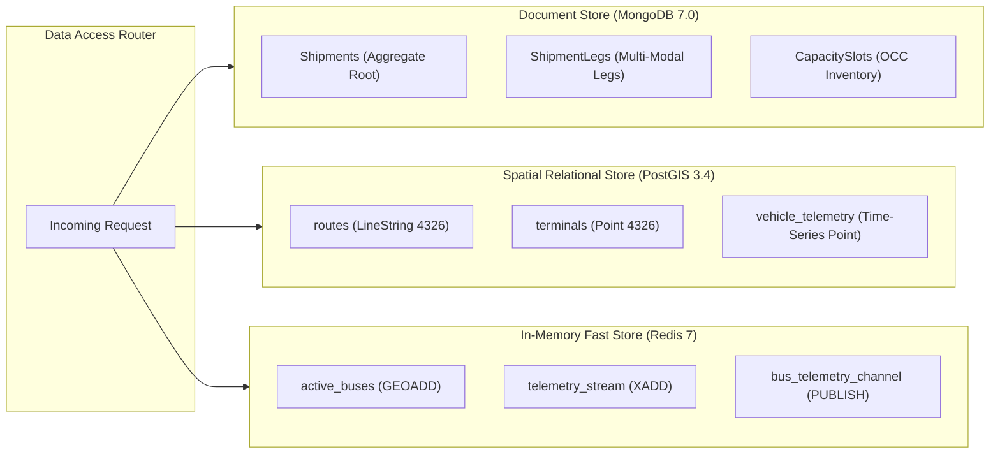

# Transitly — Technical Requirements Document (TRD)

> **Document Type:** Technical Requirements & Engineering Specification  
> **Version:** 1.0.0  
> **Status:** Approved Baseline  
> **Date:** August 2026  
> **Author:** Antigravity Engineering Team  
> **Repository:** `https://github.com/Anmo07/transitly`

---

## 1. Document Control & Scope

This **Technical Requirements Document (TRD)** establishes the canonical technical specifications, architectural constraints, data contracts, and non-functional requirements for the **Transitly** intercity logistics and capacity monetization platform. It translates product requirements from [PRD.md](file:///Users/anmoljangra/Documents/Project%20-%20Alphaa%20IT/PRD.md) into concrete engineering requirements for development through final production deployment.

---

## 2. Technology Stack & Runtime Specifications

```
┌─────────────────────────────────────────────────────────────────────────────────┐
│                           TRANSITLY RUNTIME STACK                               │
│                                                                                 │
│   Backend Runtime:      Node.js 20+ LTS (ES2022+)                               │
│   API & Web Framework:  Express.js 4.x (Stateless Container Nodes)              │
│   Document Store:       MongoDB 7.0 (Mongoose 8.x ODM, Replica Sets)            │
│   Spatial Relational:   PostgreSQL 16 + PostGIS 3.4 (pg 8.x Pool)               │
│   Fast-State & Streams: Redis 7.x (ioredis / node-redis 4.x)                    │
│   Real-Time Protocol:   WebSocket (ws / Socket.io) with Redis Pub/Sub           │
│   CSS Engine:           Tailwind CSS (PostCSS Minified, Zero-CDN Overhead)      │
│   Mapping Engine:       Leaflet.js 1.9.4 (Dynamic Lazy Loaded)                  │
│   Messaging API:        Meta WhatsApp Cloud API v19.0 (Graph REST Endpoints)    │
└─────────────────────────────────────────────────────────────────────────────────┘
```

---

## 3. Non-Functional Requirements (NFRs) & Performance Budgets

### 3.1 Availability & Latency Service Level Objectives (SLOs)

| Metric | Target Objective | Measurement Window | Action on Breach |
| :--- | :--- | :--- | :--- |
| **Booking API Availability** | $\ge 99.95\%$ | Monthly Rolling | Trigger PagerDuty P1 incident, scale replica nodes |
| **Booking API Latency** | $\text{p95} < 500\text{ ms}$ | 5-minute average | Inspect DB pool saturation & third-party partner delays |
| **Telemetry Ingestion Latency** | $\text{p99} < 5\text{ ms}$ | Continuous | Redis Fast Path (`GEOADD` + `XADD`) execution check |
| **GPS Telemetry Freshness** | $\ge 95\%$ within 30s | Continuous | Driver app reconnect retry & dead-zone alert |
| **WhatsApp Notification SLA** | $\ge 95\%$ within 60s | 15-minute rolling | Inspect background worker queue backpressure |
| **Recovery Point Objective (RPO)** | $\le 15\text{ minutes}$ | Disaster recovery | Point-in-time recovery (PITR) WAL log replay |
| **Recovery Time Objective (RTO)** | $\le 4\text{ hours}$ | Disaster recovery | Automated Terraform multi-AZ container redeployment |

### 3.2 Scale & Throughput Baseline (Initial Production Horizon)
- **Active Operators:** 100+ public transport agencies.
- **Active Fleet Buses:** 10,000 concurrent moving vehicles.
- **Daily Shipment Volume:** 100,000+ parcels processed per day.
- **Telemetry Ingestion Rate:** $10\text{ GPS pings/min/vehicle} = 1,667\text{ pings/sec}$ continuous write throughput.
- **System Peak Headroom:** 30% baseline headroom, stress-tested at $2\times$ peak load.

---

## 4. Data Persistence & Spatial Indexing Architecture

Transitly utilizes a **Polyglot Storage Topology** where data is partitioned by access characteristics:



### 4.1 Indexing Specifications

#### MongoDB Indexes
- `Shipments`: `{ trackingId: 1 }` (Unique), `{ operatorId: 1, status: 1 }`, `{ createdAt: -1 }`
- `ShipmentLegs`: `{ shipmentId: 1, sequence: 1 }`, `{ trackingId: 1 }`
- `CapacitySlots`: `{ vehicleId: 1, date: 1 }` (Unique compound), `{ status: 1 }`
- `CustodyHandoffs`: `{ shipmentId: 1, timestamp: -1 }`

#### PostGIS Spatial Indexes
- `terminals`: `CREATE INDEX idx_terminals_geom ON terminals USING GIST (location);`
- `routes`: `CREATE INDEX idx_routes_geom ON routes USING GIST (path);`
- `vehicle_telemetry`: `CREATE INDEX idx_telemetry_geom ON vehicle_telemetry USING GIST (location);`
- `proof_of_deliveries`: `CREATE INDEX idx_pod_geom ON proof_of_deliveries USING GIST (delivery_location);`

---

## 5. State Machine & Optimistic Concurrency Control (OCC)

### 5.1 Shipment State Transitions

The shipment lifecycle is governed by a strict deterministic finite automaton (DFA):

$$\text{OPEN} \xrightarrow{\text{Capacity Reserved}} \text{CONFIRMED} \xrightarrow{\text{Depot Scan}} \text{IN\_TRANSIT} \xrightarrow{\text{OTP Verified}} \text{DELIVERED} \xrightarrow{\text{Ledger Posted}} \text{CLOSED}$$

```
                ┌──────────────┐
                │     OPEN     │
                └──────┬───────┘
                       │ (Reserve Capacity + Pricing)
                       ▼
                ┌──────────────┐      (Rollback / Cancel)
                │  CONFIRMED   ├──────────────────────────────► ┌───────────┐
                └──────┬───────┘                                │ CANCELLED │
                       │ (Pickup Geofence + QR Scan)            └───────────┘
                       ▼                                              ▲
                ┌──────────────┐                                      │
                │  IN_TRANSIT  │                                      │
                └──────┬───────┘                                      │
                       │ (OTP Verify + POD Upload)                    │
                       ▼                                              │
                ┌──────────────┐      (Exception / Custody Breach)    │
                │  DELIVERED   ├──────────────────────────────────────┘
                └──────┬───────┘
                       │ (Snapshot Hash + Ledger Journal)
                       ▼
                ┌──────────────┐
                │    CLOSED    │ ◄── [Immutable Snapshot]
                └──────┬───────┘
                       │ (Post-closure Dispute)
                       ▼
                ┌──────────────┐
                │   DISPUTED   │
                └──────────────┘
```

### 5.2 Optimistic Concurrency Control (OCC) Formula

To eliminate database deadlocks under high booking concurrency, every state transition or weight modification enforces OCC:

$$\Delta \text{State} = f(\text{ShipmentID}, \text{ExpectedStatus}, \text{ExpectedVersion})$$

```javascript
const result = await Shipment.findOneAndUpdate(
  {
    _id: shipmentId,
    status: expectedStatus,
    version: expectedVersion
  },
  {
    $set: updates,
    $inc: { version: 1 }
  },
  { returnDocument: 'after' }
);

if (!result) {
  throw new ConcurrencyConflictError(
    `OCC Conflict: Shipment ${shipmentId} modified by concurrent transaction or invalid state.`
  );
}
```

---

## 6. Multi-Modal Saga Orchestration & Rollback Specification

The booking process executes across multiple domains as a **Distributed Saga** with compensating transactions:

```
┌─────────────────────────────────────────────────────────────────────────────┐
│                            BOOKING SAGA EXECUTION                           │
│                                                                             │
│  [Step 1: Validate Payload]                                                 │
│       │                                                                     │
│  [Step 2: Reserve Capacity Slot] ──────(Fail)──► [Abort & Return 400]       │
│       │                                                                     │
│  [Step 3: Calculate Dynamic Pricing] ──(Fail)──► [Compensate: Release Slot] │
│       │                                                                     │
│  [Step 4: Create Master Shipment] ─────(Fail)──► [Compensate: Release Slot] │
│       │                                                                     │
│  [Step 5: Generate QR Seal & OTP]                                           │
│       │                                                                     │
│  [Step 6: Dispatch WhatsApp Alert] ────(Fail)──► [Soft-Log & Retry Async]   │
│       │                                                                     │
│  [SUCCESS: Return Tracking ID]                                              │
└─────────────────────────────────────────────────────────────────────────────┘
```

---

## 7. Dual-Path GPS Telemetry Ingestion Pipeline

To handle 1,667+ GPS pings/sec with zero customer tracking latency:

### 7.1 Fast Path (In-Memory Sub-5ms)
1. Driver GPS ping hits `POST /api/v1/tracking/telemetry`.
2. Telemetry service executes Redis pipeline:
   - `GEOADD active_buses {lon} {lat} {vehicleId}`
   - `XADD telemetry_stream * vehicleId {vehicleId} lat {lat} lon {lon} speed {speed}`
   - `PUBLISH bus_telemetry_channel {JSON_PAYLOAD}`
3. Immediately returns HTTP `202 Accepted` to client device.
4. WebSocket server listens to `bus_telemetry_channel` and broadcasts updates to connected map clients.

### 7.2 Slow Path (Durable Relational GIS Persistence)
1. Asynchronous Node.js background consumer worker joins Redis Stream Consumer Group: `XREADGROUP GROUP telemetry_persist_workers worker_1 STREAMS telemetry_stream >`.
2. Batches 100 pings into a single multi-row PostGIS SQL query:
   ```sql
   INSERT INTO vehicle_telemetry (vehicle_id, operator_id, location, speed_kmh, heading_deg, recorded_at)
   VALUES
     ('HR-55-AB-1234', 'HR-ROADWAYS', ST_SetSRID(ST_MakePoint(77.0151, 28.9931), 4326), 64.0, 350.0, NOW()),
     ('HR-55-AB-1234', 'HR-ROADWAYS', ST_SetSRID(ST_MakePoint(76.9635, 29.3909), 4326), 68.0, 348.0, NOW());
   ```
3. Upon successful SQL transaction commit, worker sends `XACK telemetry_stream telemetry_persist_workers {msgId}` to clear pending entries list (PEL).

---

## 8. Last-Mile Adapter Interface & Dual-Geolocation Feasibility Contract

Every third-party hyper-local provider (Uber Direct, Rapido, inDrive) implements the uniform **`LastMileProviderAdapter`** contract:

```typescript
interface LastMileProviderAdapter {
  checkServiceability(
    pickupCoords: Coordinates,
    dropoffCoords: Coordinates,
    parcelSpecs: ParcelSpecs
  ): Promise<ServiceabilityResponse>;

  createQuote(
    pickupCoords: Coordinates,
    dropoffCoords: Coordinates,
    parcelSpecs: ParcelSpecs
  ): Promise<ProviderQuote>;

  confirmDispatch(
    quoteId: string,
    idempotencyKey: string,
    pickupContact: ContactInfo,
    deliveryContact: ContactInfo
  ): Promise<DispatchConfirmation>;

  cancelDispatch(
    dispatchId: string,
    reason: string
  ): Promise<CancellationResult>;

  verifyWebhookSignature(
    rawBody: string,
    signatureHeader: string
  ): boolean;
}
```

---

## 9. Versioned Event Envelope Specification (v1.0)

All inter-service asynchronous events conform to the standard JSON event envelope:

```json
{
  "eventId": "evt_01HZX89B000000000000000000",
  "eventType": "shipment.confirmed.v1",
  "version": "1.0.0",
  "timestamp": "2026-08-20T12:00:00.000Z",
  "operatorId": "HR-ROADWAYS",
  "correlationId": "corr_01HZX89B111111111111111111",
  "payload": {
    "trackingId": "TRK-88219",
    "routeId": "HR-DEL-CHD",
    "vehicleId": "HR-55-AB-1234",
    "weightKg": 5.0,
    "qrSealCode": "SEAL-TRK-88219-94B8"
  }
}
```

---

## 10. WhatsApp Cloud API & Bot Intent State Machine

```
                              ┌────────────────────┐
                              │ Inbound WA Message │
                              └─────────┬──────────┘
                                        │
                         [Verify Customer Phone / OTP]
                                        │
            ┌───────────────────────────┼───────────────────────────┐
            ▼                           ▼                           ▼
    [Track Parcel]             [Change Preference]           [Human Support]
            │                           │                           │
  Extract Tracking ID           Switch to Terminal          Create SupportTicket
            │                           │                           │
  Redact Driver Data            Update Child Leg            Alert Operations Desk
            │                           │                           │
  Send Milestone + ETA          Send Confirmation           Transfer to Agent
```

---

## 11. Security, Cryptography & Threat Mitigation

| Threat Vector | Mitigation Architecture | Implementation |
| :--- | :--- | :--- |
| **Parcel Tampering / Fake Seals** | HMAC-SHA256 Cryptographic Digital QR Seals | [`src/utils/security.js`](file:///Users/anmoljangra/Documents/Project%20-%20Alphaa%20IT/src/utils/security.js) |
| **False Delivery Claim** | Constant-Time SHA-256 Hashed 6-digit OTP + Geofence Match | `crypto.timingSafeEqual` |
| **Off-Route Unauthorized Handoff** | PostGIS Geofence Spatial Boundary Validation | `ST_Contains` query |
| **Driver Privacy & Stalking** | Automatic PII Redaction Filter on all customer responses | `redactCustomerMessage()` |
| **Concurrent Capacity Overbooking** | Optimistic Concurrency Control (OCC) on Capacity Slots | MongoDB `$inc: { version: 1 }` |
| **API Denial of Service** | Redis Sliding Window Rate Limiting (100 req/min/IP) | Redis Key TTL Rate Limiter |

---

## 12. Deployment, Containerization & CI/CD Pipeline

### 12.1 Container Verification
```bash
# Build Multi-Stage Production Container
docker build -t transitly-app:latest .

# Launch Entire 5-Service Stack
docker-compose up -d

# Verify Container Health
docker-compose ps
```

### 12.2 CI/CD Quality Gates
Every pull request to `main` must pass:
1. `npm test`: All 7 unit, architecture, security, and schema test suites pass.
2. `npm run build:css`: Tailwind CSS compiles with zero warnings.
3. Automated endpoint check: All 31 HTTP routes return `200 OK`.
